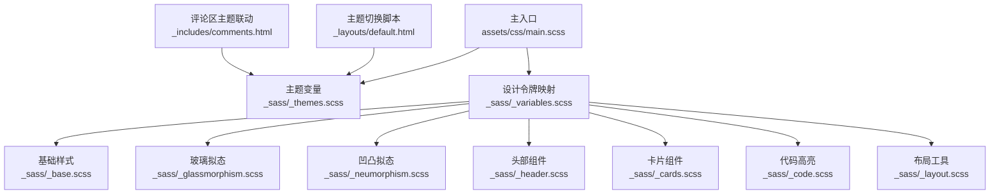
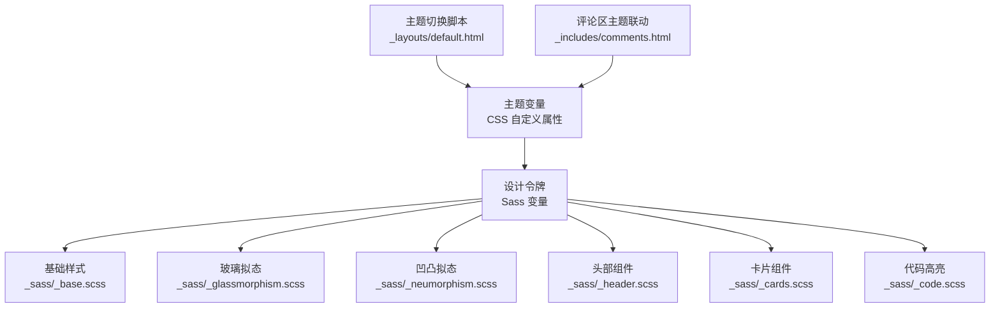
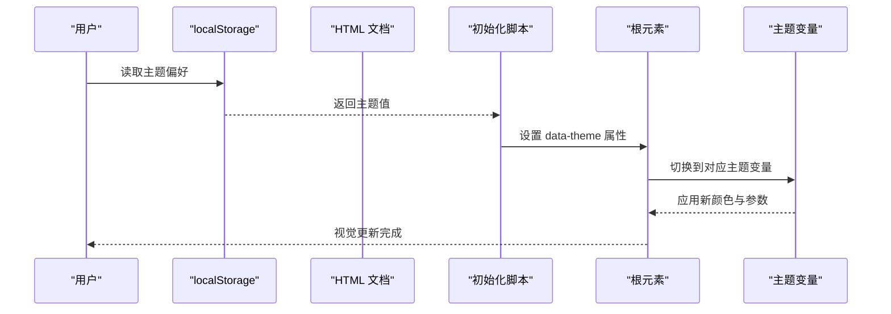
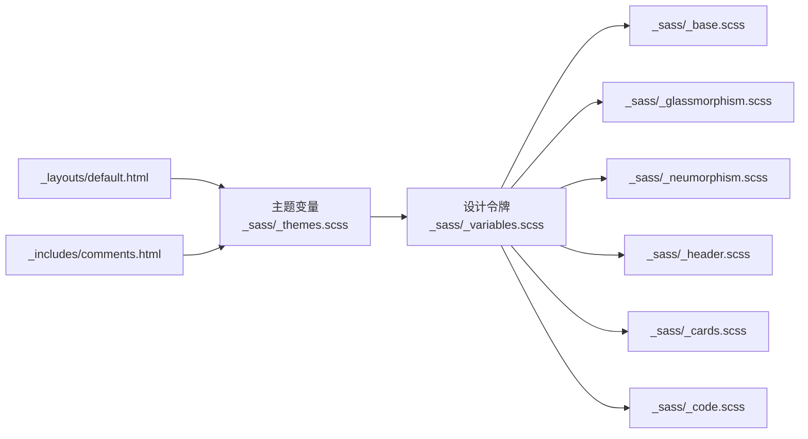

# CSS 变量设计

<cite>
**本文引用的文件**
- [_sass/_themes.scss](file://_sass/_themes.scss)
- [_sass/_variables.scss](file://_sass/_variables.scss)
- [assets/css/main.scss](file://assets/css/main.scss)
- [_sass/_base.scss](file://_sass/_base.scss)
- [_sass/_neumorphism.scss](file://_sass/_neumorphism.scss)
- [_sass/_glassmorphism.scss](file://_sass/_glassmorphism.scss)
- [_sass/_header.scss](file://_sass/_header.scss)
- [_sass/_cards.scss](file://_sass/_cards.scss)
- [_sass/_code.scss](file://_sass/_code.scss)
- [_sass/_layout.scss](file://_sass/_layout.scss)
- [_layouts/default.html](file://_layouts/default.html)
- [_includes/comments.html](file://_includes/comments.html)
- [_posts/2026-05-13-css-design-system.md](file://_posts/2026-05-13-css-design-system.md)
</cite>

## 目录
1. [简介](#简介)
2. [项目结构](#项目结构)
3. [核心组件](#核心组件)
4. [架构总览](#架构总览)
5. [详细组件分析](#详细组件分析)
6. [依赖关系分析](#依赖关系分析)
7. [性能考量](#性能考量)
8. [故障排查指南](#故障排查指南)
9. [结论](#结论)
10. [附录](#附录)

## 简介
本文件系统性阐述 labtab 的 CSS 变量设计与主题系统实现，重点覆盖以下方面：
- 设计令牌的命名规范与组织结构
- 深色与浅色主题的颜色变量定义（背景、表面、强调、文本等）
- RGB 版本变量在 backdrop-filter 与阴影中的作用
- 透明度预计算变量的设计思路与使用场景
- 主题切换机制与实际应用
- 自定义变量的最佳实践与风险规避

## 项目结构
labtab 的样式体系由 Sass 模块化组织，通过主入口编译输出最终 CSS。核心文件如下：
- 主入口：assets/css/main.scss
- 主题定义：_sass/_themes.scss
- 设计令牌映射：_sass/_variables.scss
- 基础样式与背景：_sass/_base.scss
- 材质风格（玻璃拟态/凹凸拟态）：_sass/_glassmorphism.scss、_sass/_neumorphism.scss
- 头部与卡片组件：_sass/_header.scss、_sass/_cards.scss
- 代码高亮：_sass/_code.scss
- 布局工具：_sass/_layout.scss
- 主题切换脚本：_layouts/default.html
- 评论区主题联动：_includes/comments.html
- 设计系统理念文章：_posts/2026-05-13-css-design-system.md

图表来源
- [assets/css/main.scss:1-17](file://assets/css/main.scss#L1-L17)
- [_sass/_themes.scss:1-150](file://_sass/_themes.scss#L1-L150)
- [_sass/_variables.scss:1-91](file://_sass/_variables.scss#L1-L91)
- [_sass/_base.scss:1-172](file://_sass/_base.scss#L1-L172)
- [_sass/_glassmorphism.scss:1-89](file://_sass/_glassmorphism.scss#L1-L89)
- [_sass/_neumorphism.scss:1-92](file://_sass/_neumorphism.scss#L1-L92)
- [_sass/_header.scss:1-212](file://_sass/_header.scss#L1-L212)
- [_sass/_cards.scss:1-126](file://_sass/_cards.scss#L1-L126)
- [_sass/_code.scss:1-49](file://_sass/_code.scss#L1-L49)
- [_sass/_layout.scss:1-85](file://_sass/_layout.scss#L1-L85)
- [_layouts/default.html:1-32](file://_layouts/default.html#L1-L32)
- [_includes/comments.html:1-20](file://_includes/comments.html#L1-L20)

章节来源
- [assets/css/main.scss:1-17](file://assets/css/main.scss#L1-L17)

## 核心组件
本节聚焦于 CSS 自定义属性与 Sass 设计令牌的协同工作方式。

- 主题变量层（CSS 自定义属性）
  - 定义于 _sass/_themes.scss，包含深色与浅色两套主题，每套主题提供：
    - 背景色系：主背景、次级背景、表面、表面浅色、表面更深
    - 强调色系：起始色、结束色、高亮、高亮浅
    - 文本色系：主要、次要、柔和
    - 语义状态色：成功、警告、危险
    - RGB 版本变量：用于 rgba() 计算，避免重复转换
    - 透明度预计算变量：如 highlight-soft、多种百分比透明度、玻璃边框、选择器背景等
    - 凹凸拟态阴影与玻璃模糊参数
    - 背景图案颜色
  - 主题切换通过 data-theme 属性控制，过渡动画统一设置

- 设计令牌层（Sass 变量）
  - 定义于 _sass/_variables.scss，将 CSS 自定义属性映射为 Sass 变量，供混入与组件样式使用
  - 包含：背景、表面、强调色、文本、语义色、凹凸拟态阴影、玻璃拟态参数、排版、间距、布局、过渡、层级等

- 实际应用层
  - 基础样式（_sass/_base.scss）：全局背景、渐变、滚动条、选择器、表格等
  - 材质风格（_sass/_glassmorphism.scss、_sass/_neumorphism.scss）：提供混入，统一风格
  - 组件样式（_sass/_header.scss、_sass/_cards.scss、_sass/_code.scss）：按需引用 Sass 变量
  - 主题切换（_layouts/default.html）：读取本地存储并设置 data-theme
  - 评论区联动（_includes/comments.html）：根据主题设置评论区主题

章节来源
- [_sass/_themes.scss:1-150](file://_sass/_themes.scss#L1-L150)
- [_sass/_variables.scss:1-91](file://_sass/_variables.scss#L1-L91)
- [_sass/_base.scss:1-172](file://_sass/_base.scss#L1-L172)
- [_sass/_glassmorphism.scss:1-89](file://_sass/_glassmorphism.scss#L1-L89)
- [_sass/_neumorphism.scss:1-92](file://_sass/_neumorphism.scss#L1-L92)
- [_sass/_header.scss:1-212](file://_sass/_header.scss#L1-L212)
- [_sass/_cards.scss:1-126](file://_sass/_cards.scss#L1-L126)
- [_sass/_code.scss:1-49](file://_sass/_code.scss#L1-L49)
- [_layouts/default.html:1-32](file://_layouts/default.html#L1-L32)
- [_includes/comments.html:1-20](file://_includes/comments.html#L1-L20)

## 架构总览
下图展示主题变量、设计令牌与组件样式的交互关系：

图表来源
- [_sass/_themes.scss:1-150](file://_sass/_themes.scss#L1-L150)
- [_sass/_variables.scss:1-91](file://_sass/_variables.scss#L1-L91)
- [_sass/_base.scss:1-172](file://_sass/_base.scss#L1-L172)
- [_sass/_glassmorphism.scss:1-89](file://_sass/_glassmorphism.scss#L1-L89)
- [_sass/_neumorphism.scss:1-92](file://_sass/_neumorphism.scss#L1-L92)
- [_sass/_header.scss:1-212](file://_sass/_header.scss#L1-L212)
- [_sass/_cards.scss:1-126](file://_sass/_cards.scss#L1-L126)
- [_sass/_code.scss:1-49](file://_sass/_code.scss#L1-L49)
- [_layouts/default.html:1-32](file://_layouts/default.html#L1-L32)
- [_includes/comments.html:1-20](file://_includes/comments.html#L1-L20)

## 详细组件分析

### 主题系统与命名规范
- 命名规范
  - 语义化命名：如 --bg-primary、--surface、--accent-start、--text-primary、--success、--warning、--danger
  - 后缀约定：RGB 版本以 -rgb 结尾；透明度预计算以 -xx 或 -soft 结尾；玻璃边框以 -border- 开头
  - 分组清晰：背景、表面、强调、文本、语义、RGB、透明度、拟态、背景图案等分段组织
- 组织结构
  - 深色主题（:root, [data-theme="dark"]）与浅色主题（[data-theme="light"]）并列定义
  - 过渡动画统一设置，确保主题切换时的视觉连贯性

章节来源
- [_sass/_themes.scss:1-150](file://_sass/_themes.scss#L1-L150)

### 深色与浅色主题的颜色变量
- 深色主题（默认）
  - 背景色系：主背景、次级背景、表面、表面浅色、表面更深
  - 强调色系：起始色、结束色、高亮、高亮浅
  - 文本色系：主要、次要、柔和
  - 语义状态色：成功、警告、危险
  - RGB 版本：用于 rgba() 计算，避免重复转换
  - 透明度预计算：涵盖多种透明度组合，便于在不同组件中复用
  - 凹凸拟态阴影：针对深色环境优化的明暗与内阴影
  - 玻璃模糊参数：轻重不同的模糊半径
  - 背景图案：点阵与径向渐变
- 浅色主题
  - 色彩偏向明亮，表面与背景更接近白色，强调色对比度适中
  - RGB 版本与透明度预计算与深色主题一一对应
  - 凹凸拟态阴影更偏向“浮起”感，适合明亮背景

章节来源
- [_sass/_themes.scss:5-76](file://_sass/_themes.scss#L5-L76)
- [_sass/_themes.scss:78-144](file://_sass/_themes.scss#L78-L144)

### RGB 版本变量与透明度预计算
- RGB 版本变量（-rgb）
  - 用途：在需要 rgba() 计算的场景（如玻璃拟态背景、边框）直接使用整数通道，避免浏览器重复解析
  - 应用：_sass/_glassmorphism.scss 中 backdrop-filter 背景与边框
- 透明度预计算变量
  - 设计思路：将常用透明度组合预先计算，减少运行时开销，提升渲染性能
  - 应用：高亮软化、强调色不同透明度、玻璃边框、选择器背景、黑屏遮罩等

章节来源
- [_sass/_themes.scss:27-61](file://_sass/_themes.scss#L27-L61)
- [_sass/_themes.scss:99-132](file://_sass/_themes.scss#L99-L132)
- [_sass/_glassmorphism.scss:6-20](file://_sass/_glassmorphism.scss#L6-L20)
- [_sass/_glassmorphism.scss:31-47](file://_sass/_glassmorphism.scss#L31-L47)
- [_sass/_glassmorphism.scss:50-81](file://_sass/_glassmorphism.scss#L50-L81)

### 设计令牌映射与组件应用
- 设计令牌映射（_sass/_variables.scss）
  - 将 CSS 自定义属性映射为 Sass 变量，供混入与组件样式使用
  - 包含：背景、表面、强调色、文本、语义色、凹凸拟态阴影、玻璃拟态参数、排版、间距、布局、过渡、层级等
- 组件应用示例
  - 基础样式（_sass/_base.scss）：全局背景、渐变、滚动条、选择器、表格等
  - 玻璃拟态（_sass/_glassmorphism.scss）：标准、重型、轻型、渐变边框、卡片与标签
  - 凹凸拟态（_sass/_neumorphism.scss）：按钮、卡片、输入框等
  - 头部组件（_sass/_header.scss）：导航栏在滚动时的背景与阴影
  - 卡片组件（_sass/_cards.scss）：标签背景与悬停效果
  - 代码高亮（_sass/_code.scss）：代码块容器与语言标签

章节来源
- [_sass/_variables.scss:1-91](file://_sass/_variables.scss#L1-L91)
- [_sass/_base.scss:15-29](file://_sass/_base.scss#L15-L29)
- [_sass/_base.scss:31-43](file://_sass/_base.scss#L31-L43)
- [_sass/_base.scss:96-108](file://_sass/_base.scss#L96-L108)
- [_sass/_base.scss:149-153](file://_sass/_base.scss#L149-L153)
- [_sass/_glassmorphism.scss:5-28](file://_sass/_glassmorphism.scss#L5-L28)
- [_sass/_glassmorphism.scss:30-47](file://_sass/_glassmorphism.scss#L30-L47)
- [_sass/_glassmorphism.scss:50-81](file://_sass/_glassmorphism.scss#L50-L81)
- [_sass/_neumorphism.scss:5-31](file://_sass/_neumorphism.scss#L5-L31)
- [_sass/_neumorphism.scss:33-66](file://_sass/_neumorphism.scss#L33-L66)
- [_sass/_neumorphism.scss:69-91](file://_sass/_neumorphism.scss#L69-L91)
- [_sass/_header.scss:11-21](file://_sass/_header.scss#L11-L21)
- [_sass/_header.scss:196-211](file://_sass/_header.scss#L196-L211)
- [_sass/_cards.scss:50-102](file://_sass/_cards.scss#L50-L102)
- [_sass/_code.scss:6-39](file://_sass/_code.scss#L6-L39)

### 主题切换流程

图表来源
- [_layouts/default.html:6-11](file://_layouts/default.html#L6-L11)

章节来源
- [_layouts/default.html:1-32](file://_layouts/default.html#L1-L32)

### 评论区主题联动
- 评论区（Giscus）通过 data-theme 属性与站点主题保持一致
- 该属性由站点主题切换逻辑注入，确保评论区与页面风格统一

章节来源
- [_includes/comments.html:1-20](file://_includes/comments.html#L1-L20)

### 设计系统理念与最佳实践
- 设计令牌理念：将抽象设计决策转化为具名变量，避免硬编码颜色与尺寸
- 深色模式支持：通过 CSS 自定义属性与 data-theme 实现一键切换
- 文章示例：展示了基础颜色、语义颜色、间距与字体比例的组织方式

章节来源
- [_posts/2026-05-13-css-design-system.md:1-205](file://_posts/2026-05-13-css-design-system.md#L1-L205)

## 依赖关系分析
- 主题变量依赖关系
  - 深色与浅色主题变量相互独立，但结构对称，便于维护与扩展
  - RGB 版本与透明度预计算变量与颜色变量一一对应，降低耦合
- 设计令牌依赖关系
  - Sass 变量仅作为 CSS 自定义属性的代理，不引入额外复杂度
  - 组件样式通过 Sass 变量间接依赖 CSS 自定义属性，形成清晰的单向依赖链
- 主题切换依赖关系
  - 初始化脚本依赖 localStorage 与 data-theme 属性
  - 评论区依赖站点主题设置

图表来源
- [_sass/_themes.scss:1-150](file://_sass/_themes.scss#L1-L150)
- [_sass/_variables.scss:1-91](file://_sass/_variables.scss#L1-L91)
- [_sass/_base.scss:1-172](file://_sass/_base.scss#L1-L172)
- [_sass/_glassmorphism.scss:1-89](file://_sass/_glassmorphism.scss#L1-L89)
- [_sass/_neumorphism.scss:1-92](file://_sass/_neumorphism.scss#L1-L92)
- [_sass/_header.scss:1-212](file://_sass/_header.scss#L1-L212)
- [_sass/_cards.scss:1-126](file://_sass/_cards.scss#L1-L126)
- [_sass/_code.scss:1-49](file://_sass/_code.scss#L1-L49)
- [_layouts/default.html:1-32](file://_layouts/default.html#L1-L32)
- [_includes/comments.html:1-20](file://_includes/comments.html#L1-L20)

章节来源
- [assets/css/main.scss:1-17](file://assets/css/main.scss#L1-L17)

## 性能考量
- 预计算透明度变量：减少运行时 rgba() 计算，降低合成开销
- RGB 版本变量：在 backdrop-filter 与阴影中直接使用整数通道，避免重复解析
- 统一过渡动画：主题切换时色彩与阴影平滑过渡，减少视觉跳变
- 布局与组件：通过 Sass 变量与混入减少重复代码，提升编译期优化空间

## 故障排查指南
- 主题未生效
  - 检查根元素是否正确设置 data-theme 属性
  - 确认 localStorage 中的主题偏好是否存在
- 玻璃拟态失效
  - 确认浏览器支持 backdrop-filter；若不支持，组件应回退到不透明背景
- 颜色不协调
  - 检查是否直接使用了底层颜色变量而非语义变量
  - 确认 RGB 与透明度变量是否匹配同一色调

章节来源
- [_layouts/default.html:6-11](file://_layouts/default.html#L6-L11)
- [_sass/_glassmorphism.scss:84-88](file://_sass/_glassmorphism.scss#L84-L88)

## 结论
labtab 的 CSS 变量设计以“设计令牌 + CSS 自定义属性 + Sass 映射”的方式实现了高度模块化与可维护的主题系统。通过 RGB 版本变量与透明度预计算变量，兼顾了性能与灵活性；通过深色与浅色主题的对称结构，提供了良好的扩展性。建议在自定义时遵循语义化命名与最小变更原则，优先使用 Sass 变量与混入，确保整体设计平衡与一致性。

## 附录
- 自定义变量指南与最佳实践
  - 命名规范
    - 使用语义化名称（如 --bg-primary、--text-primary、--accent-start）
    - RGB 版本以 -rgb 结尾，透明度变量以 -xx 或 -soft 结尾
  - 修改策略
    - 优先调整基础色与强调色，再微调表面与文本色
    - 保持 RGB 与透明度变量与主色调一致
    - 在玻璃与拟态组件中，优先使用预计算变量
  - 风险规避
    - 避免直接硬编码颜色值
    - 不要破坏透明度与对比度的平衡
    - 在新增变量时，同步补充 RGB 与透明度版本

章节来源
- [_sass/_themes.scss:1-150](file://_sass/_themes.scss#L1-L150)
- [_sass/_variables.scss:1-91](file://_sass/_variables.scss#L1-L91)
- [_posts/2026-05-13-css-design-system.md:174-200](file://_posts/2026-05-13-css-design-system.md#L174-L200)