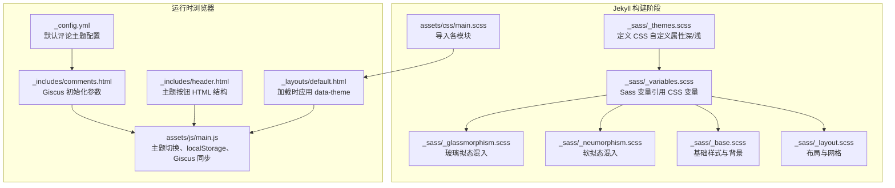
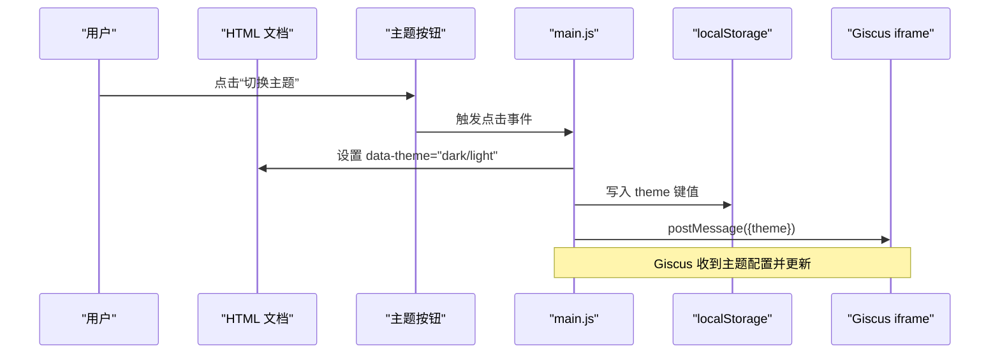
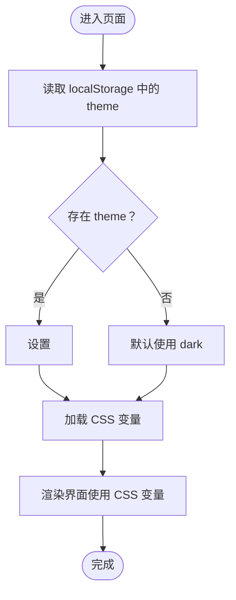
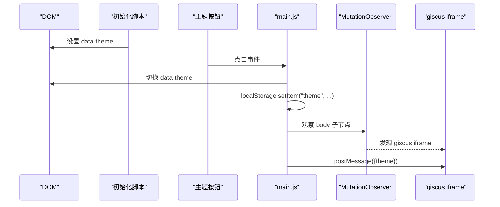
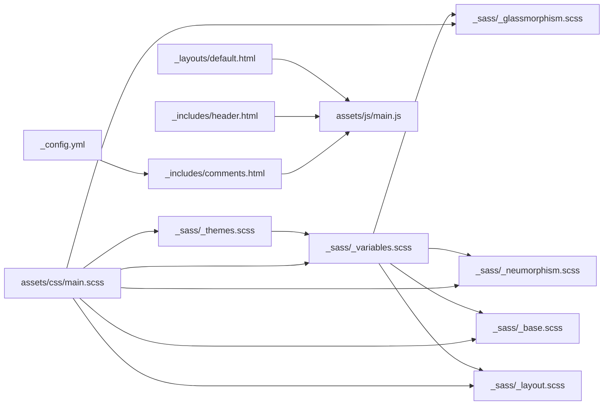

# 主题系统

<cite>
**本文引用的文件**
- [_sass/_themes.scss](file://_sass/_themes.scss)
- [_sass/_variables.scss](file://_sass/_variables.scss)
- [_sass/_glassmorphism.scss](file://_sass/_glassmorphism.scss)
- [_sass/_neumorphism.scss](file://_sass/_neumorphism.scss)
- [_sass/_base.scss](file://_sass/_base.scss)
- [_sass/_layout.scss](file://_sass/_layout.scss)
- [assets/css/main.scss](file://assets/css/main.scss)
- [assets/js/main.js](file://assets/js/main.js)
- [assets/js/effects.js](file://assets/js/effects.js)
- [_layouts/default.html](file://_layouts/default.html)
- [_includes/head.html](file://_includes/head.html)
- [_includes/header.html](file://_includes/header.html)
- [_includes/comments.html](file://_includes/comments.html)
- [_config.yml](file://_config.yml)
</cite>

## 目录
1. [简介](#简介)
2. [项目结构](#项目结构)
3. [核心组件](#核心组件)
4. [架构总览](#架构总览)
5. [详细组件分析](#详细组件分析)
6. [依赖关系分析](#依赖关系分析)
7. [性能考量](#性能考量)
8. [故障排查指南](#故障排查指南)
9. [结论](#结论)
10. [附录：主题定制指南与实践步骤](#附录主题定制指南与实践步骤)

## 简介
本文件系统性阐述 labtab 的主题系统，重点围绕“CSS 变量驱动的主题切换”机制展开，解释如何通过修改设计令牌（design tokens）定制主题外观；详解深色与浅色主题的实现原理（颜色方案、阴影效果、透明度设置）；剖析 JavaScript 主题切换功能（localStorage 持久化、主题状态同步、Giscus 评论系统主题同步）；并提供主题定制指南与可操作的实践步骤。

## 项目结构
主题系统由“Sass 设计令牌 + Jekyll 布局初始化 + JavaScript 主题切换”三部分构成：
- Sass 层：以 CSS 自定义属性为设计令牌，集中定义深色/浅色两套主题变量，并在混入中复用这些变量。
- Jekyll 层：在页面加载时读取 localStorage 并应用 data-theme，确保刷新后主题状态一致。
- JavaScript 层：提供主题按钮交互、本地存储持久化、以及与 Giscus 评论系统的主题同步。



**图表来源**
- [_sass/_themes.scss:1-150](file://_sass/_themes.scss#L1-L150)
- [_sass/_variables.scss:1-91](file://_sass/_variables.scss#L1-L91)
- [_sass/_glassmorphism.scss:1-89](file://_sass/_glassmorphism.scss#L1-L89)
- [_sass/_neumorphism.scss:1-92](file://_sass/_neumorphism.scss#L1-L92)
- [_sass/_base.scss:1-172](file://_sass/_base.scss#L1-L172)
- [_sass/_layout.scss:1-107](file://_sass/_layout.scss#L1-L107)
- [assets/css/main.scss:1-17](file://assets/css/main.scss#L1-L17)
- [_layouts/default.html:6-11](file://_layouts/default.html#L6-L11)
- [assets/js/main.js:10-47](file://assets/js/main.js#L10-L47)
- [_includes/header.html:20-23](file://_includes/header.html#L20-L23)
- [_includes/comments.html:5-18](file://_includes/comments.html#L5-L18)
- [_config.yml:66-79](file://_config.yml#L66-L79)

**章节来源**
- [assets/css/main.scss:1-17](file://assets/css/main.scss#L1-L17)
- [_sass/_themes.scss:1-150](file://_sass/_themes.scss#L1-L150)
- [_sass/_variables.scss:1-91](file://_sass/_variables.scss#L1-L91)
- [_sass/_glassmorphism.scss:1-89](file://_sass/_glassmorphism.scss#L1-L89)
- [_sass/_neumorphism.scss:1-92](file://_sass/_neumorphism.scss#L1-L92)
- [_sass/_base.scss:1-172](file://_sass/_base.scss#L1-L172)
- [_sass/_layout.scss:1-107](file://_sass/_layout.scss#L1-L107)
- [_layouts/default.html:6-11](file://_layouts/default.html#L6-L11)
- [assets/js/main.js:10-47](file://assets/js/main.js#L10-L47)
- [_includes/header.html:20-23](file://_includes/header.html#L20-L23)
- [_includes/comments.html:5-18](file://_includes/comments.html#L5-L18)
- [_config.yml:66-79](file://_config.yml#L66-L79)

## 核心组件
- CSS 变量设计令牌：在根元素与 data-theme 属性上集中声明颜色、透明度、阴影、背景图案等变量，形成深色/浅色两套主题。
- Sass 变量与混入：Sass 变量统一引用 CSS 变量，混入在不同组件中复用变量，保证视觉一致性。
- 运行时主题切换：JavaScript 读取/写入 localStorage，设置 data-theme，同时向 Giscus 发送主题配置消息。
- 页面初始化：Jekyll 在页面头部注入初始化脚本，确保首次加载即应用正确主题。

**章节来源**
- [_sass/_themes.scss:5-150](file://_sass/_themes.scss#L5-L150)
- [_sass/_variables.scss:1-91](file://_sass/_variables.scss#L1-L91)
- [assets/js/main.js:23-27](file://assets/js/main.js#L23-L27)
- [_layouts/default.html:6-11](file://_layouts/default.html#L6-L11)

## 架构总览
下图展示从用户点击到主题生效、再到评论系统同步的整体流程。



**图表来源**
- [assets/js/main.js:23-47](file://assets/js/main.js#L23-L47)
- [_includes/header.html:20-23](file://_includes/header.html#L20-L23)
- [_layouts/default.html:6-11](file://_layouts/default.html#L6-L11)
- [_includes/comments.html:5-18](file://_includes/comments.html#L5-L18)

## 详细组件分析

### 组件一：CSS 变量驱动的主题系统
- 深色主题（默认）与浅色主题分别在根选择器与 [data-theme="light"] 上定义完整变量集，覆盖背景、表面、强调色、文本、成功/警告/危险、透明色、软拟态阴影、玻璃模糊等。
- 变量命名采用语义化前缀（如 --bg-、--surface-、--accent-、--highlight-），并提供 RGB 版本用于 rgba() 计算。
- 全局过渡：所有元素的背景、文字、边框、阴影均设置平滑过渡，提升主题切换体验。



**图表来源**
- [_layouts/default.html:6-11](file://_layouts/default.html#L6-L11)
- [_sass/_themes.scss:6-76](file://_sass/_themes.scss#L6-L76)
- [_sass/_themes.scss:79-144](file://_sass/_themes.scss#L79-L144)

**章节来源**
- [_sass/_themes.scss:5-150](file://_sass/_themes.scss#L5-L150)

### 组件二：Sass 变量与混入（设计令牌到组件）
- Sass 变量层：将 CSS 变量映射为 SCSS 变量，便于混入中统一使用。
- 玻璃拟态混入：提供标准、重型、轻量、渐变边框、卡片悬停等混入，内部直接引用 CSS 变量，自动适配当前主题。
- 软拟态混入：提供 raised/pressed/flat/glow 等状态，配合 CSS 变量生成阴影，适配深浅主题。

```mermaid
classDiagram
class 变量层 {
"+$bg-primary"
"+$surface"
"+$accent-gradient"
"+$glass-bg"
"+$neu-light"
}
class 玻璃拟态混入 {
"+glass()"
"+glass-heavy()"
"+glass-light()"
"+glass-gradient-border()"
"+glass-card()"
"+glass-tag()"
}
class 软拟态混入 {
"+neu-raised()"
"+neu-pressed()"
"+neu-flat()"
"+neu-glow()"
"+neu-button()"
"+neu-card()"
"+neu-input()"
}
变量层 <.. 玻璃拟态混入 : "引用"
变量层 <.. 软拟态混入 : "引用"
```

**图表来源**
- [_sass/_variables.scss:1-91](file://_sass/_variables.scss#L1-L91)
- [_sass/_glassmorphism.scss:5-81](file://_sass/_glassmorphism.scss#L5-L81)
- [_sass/_neumorphism.scss:5-91](file://_sass/_neumorphism.scss#L5-L91)

**章节来源**
- [_sass/_variables.scss:1-91](file://_sass/_variables.scss#L1-L91)
- [_sass/_glassmorphism.scss:1-89](file://_sass/_glassmorphism.scss#L1-L89)
- [_sass/_neumorphism.scss:1-92](file://_sass/_neumorphism.scss#L1-L92)

### 组件三：JavaScript 主题切换与 Giscus 同步
- 主题切换逻辑：读取当前 data-theme，取反后写回并持久化到 localStorage。
- Giscus 同步：当检测到 giscus iframe 加载时，向其发送主题配置；点击按钮也会实时同步。
- 页面初始化：Jekyll 注入脚本在 DOMContentLoaded 前执行，确保首屏即应用正确主题。



**图表来源**
- [_layouts/default.html:6-11](file://_layouts/default.html#L6-L11)
- [assets/js/main.js:23-47](file://assets/js/main.js#L23-L47)
- [_includes/comments.html:5-18](file://_includes/comments.html#L5-L18)

**章节来源**
- [assets/js/main.js:10-47](file://assets/js/main.js#L10-L47)
- [_layouts/default.html:6-11](file://_layouts/default.html#L6-L11)
- [_includes/comments.html:5-18](file://_includes/comments.html#L5-L18)
- [_config.yml:66-79](file://_config.yml#L66-L79)

### 组件四：基础样式与背景图案
- 基础样式：全局重置、滚动行为、字体、行高、链接、块引用、表格、滚动条等，均基于 CSS 变量。
- 背景：固定径向渐变与点阵背景，增强层次感；选区颜色也由 CSS 变量控制。
- 布局：容器、网格、弹性布局工具类、阅读进度条等。

**章节来源**
- [_sass/_base.scss:10-172](file://_sass/_base.scss#L10-L172)
- [_sass/_layout.scss:5-107](file://_sass/_layout.scss#L5-L107)

### 组件五：视觉增强与动画（可选）
- effects.js 提供卡片倾斜、鼠标跟踪发光、滚动揭示等增强效果，这些效果在主题切换时自动适配当前 CSS 变量。

**章节来源**
- [assets/js/effects.js:10-79](file://assets/js/effects.js#L10-L79)

## 依赖关系分析
- 构建期依赖：assets/css/main.scss 导入 _themes.scss 与 _variables.scss，使混入与组件样式能够引用 CSS 变量。
- 运行时依赖：default.html 注入初始化脚本；header.html 提供主题按钮；comments.html 作为 Giscus 容器；main.js 实现切换与同步。
- 配置依赖：_config.yml 中 comments.giscus.theme 为默认主题，但运行时由 JS 动态覆盖。



**图表来源**
- [assets/css/main.scss:1-17](file://assets/css/main.scss#L1-L17)
- [_sass/_themes.scss:1-150](file://_sass/_themes.scss#L1-L150)
- [_sass/_variables.scss:1-91](file://_sass/_variables.scss#L1-L91)
- [_sass/_glassmorphism.scss:1-89](file://_sass/_glassmorphism.scss#L1-L89)
- [_sass/_neumorphism.scss:1-92](file://_sass/_neumorphism.scss#L1-L92)
- [_sass/_base.scss:1-172](file://_sass/_base.scss#L1-L172)
- [_sass/_layout.scss:1-107](file://_sass/_layout.scss#L1-L107)
- [_layouts/default.html:6-11](file://_layouts/default.html#L6-L11)
- [_includes/header.html:20-23](file://_includes/header.html#L20-L23)
- [_includes/comments.html:5-18](file://_includes/comments.html#L5-L18)
- [_config.yml:66-79](file://_config.yml#L66-L79)

**章节来源**
- [assets/css/main.scss:1-17](file://assets/css/main.scss#L1-L17)
- [_sass/_themes.scss:1-150](file://_sass/_themes.scss#L1-L150)
- [_sass/_variables.scss:1-91](file://_sass/_variables.scss#L1-L91)
- [_sass/_glassmorphism.scss:1-89](file://_sass/_glassmorphism.scss#L1-L89)
- [_sass/_neumorphism.scss:1-92](file://_sass/_neumorphism.scss#L1-L92)
- [_sass/_base.scss:1-172](file://_sass/_base.scss#L1-L172)
- [_sass/_layout.scss:1-107](file://_sass/_layout.scss#L1-L107)
- [_layouts/default.html:6-11](file://_layouts/default.html#L6-L11)
- [_includes/header.html:20-23](file://_includes/header.html#L20-L23)
- [_includes/comments.html:5-18](file://_includes/comments.html#L5-L18)
- [_config.yml:66-79](file://_config.yml#L66-L79)

## 性能考量
- CSS 变量切换：仅变更 CSS 自定义属性，避免重排与重绘，过渡时间短，体验顺滑。
- 混入复用：通过变量与混入减少重复样式，降低 CSS 体积与解析成本。
- 运行时观察：MutationObserver 仅在 iframe 出现时触发一次同步，开销极小。
- 渐进增强：无 backdrop-filter 的浏览器降级为不透明背景，保证可用性。

[本节为通用性能建议，无需特定文件引用]

## 故障排查指南
- 主题未生效
  - 检查是否正确设置了 data-theme 且未被其他样式覆盖。
  - 确认 assets/css/main.css 已加载，且 _sass/_themes.scss 已编译。
  - 参考路径：[_layouts/default.html:6-11](file://_layouts/default.html#L6-L11)，[_sass/_themes.scss:6-76](file://_sass/_themes.scss#L6-L76)
- localStorage 未保存
  - 确认浏览器允许本地存储；检查 main.js 中 setItem 调用是否执行。
  - 参考路径：[assets/js/main.js:23-27](file://assets/js/main.js#L23-L27)
- Giscus 主题不同步
  - 确认 iframe 已加载；检查 postMessage 目标源与消息格式。
  - 参考路径：[assets/js/main.js:13-21](file://assets/js/main.js#L13-L21)，[_includes/comments.html:5-18](file://_includes/comments.html#L5-L18)
- 浏览器不支持 backdrop-filter
  - 查看 _sass/_glassmorphism.scss 的降级规则，确认 .glass-fallback 是否生效。
  - 参考路径：[_sass/_glassmorphism.scss:84-89](file://_sass/_glassmorphism.scss#L84-L89)

**章节来源**
- [_layouts/default.html:6-11](file://_layouts/default.html#L6-L11)
- [_sass/_themes.scss:6-76](file://_sass/_themes.scss#L6-L76)
- [assets/js/main.js:13-27](file://assets/js/main.js#L13-L27)
- [_includes/comments.html:5-18](file://_includes/comments.html#L5-L18)
- [_sass/_glassmorphism.scss:84-89](file://_sass/_glassmorphism.scss#L84-L89)

## 结论
labtab 的主题系统以 CSS 自定义属性为核心，结合 Sass 变量与混入，实现了高内聚、低耦合的设计令牌体系；运行时通过 JavaScript 与 localStorage 实现状态持久化，并与 Giscus 评论系统保持主题一致。该架构易于扩展与维护，适合进一步定制与规模化应用。

[本节为总结性内容，无需特定文件引用]

## 附录：主题定制指南与实践步骤

### 一、通过修改设计令牌定制主题外观
- 修改位置
  - 深色主题变量：[_sass/_themes.scss:6-76](file://_sass/_themes.scss#L6-L76)
  - 浅色主题变量：[_sass/_themes.scss:79-144](file://_sass/_themes.scss#L79-L144)
  - 变量引用与混入：[_sass/_variables.scss:1-91](file://_sass/_variables.scss#L1-L91)，[_sass/_glassmorphism.scss:1-89](file://_sass/_glassmorphism.scss#L1-L89)，[_sass/_neumorphism.scss:1-92](file://_sass/_neumorphism.scss#L1-L92)
- 建议步骤
  1) 在深色/浅色块中按需调整主色、强调色、文本色、透明度与阴影变量。
  2) 在混入中验证变量引用是否正确（如玻璃拟态、软拟态）。
  3) 编译并预览，确认过渡与背景图案符合预期。
  4) 如需新增主题（如“暗蓝”），复制现有变量块并在根选择器或新属性上定义。

**章节来源**
- [_sass/_themes.scss:6-144](file://_sass/_themes.scss#L6-L144)
- [_sass/_variables.scss:1-91](file://_sass/_variables.scss#L1-L91)
- [_sass/_glassmorphism.scss:1-89](file://_sass/_glassmorphism.scss#L1-L89)
- [_sass/_neumorphism.scss:1-92](file://_sass/_neumorphism.scss#L1-L92)

### 二、颜色调整
- 背景与表面：--bg-primary、--bg-secondary、--surface、--surface-light、--surface-darker
- 强调与渐变：--accent-start、--accent-end、$accent-gradient
- 文本与高亮：--text-primary、--text-secondary、--text-muted、--highlight、--highlight-light
- 成功/警告/危险：--success、--warning、--danger
- 透明与玻璃：--highlight-soft、--surface-40、--surface-75、--glass-border-15、--glass-blur 等
- 参考路径：[_sass/_themes.scss:6-144](file://_sass/_themes.scss#L6-L144)，[_sass/_variables.scss:1-41](file://_sass/_variables.scss#L1-L41)

**章节来源**
- [_sass/_themes.scss:6-144](file://_sass/_themes.scss#L6-L144)
- [_sass/_variables.scss:1-41](file://_sass/_variables.scss#L1-L41)

### 三、字体配置
- 字体族与字号：$font-sans、$font-mono、$font-size-base、$font-size-sm、$font-size-lg 等
- 行高与标题层级：$line-height、标题字号变量
- 应用范围：基础样式与排版组件均基于这些变量
- 参考路径：[_sass/_variables.scss:44-55](file://_sass/_variables.scss#L44-L55)，[_sass/_base.scss:48-65](file://_sass/_base.scss#L48-L65)

**章节来源**
- [_sass/_variables.scss:44-55](file://_sass/_variables.scss#L44-L55)
- [_sass/_base.scss:48-65](file://_sass/_base.scss#L48-L65)

### 四、间距与圆角
- 间距：$spacing-xs、$spacing-sm、$spacing-md、$spacing-lg、$spacing-xl、$spacing-2xl、$spacing-3xl
- 圆角：$border-radius、$border-radius-sm、$border-radius-lg、$border-radius-xl
- 布局容器与网格：$container-max、$container-narrow
- 参考路径：[_sass/_variables.scss:57-77](file://_sass/_variables.scss#L57-L77)，[_sass/_layout.scss:5-44](file://_sass/_layout.scss#L5-L44)

**章节来源**
- [_sass/_variables.scss:57-77](file://_sass/_variables.scss#L57-L77)
- [_sass/_layout.scss:5-44](file://_sass/_layout.scss#L5-L44)

### 五、JavaScript 主题切换与持久化
- 切换逻辑：读取/切换 data-theme，写入 localStorage，同步 Giscus
- 初始化：页面加载时根据 localStorage 应用主题
- 参考路径：[assets/js/main.js:23-47](file://assets/js/main.js#L23-L47)，[_layouts/default.html:6-11](file://_layouts/default.html#L6-L11)，[_includes/header.html:20-23](file://_includes/header.html#L20-L23)

**章节来源**
- [assets/js/main.js:23-47](file://assets/js/main.js#L23-L47)
- [_layouts/default.html:6-11](file://_layouts/default.html#L6-L11)
- [_includes/header.html:20-23](file://_includes/header.html#L20-L23)

### 六、Giscus 评论系统主题同步
- 默认主题：在 _config.yml 中配置
- 运行时同步：通过 postMessage 将主题传递给 iframe
- 参考路径：[_config.yml:66-79](file://_config.yml#L66-L79)，[_includes/comments.html:5-18](file://_includes/comments.html#L5-L18)，[assets/js/main.js:13-21](file://assets/js/main.js#L13-L21)

**章节来源**
- [_config.yml:66-79](file://_config.yml#L66-L79)
- [_includes/comments.html:5-18](file://_includes/comments.html#L5-L18)
- [assets/js/main.js:13-21](file://assets/js/main.js#L13-L21)

### 七、创建自定义主题的步骤（示例）
- 步骤 1：在根选择器或新增属性上定义新主题变量块（参考深色/浅色块结构）
  - 参考路径：[_sass/_themes.scss:6-76](file://_sass/_themes.scss#L6-L76)
- 步骤 2：在混入中验证变量引用（如玻璃拟态、软拟态）
  - 参考路径：[_sass/_glassmorphism.scss:5-81](file://_sass/_glassmorphism.scss#L5-L81)，[_sass/_neumorphism.scss:5-91](file://_sass/_neumorphism.scss#L5-L91)
- 步骤 3：在页面初始化脚本中添加新主题选项（如 data-theme="custom"）
  - 参考路径：[_layouts/default.html:6-11](file://_layouts/default.html#L6-L11)
- 步骤 4：在主题按钮逻辑中处理新主题切换与 localStorage 写入
  - 参考路径：[assets/js/main.js:23-35](file://assets/js/main.js#L23-L35)
- 步骤 5：如需同步 Giscus，扩展 postMessage 的主题映射
  - 参考路径：[assets/js/main.js:13-21](file://assets/js/main.js#L13-L21)，[_includes/comments.html:5-18](file://_includes/comments.html#L5-L18)

**章节来源**
- [_sass/_themes.scss:6-76](file://_sass/_themes.scss#L6-L76)
- [_sass/_glassmorphism.scss:5-81](file://_sass/_glassmorphism.scss#L5-L81)
- [_sass/_neumorphism.scss:5-91](file://_sass/_neumorphism.scss#L5-L91)
- [_layouts/default.html:6-11](file://_layouts/default.html#L6-L11)
- [assets/js/main.js:13-35](file://assets/js/main.js#L13-L35)
- [_includes/comments.html:5-18](file://_includes/comments.html#L5-L18)