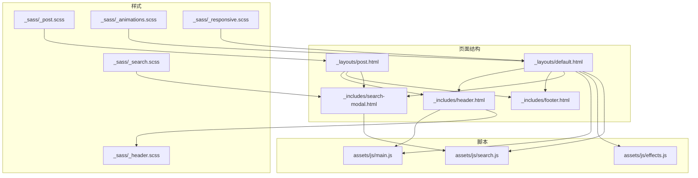
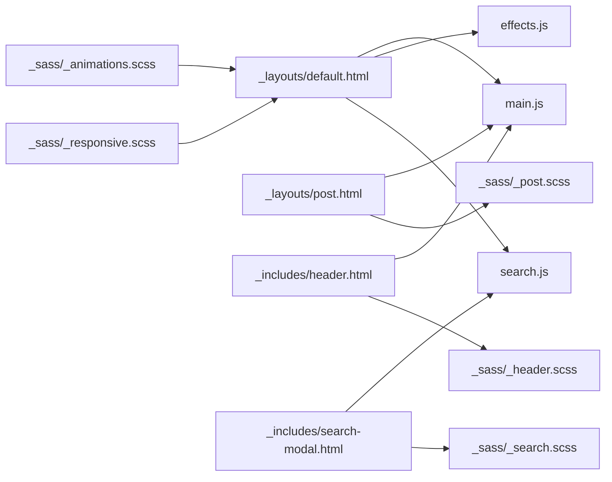
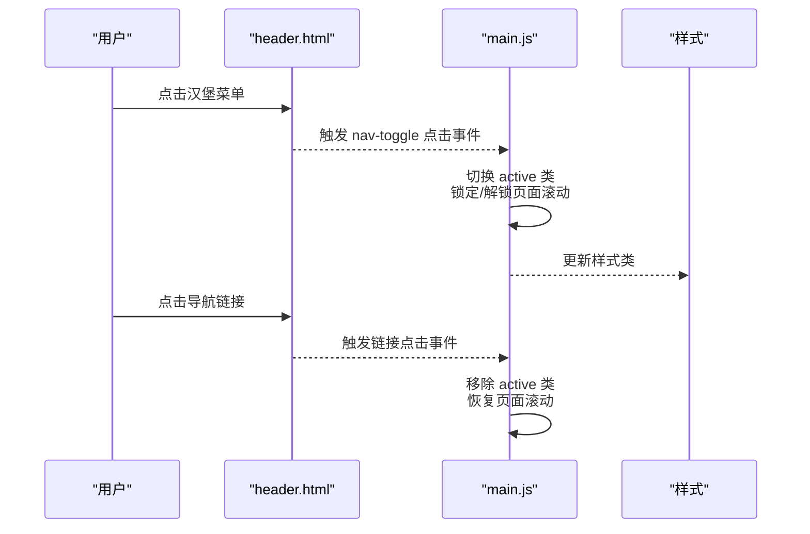
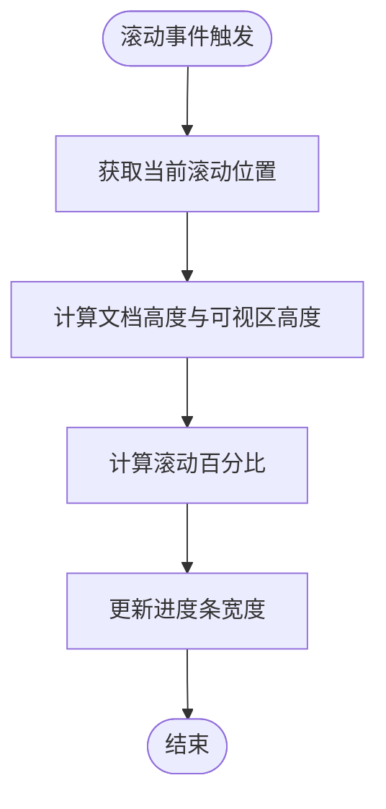
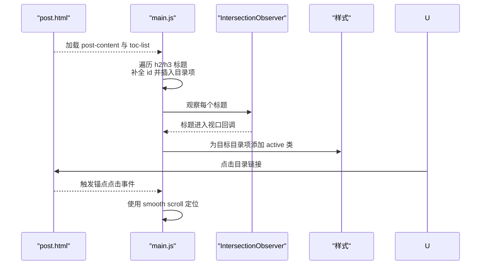
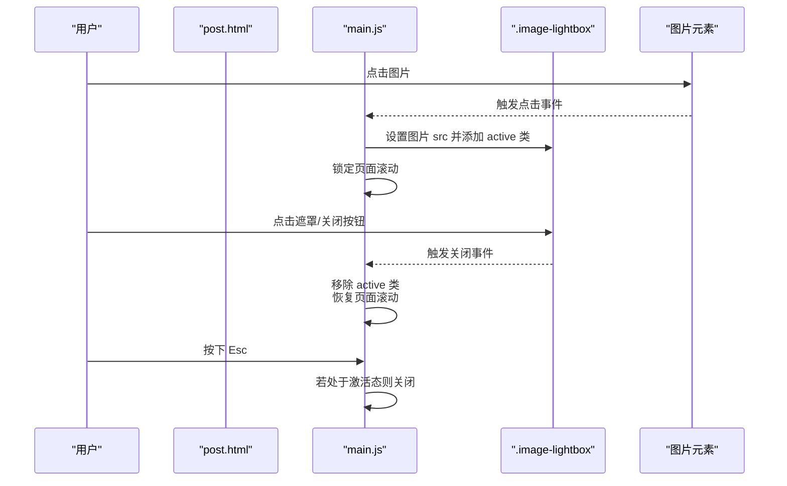
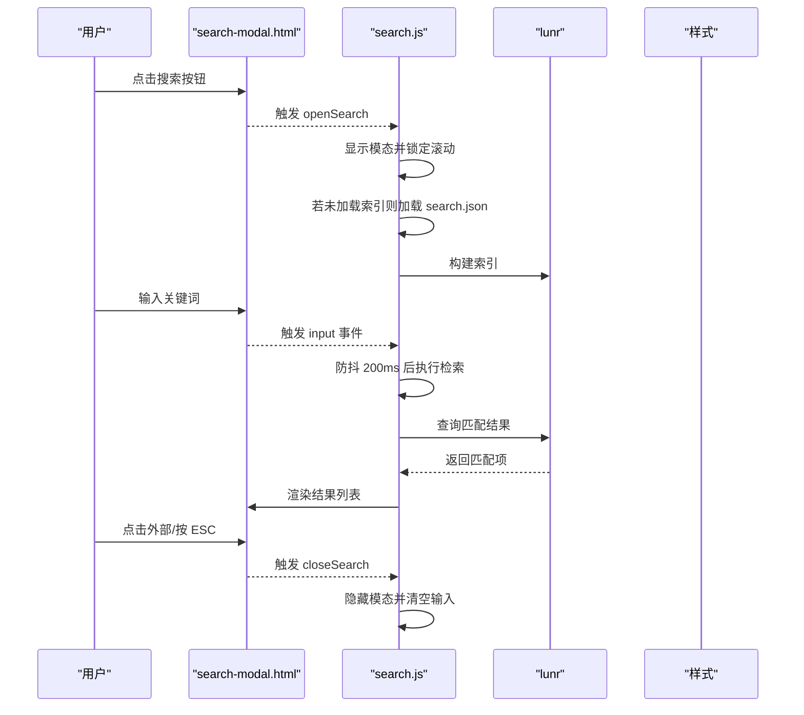
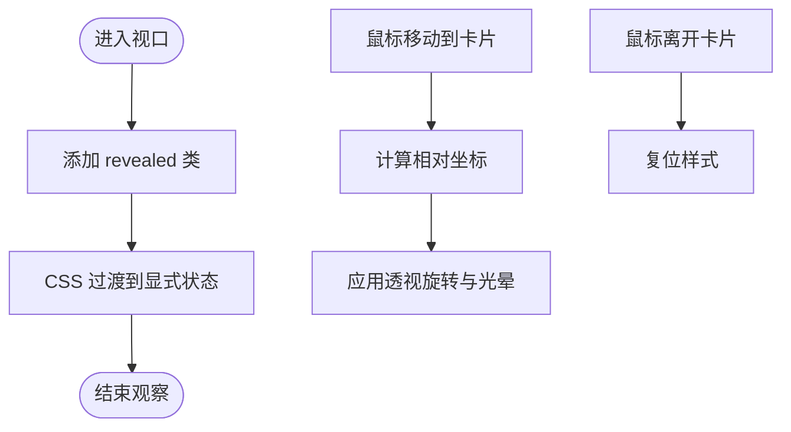
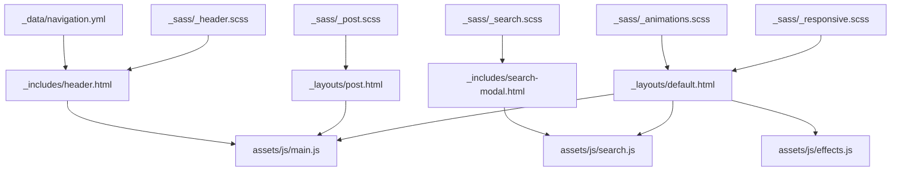

# 交互功能

<cite>
**本文引用的文件**
- [assets/js/main.js](file://assets/js/main.js)
- [assets/js/effects.js](file://assets/js/effects.js)
- [assets/js/search.js](file://assets/js/search.js)
- [_includes/header.html](file://_includes/header.html)
- [_includes/footer.html](file://_includes/footer.html)
- [_includes/search-modal.html](file://_includes/search-modal.html)
- [_layouts/default.html](file://_layouts/default.html)
- [_layouts/post.html](file://_layouts/post.html)
- [_sass/_header.scss](file://_sass/_header.scss)
- [_sass/_post.scss](file://_sass/_post.scss)
- [_sass/_search.scss](file://_sass/_search.scss)
- [_sass/_animations.scss](file://_sass/_animations.scss)
- [_sass/_responsive.scss](file://_sass/_responsive.scss)
- [_data/navigation.yml](file://_data/navigation.yml)
- [_config.yml](file://_config.yml)
</cite>

## 目录
1. [简介](#简介)
2. [项目结构](#项目结构)
3. [核心组件](#核心组件)
4. [架构总览](#架构总览)
5. [详细组件分析](#详细组件分析)
6. [依赖关系分析](#依赖关系分析)
7. [性能考量](#性能考量)
8. [故障排查指南](#故障排查指南)
9. [结论](#结论)
10. [附录：自定义与扩展指南](#附录自定义与扩展指南)

## 简介
本文件系统性梳理 labtab 的交互功能实现，覆盖导航体系（顶部导航、移动端菜单、滚动行为）、目录生成（标题提取、滚动高亮、平滑跳转）、图片灯箱（点击预览、ESC 关闭、遮罩关闭）、搜索模态（索引加载、防抖检索、键盘导航）、以及通用交互（按钮状态、动画与动效、无障碍支持）。同时提供可扩展的自定义指南与最佳实践，帮助开发者在不破坏现有架构的前提下进行二次开发。

## 项目结构
- 前端脚本位于 assets/js，分别负责主交互、视觉增强、搜索功能。
- 页面结构通过 Jekyll 布局与 includes 组合，头部、页脚、搜索模态等通过 includes 注入。
- 样式通过 Sass 分层组织，导航、文章内容、搜索模态、动画等样式文件对应相应交互模块。
- 导航数据来自 _data/navigation.yml，统一管理站点导航项。

**图表来源**
- [_layouts/default.html:1-32](file://_layouts/default.html#L1-L32)
- [_layouts/post.html:1-83](file://_layouts/post.html#L1-L83)
- [_includes/header.html:1-44](file://_includes/header.html#L1-L44)
- [_includes/footer.html:1-16](file://_includes/footer.html#L1-L16)
- [_includes/search-modal.html:1-24](file://_includes/search-modal.html#L1-L24)
- [assets/js/main.js:1-324](file://assets/js/main.js#L1-L324)
- [assets/js/effects.js:1-79](file://assets/js/effects.js#L1-L79)
- [assets/js/search.js:1-160](file://assets/js/search.js#L1-L160)
- [_sass/_header.scss:1-212](file://_sass/_header.scss#L1-L212)
- [_sass/_post.scss:1-344](file://_sass/_post.scss#L1-L344)
- [_sass/_search.scss:1-155](file://_sass/_search.scss#L1-L155)
- [_sass/_animations.scss:1-78](file://_sass/_animations.scss#L1-L78)
- [_sass/_responsive.scss:1-119](file://_sass/_responsive.scss#L1-L119)

**章节来源**
- [_layouts/default.html:1-32](file://_layouts/default.html#L1-L32)
- [_layouts/post.html:1-83](file://_layouts/post.html#L1-L83)
- [_includes/header.html:1-44](file://_includes/header.html#L1-L44)
- [_includes/footer.html:1-16](file://_includes/footer.html#L1-L16)
- [_includes/search-modal.html:1-24](file://_includes/search-modal.html#L1-L24)
- [_sass/_header.scss:1-212](file://_sass/_header.scss#L1-L212)
- [_sass/_post.scss:1-344](file://_sass/_post.scss#L1-L344)
- [_sass/_search.scss:1-155](file://_sass/_search.scss#L1-L155)
- [_sass/_animations.scss:1-78](file://_sass/_animations.scss#L1-L78)
- [_sass/_responsive.scss:1-119](file://_sass/_responsive.scss#L1-L119)

## 核心组件
- 主交互脚本（导航、滚动行为、移动端菜单、目录生成、平滑滚动、图片灯箱、滚动进度条、淡入动画）
- 视觉增强脚本（卡片倾斜与光晕、进入视口滚动揭示）
- 搜索脚本（模态打开/关闭、索引加载、防抖检索、键盘快捷键）

**章节来源**
- [assets/js/main.js:1-324](file://assets/js/main.js#L1-L324)
- [assets/js/effects.js:1-79](file://assets/js/effects.js#L1-L79)
- [assets/js/search.js:1-160](file://assets/js/search.js#L1-L160)

## 架构总览
交互功能围绕“页面结构 + 脚本 + 样式”的三层协作展开：
- 页面结构：default.html 注入 header、footer、search-modal；post.html 在文章页注入目录侧边栏与内容容器。
- 脚本：main.js 负责导航、滚动、移动端菜单、目录生成、平滑滚动、图片灯箱、滚动进度条、淡入动画；effects.js 负责卡片动效与滚动揭示；search.js 负责搜索模态与检索。
- 样式：header.scss 控制导航外观与滚动态；post.scss 控制文章内容、目录侧边栏与灯箱；search.scss 控制搜索模态；animations.scss 提供动画与无障碍降级；responsive.scss 提供响应式断点。

**图表来源**
- [_layouts/default.html:1-32](file://_layouts/default.html#L1-L32)
- [_layouts/post.html:1-83](file://_layouts/post.html#L1-L83)
- [_includes/header.html:1-44](file://_includes/header.html#L1-L44)
- [_includes/search-modal.html:1-24](file://_includes/search-modal.html#L1-L24)
- [assets/js/main.js:1-324](file://assets/js/main.js#L1-L324)
- [assets/js/effects.js:1-79](file://assets/js/effects.js#L1-L79)
- [assets/js/search.js:1-160](file://assets/js/search.js#L1-L160)
- [_sass/_header.scss:1-212](file://_sass/_header.scss#L1-L212)
- [_sass/_post.scss:1-344](file://_sass/_post.scss#L1-L344)
- [_sass/_search.scss:1-155](file://_sass/_search.scss#L1-L155)
- [_sass/_animations.scss:1-78](file://_sass/_animations.scss#L1-L78)
- [_sass/_responsive.scss:1-119](file://_sass/_responsive.scss#L1-L119)

## 详细组件分析

### 导航系统
- 顶部导航与移动端菜单
  - 顶部导航使用固定定位与过渡，滚动超过阈值时添加“scrolled”类以改变外观。
  - 移动端汉堡菜单通过切换“active”类控制显示/隐藏，并在打开时禁用页面滚动。
  - 导航链接在移动端点击后自动收起菜单。
- 语言与主题切换
  - 语言切换通过本地存储与 i18n 字典更新文案与图标；主题切换通过 data-theme 属性与本地存储持久化，并向评论系统发送主题配置。
- 无障碍与键盘支持
  - 导航按钮均设置 aria-label；搜索模态支持 ESC 关闭与 Ctrl/Cmd+K 快捷键。

**图表来源**
- [_includes/header.html:1-44](file://_includes/header.html#L1-L44)
- [assets/js/main.js:144-181](file://assets/js/main.js#L144-L181)
- [_sass/_header.scss:15-22](file://_sass/_header.scss#L15-L22)

**章节来源**
- [_includes/header.html:1-44](file://_includes/header.html#L1-L44)
- [assets/js/main.js:144-181](file://assets/js/main.js#L144-L181)
- [_sass/_header.scss:1-212](file://_sass/_header.scss#L1-L212)
- [_sass/_responsive.scss:29-48](file://_sass/_responsive.scss#L29-L48)

### 滚动行为与进度条
- 头部滚动行为：监听 scroll，超过阈值为 header 添加“scrolled”，减少内边距并增加阴影与模糊背景。
- 阅读进度条：计算滚动百分比并更新进度条宽度，使用被动事件提升滚动性能。

**图表来源**
- [assets/js/main.js:147-157](file://assets/js/main.js#L147-L157)
- [assets/js/main.js:187-197](file://assets/js/main.js#L187-L197)

**章节来源**
- [assets/js/main.js:147-157](file://assets/js/main.js#L147-L157)
- [assets/js/main.js:187-197](file://assets/js/main.js#L187-L197)
- [_layouts/default.html:16-18](file://_layouts/default.html#L16-L18)

### 目录生成（TOC）
- 自动提取：遍历文章内容中的 h2/h3 标题，若无 id 则生成唯一 id，并在右侧目录列表中生成对应链接。
- 滚动高亮：使用 IntersectionObserver，在标题进入视口时为对应目录项添加“active”类。
- 平滑滚动：点击目录项时使用 smooth scroll 定位到目标标题。
- 响应式隐藏：在小屏设备上隐藏目录侧边栏。

**图表来源**
- [_layouts/post.html:38-52](file://_layouts/post.html#L38-L52)
- [assets/js/main.js:205-247](file://assets/js/main.js#L205-L247)
- [assets/js/main.js:252-261](file://assets/js/main.js#L252-L261)
- [_sass/_post.scss:187-236](file://_sass/_post.scss#L187-L236)
- [_sass/_responsive.scss:11-13](file://_sass/_responsive.scss#L11-L13)

**章节来源**
- [_layouts/post.html:38-52](file://_layouts/post.html#L38-L52)
- [assets/js/main.js:205-247](file://assets/js/main.js#L205-L247)
- [assets/js/main.js:252-261](file://assets/js/main.js#L252-L261)
- [_sass/_post.scss:187-236](file://_sass/_post.scss#L187-L236)
- [_sass/_responsive.scss:11-13](file://_sass/_responsive.scss#L11-L13)

### 图片灯箱
- 点击预览：为文章内容中的所有图片绑定点击事件，打开灯箱并展示原图。
- ESC 关闭：监听键盘事件，按下 Escape 关闭灯箱。
- 遮罩关闭：点击遮罩层或右上角关闭按钮关闭。
- 性能优化：仅在文章页存在内容容器时初始化；避免重复创建 DOM；使用 CSS 过渡与 backdrop-filter 实现视觉效果。

**图表来源**
- [_layouts/post.html:38-52](file://_layouts/post.html#L38-L52)
- [assets/js/main.js:287-321](file://assets/js/main.js#L287-L321)
- [_sass/_post.scss:246-314](file://_sass/_post.scss#L246-L314)

**章节来源**
- [_layouts/post.html:38-52](file://_layouts/post.html#L38-L52)
- [assets/js/main.js:287-321](file://assets/js/main.js#L287-L321)
- [_sass/_post.scss:246-314](file://_sass/_post.scss#L246-L314)

### 搜索模态
- 打开/关闭：点击搜索按钮或按 Ctrl/Cmd+K 打开；点击外部区域或 ESC 关闭。
- 索引加载：首次打开时动态加载 search.json 并构建 lunr 索引。
- 防抖检索：输入框变更使用 200ms 防抖，限制查询频率。
- 结果渲染：最多展示前 8 条结果，包含标题、摘要与元信息。
- 国际化：使用 i18n 字典更新占位符与提示文案。

**图表来源**
- [_includes/search-modal.html:1-24](file://_includes/search-modal.html#L1-L24)
- [assets/js/search.js:19-70](file://assets/js/search.js#L19-L70)
- [assets/js/search.js:119-158](file://assets/js/search.js#L119-L158)
- [_sass/_search.scss:5-155](file://_sass/_search.scss#L5-L155)

**章节来源**
- [_includes/search-modal.html:1-24](file://_includes/search-modal.html#L1-L24)
- [assets/js/search.js:19-70](file://assets/js/search.js#L19-L70)
- [assets/js/search.js:119-158](file://assets/js/search.js#L119-L158)
- [_sass/_search.scss:1-155](file://_sass/_search.scss#L1-L155)

### 动画与视觉增强
- 卡片倾斜与光晕：桌面端监听鼠标移动，计算相对坐标驱动透视旋转与径向光晕；离开时复位。
- 滚动揭示：对特定节（section/archive-year/related-posts）启用 IntersectionObserver，进入视口后添加“revealed”类。
- 淡入动画：为带“animate-fade-in-up”类的元素启用逐个延迟的淡入动画；尊重“减少动态效果”偏好设置。
- 其他：导航按钮悬停态、搜索模态弹入动画、灯箱缩放过渡等。

**图表来源**
- [assets/js/effects.js:10-48](file://assets/js/effects.js#L10-L48)
- [assets/js/effects.js:53-76](file://assets/js/effects.js#L53-L76)
- [_sass/_animations.scss:68-77](file://_sass/_animations.scss#L68-L77)
- [_sass/_post.scss:246-314](file://_sass/_post.scss#L246-L314)

**章节来源**
- [assets/js/effects.js:10-48](file://assets/js/effects.js#L10-L48)
- [assets/js/effects.js:53-76](file://assets/js/effects.js#L53-L76)
- [_sass/_animations.scss:1-78](file://_sass/_animations.scss#L1-L78)
- [_sass/_post.scss:246-314](file://_sass/_post.scss#L246-L314)

### 表单验证与交互状态
- 搜索输入：使用防抖降低查询频率；空查询显示提示文案；异常查询回退至精确匹配。
- 模态交互：点击外部区域关闭；ESC 关闭；关闭时清空输入与结果。
- 导航交互：移动端菜单开关切换 body 滚动；链接点击后自动收起菜单。

**章节来源**
- [assets/js/search.js:79-110](file://assets/js/search.js#L79-L110)
- [assets/js/search.js:127-148](file://assets/js/search.js#L127-L148)
- [assets/js/main.js:165-180](file://assets/js/main.js#L165-L180)

## 依赖关系分析
- 数据依赖：导航项来源于 _data/navigation.yml，确保导航一致性。
- 样式依赖：导航、文章、搜索、动画、响应式样式分别对应不同交互模块。
- 脚本依赖：default.html 同时引入 main.js、search.js、effects.js；post.html 依赖 main.js 的目录与灯箱能力。
- 外部依赖：搜索使用 lunr.js CDN；评论系统通过 postMessage 同步主题。

**图表来源**
- [_data/navigation.yml:1-16](file://_data/navigation.yml#L1-L16)
- [_includes/header.html:1-44](file://_includes/header.html#L1-L44)
- [_layouts/default.html:1-32](file://_layouts/default.html#L1-L32)
- [_layouts/post.html:1-83](file://_layouts/post.html#L1-L83)
- [_includes/search-modal.html:1-24](file://_includes/search-modal.html#L1-L24)
- [assets/js/main.js:1-324](file://assets/js/main.js#L1-L324)
- [assets/js/effects.js:1-79](file://assets/js/effects.js#L1-L79)
- [assets/js/search.js:1-160](file://assets/js/search.js#L1-L160)
- [_sass/_header.scss:1-212](file://_sass/_header.scss#L1-L212)
- [_sass/_post.scss:1-344](file://_sass/_post.scss#L1-L344)
- [_sass/_search.scss:1-155](file://_sass/_search.scss#L1-L155)
- [_sass/_animations.scss:1-78](file://_sass/_animations.scss#L1-L78)
- [_sass/_responsive.scss:1-119](file://_sass/_responsive.scss#L1-L119)

**章节来源**
- [_data/navigation.yml:1-16](file://_data/navigation.yml#L1-L16)
- [_includes/header.html:1-44](file://_includes/header.html#L1-L44)
- [_layouts/default.html:1-32](file://_layouts/default.html#L1-L32)
- [_layouts/post.html:1-83](file://_layouts/post.html#L1-L83)
- [_includes/search-modal.html:1-24](file://_includes/search-modal.html#L1-L24)
- [assets/js/main.js:1-324](file://assets/js/main.js#L1-L324)
- [assets/js/effects.js:1-79](file://assets/js/effects.js#L1-L79)
- [assets/js/search.js:1-160](file://assets/js/search.js#L1-L160)
- [_sass/_header.scss:1-212](file://_sass/_header.scss#L1-L212)
- [_sass/_post.scss:1-344](file://_sass/_post.scss#L1-L344)
- [_sass/_search.scss:1-155](file://_sass/_search.scss#L1-L155)
- [_sass/_animations.scss:1-78](file://_sass/_animations.scss#L1-L78)
- [_sass/_responsive.scss:1-119](file://_sass/_responsive.scss#L1-L119)

## 性能考量
- 被动事件监听：滚动与触摸事件采用 passive: true，减少主线程阻塞。
- IntersectionObserver：用于目录高亮与滚动揭示，避免频繁计算与重排。
- 防抖：搜索输入防抖 200ms，降低查询压力。
- 惰性加载：搜索索引按需加载，首次打开才构建 lunr 索引。
- CSS 过渡：优先使用 transform/opacity 等 GPU 友好属性，配合 backdrop-filter 与模糊效果。
- 减少动态效果：当用户启用“减少动态效果”偏好时，动画与过渡时间被缩短，保证可用性。

**章节来源**
- [assets/js/main.js:157-157](file://assets/js/main.js#L157-L157)
- [assets/js/main.js:195-195](file://assets/js/main.js#L195-L195)
- [assets/js/effects.js:53-76](file://assets/js/effects.js#L53-L76)
- [assets/js/search.js:150-157](file://assets/js/search.js#L150-L157)
- [_sass/_animations.scss:68-77](file://_sass/_animations.scss#L68-L77)

## 故障排查指南
- 主题同步问题
  - 症状：评论主题与站点主题不一致。
  - 排查：确认 giscus iframe 是否加载完成；检查 postMessage 发送是否成功；核对 data-theme 值。
  - 参考路径：[sendGiscusTheme:13-21](file://assets/js/main.js#L13-L21)，[setTheme:23-27](file://assets/js/main.js#L23-L27)，[giscusObserver:38-47](file://assets/js/main.js#L38-L47)
- 移动端菜单无法关闭
  - 症状：点击导航链接后菜单仍保持开启。
  - 排查：确认 navMobile.querySelectorAll('.nav__link') 是否正确选择到链接；检查事件绑定顺序。
  - 参考路径：[移动端菜单事件:165-180](file://assets/js/main.js#L165-L180)
- 目录不显示或高亮异常
  - 症状：文章无标题时不显示目录；滚动时高亮不准确。
  - 排查：确认 post-content 是否存在；检查标题是否生成唯一 id；调整 IntersectionObserver 的 rootMargin。
  - 参考路径：[目录生成:205-247](file://assets/js/main.js#L205-L247)，[滚动高亮:229-241](file://assets/js/main.js#L229-L241)
- 灯箱无法打开或 ESC 不生效
  - 症状：点击图片无反应；按 ESC 无效。
  - 排查：确认 post-content 存在；检查 lightbox DOM 是否创建；验证键盘事件绑定。
  - 参考路径：[灯箱初始化与事件:287-321](file://assets/js/main.js#L287-L321)
- 搜索无结果或报错
  - 症状：输入后无结果或控制台报错。
  - 排查：确认 search.json 可访问；检查 baseurl 解析逻辑；查看异常捕获与回退逻辑。
  - 参考路径：[索引加载:36-70](file://assets/js/search.js#L36-L70)，[异常回退:86-90](file://assets/js/search.js#L86-L90)

**章节来源**
- [assets/js/main.js:13-21](file://assets/js/main.js#L13-L21)
- [assets/js/main.js:38-47](file://assets/js/main.js#L38-L47)
- [assets/js/main.js:165-180](file://assets/js/main.js#L165-L180)
- [assets/js/main.js:205-247](file://assets/js/main.js#L205-L247)
- [assets/js/main.js:229-241](file://assets/js/main.js#L229-L241)
- [assets/js/main.js:287-321](file://assets/js/main.js#L287-L321)
- [assets/js/search.js:36-70](file://assets/js/search.js#L36-L70)
- [assets/js/search.js:86-90](file://assets/js/search.js#L86-L90)

## 结论
labtab 的交互设计以简洁、可维护为核心，通过分层的脚本与样式实现导航、目录、灯箱、搜索与动画等丰富体验。借助被动事件、IntersectionObserver、防抖与惰性加载等策略，整体性能表现良好。建议在扩展新功能时遵循现有命名规范与模块边界，优先使用 IntersectionObserver 与 CSS 过渡，确保跨设备与无障碍兼容。

## 附录：自定义与扩展指南
- 事件处理
  - 使用事件委托减少绑定数量；对高频事件（如 scroll、resize、input）采用防抖/节流。
  - 对键盘快捷键统一在文档级监听，避免重复绑定。
- DOM 操作
  - 将一次性创建的元素缓存于变量；批量修改样式时合并重排。
  - 通过 data-* 属性传递配置，避免硬编码。
- 性能优化技巧
  - 优先使用 transform/opacity；避免在动画中触发布局。
  - 使用 IntersectionObserver 替代频繁的 offset 计算。
  - 对大列表采用虚拟滚动或分页。
- 可访问性
  - 为交互元素提供 aria-label；为模态设置 role="dialog" 与 aria-modal。
  - 支持键盘操作（Tab、Enter、Escape）；焦点管理清晰。
- 扩展开发方法
  - 新增交互模块时，先在样式中定义类名与动画，再在脚本中绑定事件与状态切换。
  - 对需要持久化的状态（如主题、语言）使用 localStorage，并在页面初始化时读取。
  - 对外部服务（如评论、搜索）通过 postMessage 或异步加载方式集成，确保失败回退与错误提示。