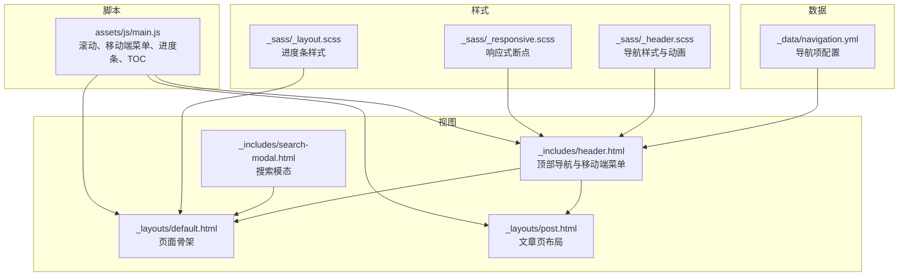
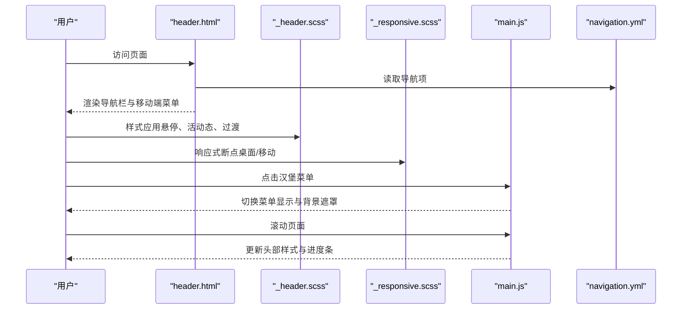
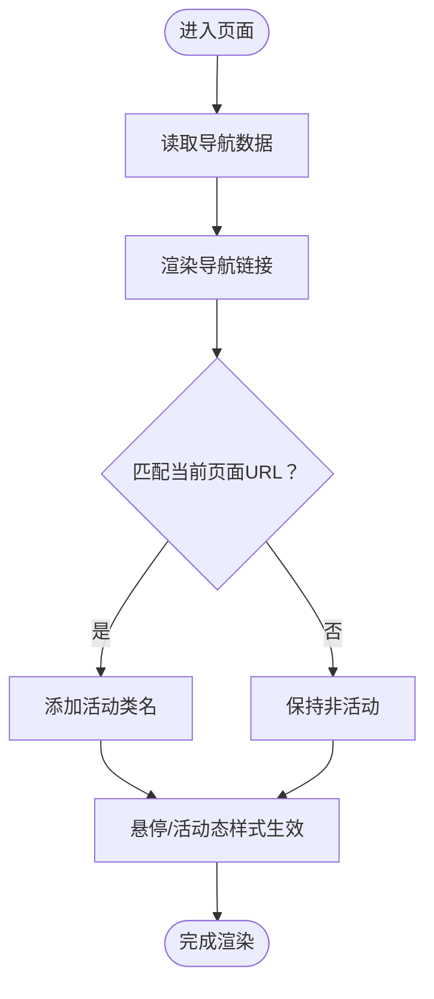
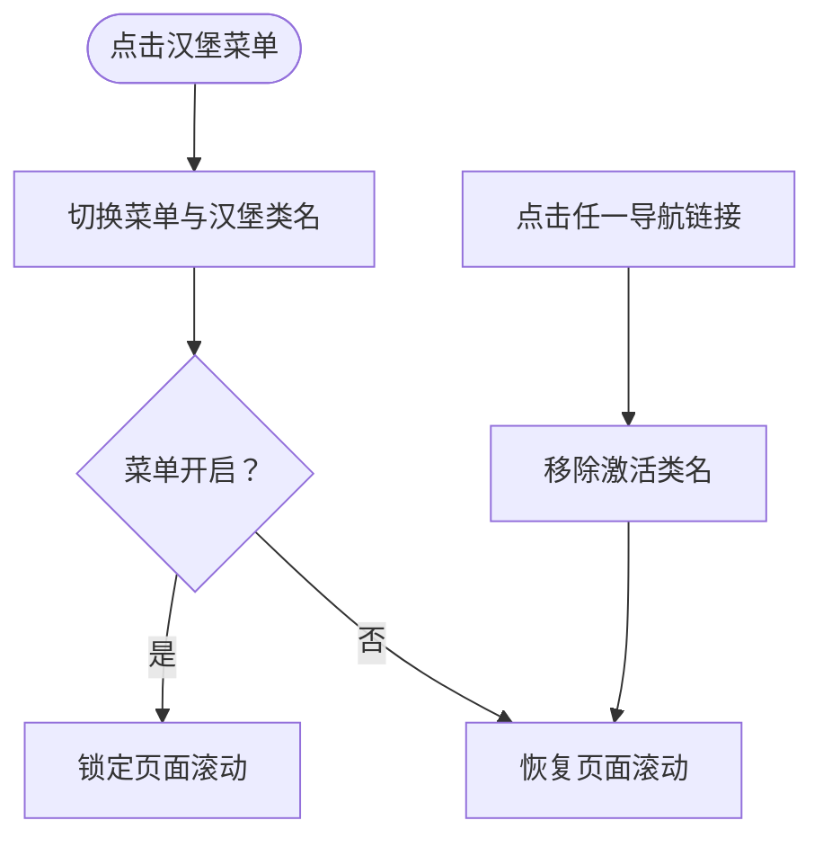
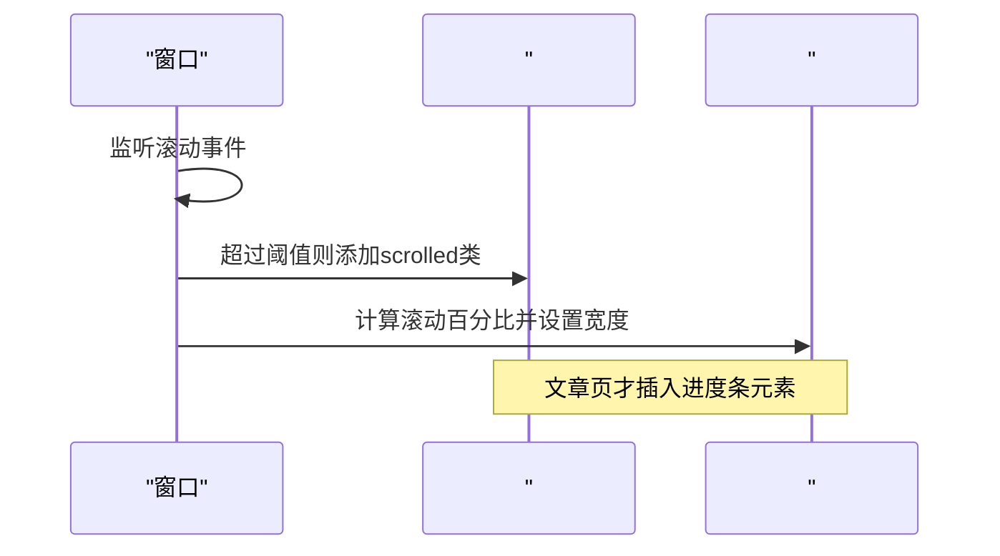
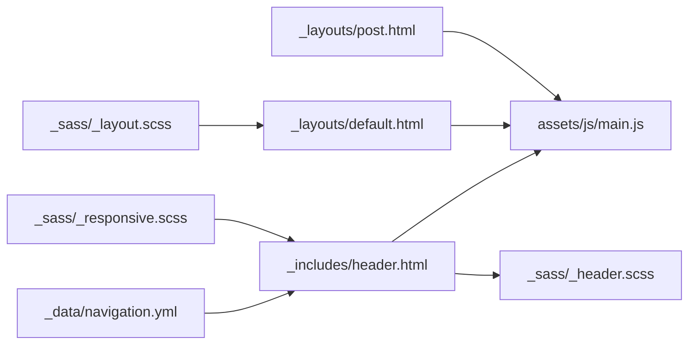

# 导航系统

<cite>
**本文引用的文件**
- [_includes/header.html](file://_includes/header.html)
- [_sass/_header.scss](file://_sass/_header.scss)
- [_sass/_responsive.scss](file://_sass/_responsive.scss)
- [_sass/_layout.scss](file://_sass/_layout.scss)
- [assets/js/main.js](file://assets/js/main.js)
- [_layouts/default.html](file://_layouts/default.html)
- [_layouts/post.html](file://_layouts/post.html)
- [_data/navigation.yml](file://_data/navigation.yml)
- [_includes/search-modal.html](file://_includes/search-modal.html)
- [_config.yml](file://_config.yml)
</cite>

## 目录
1. [简介](#简介)
2. [项目结构](#项目结构)
3. [核心组件](#核心组件)
4. [架构总览](#架构总览)
5. [详细组件分析](#详细组件分析)
6. [依赖关系分析](#依赖关系分析)
7. [性能考量](#性能考量)
8. [故障排查指南](#故障排查指南)
9. [结论](#结论)
10. [附录](#附录)

## 简介
本文件为导航系统的详细技术文档，聚焦于顶部导航栏的实现（导航项渲染、活动状态管理、响应式设计）、移动端菜单功能（汉堡菜单切换、背景遮罩）、滚动行为处理（滚动监听、头部样式变化、进度条显示），以及面包屑导航的实现原理与自定义方法。同时提供扩展指南（新增导航项、修改样式、添加动画效果）与最佳实践。

## 项目结构
导航系统由 Jekyll 模板片段、SCSS 样式与 JavaScript 逻辑共同组成，采用“数据驱动 + 组件化”的方式实现：
- 数据层：通过站点数据文件定义导航项
- 视图层：通过模板片段渲染导航栏与移动端菜单
- 样式层：通过 SCSS 控制外观、交互与响应式断点
- 行为层：通过 JavaScript 实现滚动、移动端菜单、进度条等交互

**图表来源**
- [_data/navigation.yml:1-16](file://_data/navigation.yml#L1-L16)
- [_includes/header.html:1-44](file://_includes/header.html#L1-L44)
- [_includes/search-modal.html:1-24](file://_includes/search-modal.html#L1-L24)
- [_layouts/default.html:1-32](file://_layouts/default.html#L1-L32)
- [_layouts/post.html:1-83](file://_layouts/post.html#L1-L83)
- [_sass/_header.scss:1-212](file://_sass/_header.scss#L1-L212)
- [_sass/_responsive.scss:1-119](file://_sass/_responsive.scss#L1-L119)
- [_sass/_layout.scss:96-106](file://_sass/_layout.scss#L96-L106)
- [assets/js/main.js:144-197](file://assets/js/main.js#L144-L197)

**章节来源**
- [_includes/header.html:1-44](file://_includes/header.html#L1-L44)
- [_sass/_header.scss:1-212](file://_sass/_header.scss#L1-L212)
- [_sass/_responsive.scss:29-43](file://_sass/_responsive.scss#L29-L43)
- [_sass/_layout.scss:96-106](file://_sass/_layout.scss#L96-L106)
- [assets/js/main.js:144-197](file://assets/js/main.js#L144-L197)
- [_layouts/default.html:16-18](file://_layouts/default.html#L16-L18)
- [_layouts/post.html:38-47](file://_layouts/post.html#L38-L47)
- [_data/navigation.yml:1-16](file://_data/navigation.yml#L1-L16)

## 核心组件
- 顶部导航栏：包含 Logo、主导航链接、语言切换、主题切换、搜索按钮与汉堡菜单
- 移动端菜单：汉堡菜单触发，覆盖全屏遮罩，点击链接自动关闭
- 滚动行为：滚动超过阈值时头部样式变化；文章页显示阅读进度条
- 面包屑导航：当前实现以文章页标题与分类/标签链接为主，未见通用面包屑组件

**章节来源**
- [_includes/header.html:1-44](file://_includes/header.html#L1-L44)
- [_sass/_header.scss:15-22](file://_sass/_header.scss#L15-L22)
- [assets/js/main.js:144-197](file://assets/js/main.js#L144-L197)
- [_layouts/post.html:14-34](file://_layouts/post.html#L14-L34)

## 架构总览
导航系统采用“模板 + 样式 + 脚本”三层协作：
- 模板负责结构与数据绑定（Jekyll Liquid）
- 样式负责视觉与交互（SCSS）
- 脚本负责运行时行为（滚动、菜单、进度条）

**图表来源**
- [_includes/header.html:1-44](file://_includes/header.html#L1-L44)
- [_sass/_header.scss:1-212](file://_sass/_header.scss#L1-L212)
- [_sass/_responsive.scss:29-43](file://_sass/_responsive.scss#L29-L43)
- [assets/js/main.js:144-197](file://assets/js/main.js#L144-L197)
- [_data/navigation.yml:1-16](file://_data/navigation.yml#L1-L16)

## 详细组件分析

### 顶部导航栏与活动状态管理
- 导航项渲染：通过站点数据文件循环生成主导航链接，并根据当前页面 URL 动态添加活动类名
- 活动状态：使用类名控制下划线动画与文本颜色变化
- 交互细节：悬停时下划线从 0 扩展至 70%，活动态保持该状态

**图表来源**
- [_includes/header.html:6-12](file://_includes/header.html#L6-L12)
- [_sass/_header.scss:78-85](file://_sass/_header.scss#L78-L85)
- [_data/navigation.yml:1-16](file://_data/navigation.yml#L1-L16)

**章节来源**
- [_includes/header.html:6-12](file://_includes/header.html#L6-L12)
- [_sass/_header.scss:56-86](file://_sass/_header.scss#L56-L86)
- [_data/navigation.yml:1-16](file://_data/navigation.yml#L1-L16)

### 响应式设计与移动端菜单
- 断点策略：在特定宽度下隐藏桌面导航、显示汉堡菜单、隐藏搜索快捷键
- 汉堡菜单：三段式线条，激活时旋转形成“×”图标
- 菜单遮罩：覆盖全屏玻璃模糊背景，居中垂直排列导航链接
- 关闭机制：点击任意链接后自动关闭菜单并恢复页面滚动

**图表来源**
- [_sass/_responsive.scss:29-43](file://_sass/_responsive.scss#L29-L43)
- [_sass/_header.scss:157-211](file://_sass/_header.scss#L157-L211)
- [assets/js/main.js:165-180](file://assets/js/main.js#L165-L180)

**章节来源**
- [_sass/_responsive.scss:29-43](file://_sass/_responsive.scss#L29-L43)
- [_sass/_header.scss:157-211](file://_sass/_header.scss#L157-L211)
- [assets/js/main.js:165-180](file://assets/js/main.js#L165-L180)

### 滚动行为处理（头部样式与进度条）
- 头部样式变化：滚动超过阈值时为容器添加“scrolled”类，改变内边距、背景与阴影
- 进度条：仅在文章页显示，基于窗口滚动位置计算百分比宽度，实时更新

**图表来源**
- [assets/js/main.js:144-157](file://assets/js/main.js#L144-L157)
- [assets/js/main.js:185-197](file://assets/js/main.js#L185-L197)
- [_sass/_layout.scss:96-106](file://_sass/_layout.scss#L96-L106)
- [_layouts/default.html:16-18](file://_layouts/default.html#L16-L18)

**章节来源**
- [assets/js/main.js:144-157](file://assets/js/main.js#L144-L157)
- [assets/js/main.js:185-197](file://assets/js/main.js#L185-L197)
- [_sass/_layout.scss:96-106](file://_sass/_layout.scss#L96-L106)
- [_layouts/default.html:16-18](file://_layouts/default.html#L16-L18)

### 面包屑导航
- 当前实现：文章页通过标题与分类/标签链接体现层级信息，未见通用面包屑组件或数据源
- 自定义建议：可在布局中引入路径解析或站点数据，动态生成面包屑列表

**章节来源**
- [_layouts/post.html:14-34](file://_layouts/post.html#L14-L34)

### 搜索与国际化按钮
- 搜索按钮：打开搜索模态框，支持键盘快捷键提示
- 国际化按钮：切换语言字典，更新文案与语言属性

**章节来源**
- [_includes/header.html:15-29](file://_includes/header.html#L15-L29)
- [_includes/search-modal.html:1-24](file://_includes/search-modal.html#L1-L24)
- [assets/js/main.js:52-139](file://assets/js/main.js#L52-L139)

## 依赖关系分析
- 模板依赖数据：导航项来源于站点数据文件
- 样式依赖变量：颜色、字体、间距等变量统一管理
- 脚本依赖 DOM：滚动、菜单、进度条均依赖对应元素存在性判断

**图表来源**
- [_data/navigation.yml:1-16](file://_data/navigation.yml#L1-L16)
- [_includes/header.html:1-44](file://_includes/header.html#L1-L44)
- [_sass/_header.scss:1-212](file://_sass/_header.scss#L1-L212)
- [_sass/_responsive.scss:1-119](file://_sass/_responsive.scss#L1-L119)
- [_sass/_layout.scss:96-106](file://_sass/_layout.scss#L96-L106)
- [assets/js/main.js:144-197](file://assets/js/main.js#L144-L197)
- [_layouts/default.html:1-32](file://_layouts/default.html#L1-L32)
- [_layouts/post.html:1-83](file://_layouts/post.html#L1-L83)

**章节来源**
- [_data/navigation.yml:1-16](file://_data/navigation.yml#L1-L16)
- [_includes/header.html:1-44](file://_includes/header.html#L1-L44)
- [_sass/_header.scss:1-212](file://_sass/_header.scss#L1-L212)
- [_sass/_responsive.scss:1-119](file://_sass/_responsive.scss#L1-L119)
- [_sass/_layout.scss:96-106](file://_sass/_layout.scss#L96-L106)
- [assets/js/main.js:144-197](file://assets/js/main.js#L144-L197)
- [_layouts/default.html:1-32](file://_layouts/default.html#L1-L32)
- [_layouts/post.html:1-83](file://_layouts/post.html#L1-L83)

## 性能考量
- 滚动事件监听：使用被动监听以减少主线程阻塞
- IntersectionObserver：用于高亮目录与淡入动画，避免频繁重排
- 样式过渡：使用 CSS 过渡而非 JS 动画，降低 CPU 占用
- 汉堡菜单：仅在移动端启用，减少桌面端无谓渲染

**章节来源**
- [assets/js/main.js:157-157](file://assets/js/main.js#L157-L157)
- [assets/js/main.js:268-282](file://assets/js/main.js#L268-L282)
- [_sass/_header.scss:13-13](file://_sass/_header.scss#L13-L13)
- [_sass/_responsive.scss:29-43](file://_sass/_responsive.scss#L29-L43)

## 故障排查指南
- 导航项不显示或不生效
  - 检查数据文件是否存在且格式正确
  - 确认模板中循环渲染逻辑与活动类名条件
  - 参考：[_data/navigation.yml:1-16](file://_data/navigation.yml#L1-L16)，[_includes/header.html:6-12](file://_includes/header.html#L6-L12)
- 移动端菜单无法关闭
  - 确认脚本是否正确绑定点击事件与移除类名
  - 参考：[assets/js/main.js:165-180](file://assets/js/main.js#L165-L180)
- 进度条不显示
  - 确认文章页布局已插入进度条元素
  - 参考：[_layouts/default.html:16-18](file://_layouts/default.html#L16-L18)，[_sass/_layout.scss:96-106](file://_sass/_layout.scss#L96-L106)
- 滚动样式未变化
  - 检查阈值与类名切换逻辑
  - 参考：[assets/js/main.js:144-157](file://assets/js/main.js#L144-L157)，[_sass/_header.scss:15-22](file://_sass/_header.scss#L15-L22)
- 主题/语言切换无效
  - 检查本地存储与 DOM 属性设置
  - 参考：[assets/js/main.js:23-35](file://assets/js/main.js#L23-L35)，[assets/js/main.js:106-139](file://assets/js/main.js#L106-L139)

**章节来源**
- [_data/navigation.yml:1-16](file://_data/navigation.yml#L1-L16)
- [_includes/header.html:6-12](file://_includes/header.html#L6-L12)
- [assets/js/main.js:165-180](file://assets/js/main.js#L165-L180)
- [_layouts/default.html:16-18](file://_layouts/default.html#L16-L18)
- [_sass/_layout.scss:96-106](file://_sass/_layout.scss#L96-L106)
- [_sass/_header.scss:15-22](file://_sass/_header.scss#L15-L22)
- [assets/js/main.js:23-35](file://assets/js/main.js#L23-L35)
- [assets/js/main.js:106-139](file://assets/js/main.js#L106-L139)

## 结论
该导航系统以简洁的数据驱动方式实现，结合 SCSS 的过渡与响应式能力，配合轻量的 JavaScript 逻辑，提供了良好的可维护性与可扩展性。建议在后续迭代中补充通用面包屑组件与更完善的无障碍支持。

## 附录

### 扩展指南
- 新增导航项
  - 在数据文件中添加新条目，模板会自动渲染
  - 参考：[_data/navigation.yml:1-16](file://_data/navigation.yml#L1-L16)，[_includes/header.html:6-12](file://_includes/header.html#L6-L12)
- 修改样式
  - 调整颜色、字体、间距与过渡参数
  - 参考：[_sass/_header.scss:1-212](file://_sass/_header.scss#L1-L212)，[_sass/_variables.scss](file://_sass/_variables.scss)
- 添加动画效果
  - 使用现有过渡或新增 CSS 动画类
  - 参考：[_sass/_animations.scss](file://_sass/_animations.scss)
- 自定义面包屑
  - 在布局中引入路径解析或站点数据，生成面包屑列表
  - 参考：[_layouts/post.html:14-34](file://_layouts/post.html#L14-L34)

### 最佳实践
- 使用被动监听优化滚动性能
- 将交互逻辑集中在单一模块，便于维护
- 保持数据与视图分离，提高可测试性
- 在移动端优先考虑可访问性与手势支持