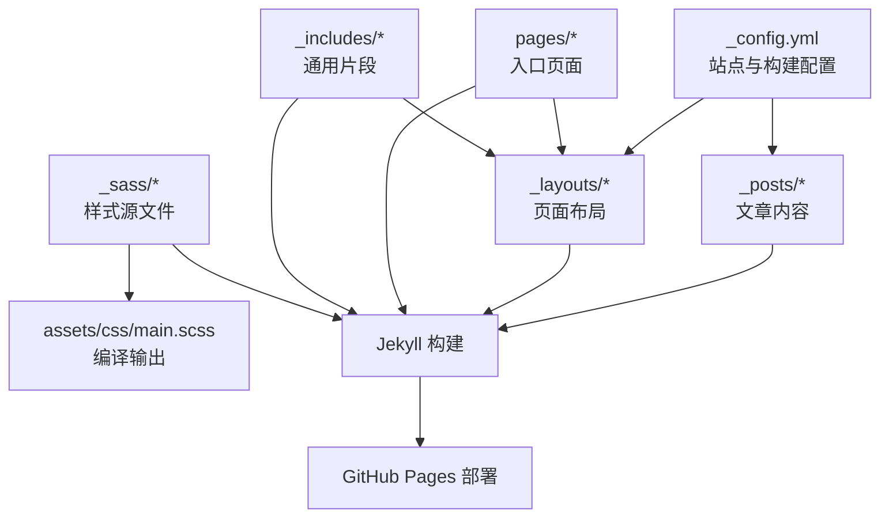
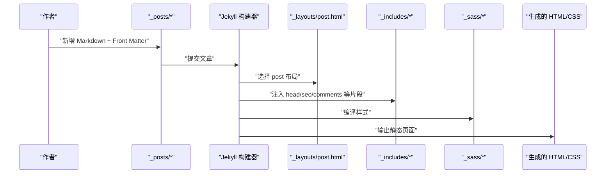
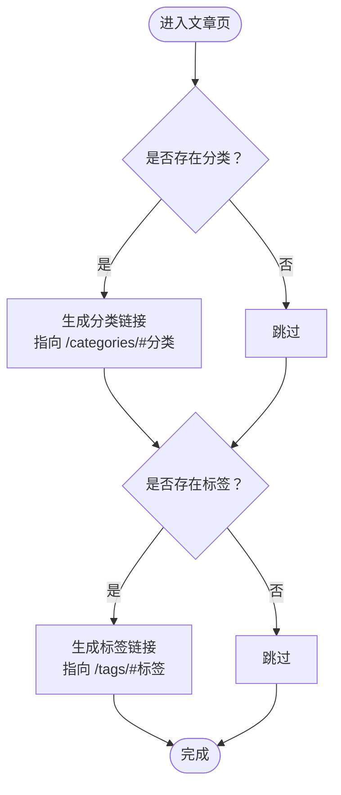
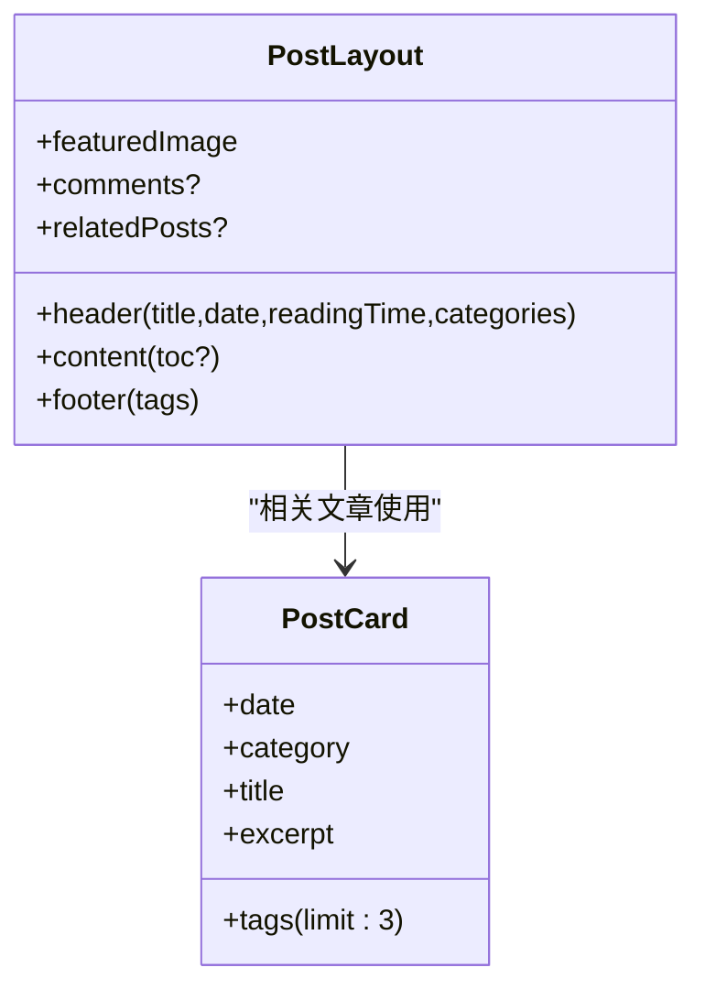
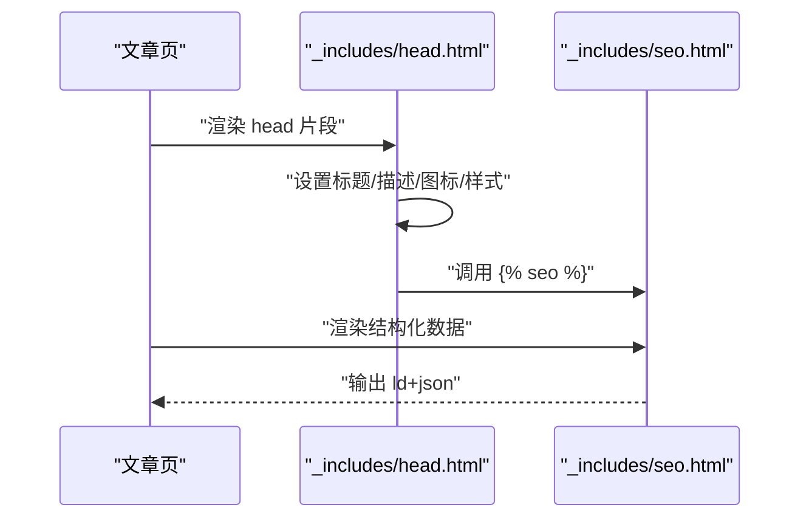
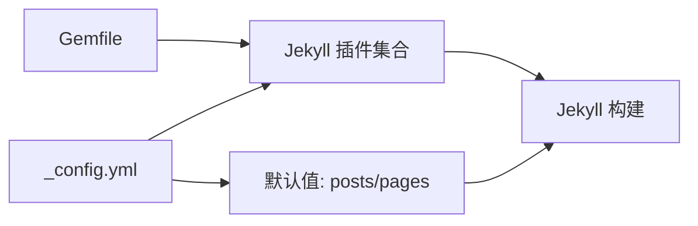

# 内容管理

<cite>
**本文引用的文件**
- [_config.yml](file://_config.yml)
- [Gemfile](file://Gemfile)
- [README.md](file://README.md)
- [_posts/2026-05-17-welcome-to-labtab.md](file://_posts/2026-05-17-welcome-to-labtab.md)
- [_posts/2026-01-01-2025-annual-review.md](file://_posts/2026-01-01-2025-annual-review.md)
- [_layouts/post.html](file://_layouts/post.html)
- [_layouts/categories.html](file://_layouts/categories.html)
- [_layouts/tags.html](file://_layouts/tags.html)
- [pages/categories.html](file://pages/categories.html)
- [pages/tags.html](file://pages/tags.html)
- [_includes/head.html](file://_includes/head.html)
- [_includes/seo.html](file://_includes/seo.html)
- [_includes/post-card.html](file://_includes/post-card.html)
- [_sass/_post.scss](file://_sass/_post.scss)
</cite>

## 目录
1. [简介](#简介)
2. [项目结构](#项目结构)
3. [核心组件](#核心组件)
4. [架构总览](#架构总览)
5. [详细组件分析](#详细组件分析)
6. [依赖关系分析](#依赖关系分析)
7. [性能考量](#性能考量)
8. [故障排查指南](#故障排查指南)
9. [结论](#结论)
10. [附录](#附录)

## 简介
本文件为 labtab 的内容管理系统提供系统化文档，围绕 Jekyll 文章发布流程展开，涵盖 Markdown 文件格式与 Front Matter 配置、文件命名约定、分类与标签系统、文章布局系统、SEO 优化、最佳实践与实用模板。读者可据此快速上手内容创作与管理。

## 项目结构
labtab 使用 Jekyll 静态站点生成器，采用典型的 Jekyll 目录结构：
- 根配置与构建设置位于根目录配置文件
- 文章统一存放于 _posts 目录，按日期命名
- 页面布局与模板位于 _layouts
- 页面入口与导航数据位于 pages 与 _data
- SEO、头部元信息与评论等通用片段位于 _includes
- 样式通过 Sass 编译输出至 assets/css

图表来源
- [_config.yml:1-91](file://_config.yml#L1-L91)
- [_posts/2026-05-17-welcome-to-labtab.md:1-92](file://_posts/2026-05-17-welcome-to-labtab.md#L1-L92)
- [_layouts/post.html:1-83](file://_layouts/post.html#L1-L83)
- [pages/categories.html:1-6](file://pages/categories.html#L1-L6)
- [_includes/head.html:1-30](file://_includes/head.html#L1-L30)
- [_sass/_post.scss:1-344](file://_sass/_post.scss#L1-L344)

章节来源
- [_config.yml:1-91](file://_config.yml#L1-L91)
- [README.md:1-50](file://README.md#L1-L50)

## 核心组件
- 站点与构建配置：定义站点元信息、Markdown 渲染、高亮、分页、插件与默认值等
- 文章与 Front Matter：定义文章布局、标题、日期、分类、标签、目录与评论开关等
- 布局系统：post.html 作为文章页布局，categories.html 与 tags.html 提供分类与标签聚合页
- SEO 与头部：head.html 注入 SEO 元信息，seo.html 输出结构化数据
- 通用片段：post-card.html 用于卡片展示，便于在列表页复用
- 样式体系：_sass/_post.scss 提供文章页排版与交互细节

章节来源
- [_config.yml:1-91](file://_config.yml#L1-L91)
- [_posts/2026-05-17-welcome-to-labtab.md:1-92](file://_posts/2026-05-17-welcome-to-labtab.md#L1-L92)
- [_layouts/post.html:1-83](file://_layouts/post.html#L1-L83)
- [_layouts/categories.html:1-41](file://_layouts/categories.html#L1-L41)
- [_layouts/tags.html:1-45](file://_layouts/tags.html#L1-L45)
- [_includes/head.html:1-30](file://_includes/head.html#L1-L30)
- [_includes/seo.html:1-27](file://_includes/seo.html#L1-L27)
- [_includes/post-card.html:1-28](file://_includes/post-card.html#L1-L28)
- [_sass/_post.scss:1-344](file://_sass/_post.scss#L1-L344)

## 架构总览
下图展示了从文章内容到最终页面渲染的关键流程：Jekyll 解析 _posts 中的 Markdown 与 Front Matter，应用 _layouts/post.html 布局，注入 _includes 片段，并结合 _sass 样式生成静态页面；页面入口 pages/categories.html 与 pages/tags.html 分别映射到分类与标签聚合页布局。

图表来源
- [_posts/2026-05-17-welcome-to-labtab.md:1-92](file://_posts/2026-05-17-welcome-to-labtab.md#L1-L92)
- [_layouts/post.html:1-83](file://_layouts/post.html#L1-L83)
- [_includes/head.html:1-30](file://_includes/head.html#L1-L30)
- [_includes/seo.html:1-27](file://_includes/seo.html#L1-L27)
- [_sass/_post.scss:1-344](file://_sass/_post.scss#L1-L344)

## 详细组件分析

### Jekyll 文章发布流程与 Front Matter
- 发布流程
  - 在 _posts 目录按 YYYY-MM-DD-title.md 命名新增 Markdown 文件
  - 在文件顶部以 YAML Front Matter 声明布局、标题、日期、分类、标签、目录与评论等字段
  - 本地或 CI 触发构建，生成静态页面
- Front Matter 字段说明
  - layout：指定页面布局，如 post
  - title：文章标题
  - date：发布时间（含时区）
  - categories：分类数组，支持多分类
  - tags：标签数组
  - toc：是否显示目录侧边栏
  - comments：是否启用评论
  - excerpt：摘要，用于 SEO 描述与列表摘要
- 示例与模板
  - 参考现有文章的 Front Matter 结构与命名约定
  - 参考 README 中“如何新增文章”的步骤与模板

章节来源
- [_posts/2026-05-17-welcome-to-labtab.md:1-92](file://_posts/2026-05-17-welcome-to-labtab.md#L1-L92)
- [_posts/2026-01-01-2025-annual-review.md:1-162](file://_posts/2026-01-01-2025-annual-review.md#L1-L162)
- [README.md:14-32](file://README.md#L14-L32)

### 分类与标签系统
- 分类与标签的使用
  - 在 Front Matter 中设置 categories 与 tags 数组
  - 分类页与标签页通过 Jekyll 集合自动聚合：site.categories 与 site.tags
- 分类页布局与入口
  - pages/categories.html 指定 layout: categories，并设置 permalink
  - _layouts/categories.html 展示分类卡片与按分类分组的文章列表
- 标签页布局与入口
  - pages/tags.html 指定 layout: tags，并设置 permalink
  - _layouts/tags.html 展示标签云与按标签分组的文章列表
- 文章页中的分类/标签链接
  - _layouts/post.html 中根据 page.categories 与 page.tags 生成链接，点击跳转到分类/标签页锚点

图表来源
- [_layouts/post.html:27-62](file://_layouts/post.html#L27-L62)
- [_layouts/categories.html:13-31](file://_layouts/categories.html#L13-L31)
- [_layouts/tags.html:22-32](file://_layouts/tags.html#L22-L32)

章节来源
- [_posts/2026-05-17-welcome-to-labtab.md:5-6](file://_posts/2026-05-17-welcome-to-labtab.md#L5-L6)
- [_posts/2026-01-01-2025-annual-review.md:5-6](file://_posts/2026-01-01-2025-annual-review.md#L5-L6)
- [pages/categories.html:1-6](file://pages/categories.html#L1-L6)
- [_layouts/categories.html:1-41](file://_layouts/categories.html#L1-L41)
- [pages/tags.html:1-6](file://pages/tags.html#L1-L6)
- [_layouts/tags.html:1-45](file://_layouts/tags.html#L1-L45)
- [_layouts/post.html:27-62](file://_layouts/post.html#L27-L62)

### 文章布局系统：post.html
- 结构要点
  - 特色图片区域：当 page.image 存在时显示
  - 文章头部：标题、日期、阅读时长、分类链接
  - 正文内容：支持目录侧边栏（当 page.toc 为真时）
  - 文章底部：标签云
  - 评论模块：当 page.comments 不为 false 时加载
  - 相关文章：基于 site.related_posts 的前若干篇
- 自定义选项
  - toc：控制是否渲染目录侧边栏
  - comments：控制是否渲染评论
  - categories/tags：控制头部与底部的分类/标签展示
  - image：控制特色图片展示

图表来源
- [_layouts/post.html:1-83](file://_layouts/post.html#L1-L83)
- [_includes/post-card.html:1-28](file://_includes/post-card.html#L1-L28)

章节来源
- [_layouts/post.html:1-83](file://_layouts/post.html#L1-L83)
- [_includes/post-card.html:1-28](file://_includes/post-card.html#L1-L28)

### SEO 与头部元信息
- 头部注入
  - head.html 动态设置标题与描述，预连接字体与图标，引入主样式与 RSS
  - 引入 jekyll-seo-tag 的  片段，自动生成标准 SEO 元信息
- 结构化数据
  - seo.html 在文章页输出 BlogPosting 的结构化数据，包含标题、发布时间、修改时间、作者、出版者、描述与页面地址等

图表来源
- [_includes/head.html:1-30](file://_includes/head.html#L1-L30)
- [_includes/seo.html:1-27](file://_includes/seo.html#L1-L27)

章节来源
- [_includes/head.html:1-30](file://_includes/head.html#L1-L30)
- [_includes/seo.html:1-27](file://_includes/seo.html#L1-L27)
- [_config.yml:84-91](file://_config.yml#L84-L91)

### 样式与排版：文章内容样式
- 文章页排版要点
  - 标题层级、段落行高、列表样式、内联与代码块高亮
  - 目录侧边栏、图片缩放与灯箱交互、标签云与分类标签的玻璃拟态风格
  - 相关文章网格布局
- 关键样式类
  - .post-header、.post-content、.toc、.post-tags、.post-layout、.related-posts 等

章节来源
- [_sass/_post.scss:1-344](file://_sass/_post.scss#L1-L344)

## 依赖关系分析
- 构建与插件
  - Gemfile 指定 Jekyll 版本与插件：jekyll-feed、jekyll-seo-tag、jekyll-sitemap、jekyll-paginate-v2、jekyll-include-cache
  - _config.yml 启用插件并配置分页、语法高亮、Permalink 等
- 默认值与继承
  - _config.yml 中为 posts 与 pages 设置默认布局与属性，简化 Front Matter

图表来源
- [Gemfile:1-14](file://Gemfile#L1-L14)
- [_config.yml:35-64](file://_config.yml#L35-L64)

章节来源
- [Gemfile:1-14](file://Gemfile#L1-L14)
- [_config.yml:35-64](file://_config.yml#L35-L64)

## 性能考量
- 构建性能
  - 合理控制文章数量与图片尺寸，避免过大的资源影响构建时间
  - 使用 jekyll-paginate-v2 控制分页大小，减少单页渲染压力
- 前端性能
  - 图片懒加载与骨架屏：文章页已内置图片缩放与悬停效果，建议配合懒加载策略
  - 目录侧边栏使用粘性定位，提升长文阅读体验
- SEO 与索引
  - jekyll-sitemap 与 jekyll-feed 自动生成站点地图与订阅源，利于搜索引擎抓取

## 故障排查指南
- Front Matter 字段缺失导致渲染异常
  - 确认 layout、title、date 必填项齐全；categories/tags 为数组格式
- 分类/标签页无法显示内容
  - 检查 pages/categories.html 与 pages/tags.html 的 permalink 是否正确
  - 确认 _layouts/categories.html 与 _layouts/tags.html 中的集合遍历逻辑未被破坏
- 评论不显示
  - 检查 _config.yml 中 comments.provider 与 giscus 配置是否正确
  - 确认 GitHub Discussions 已启用且分类 ID 有效
- 本地预览与线上差异
  - 使用 README 中提供的本地命令进行预览，确保构建环境一致

章节来源
- [_config.yml:65-79](file://_config.yml#L65-L79)
- [README.md:41-47](file://README.md#L41-L47)

## 结论
labtab 的内容管理以 Jekyll 为核心，通过规范化的 Front Matter、清晰的布局与通用片段、完善的分类/标签体系以及 SEO 结构化数据，实现了从内容创作到页面渲染的高效闭环。遵循本文档的命名约定、Front Matter 字段与最佳实践，即可快速上手并持续产出高质量内容。

## 附录

### Front Matter 字段速查表
- layout：post
- title：文章标题
- date：发布时间（含时区）
- categories：分类数组
- tags：标签数组
- toc：是否显示目录
- comments：是否启用评论
- excerpt：摘要

章节来源
- [_posts/2026-05-17-welcome-to-labtab.md:1-51](file://_posts/2026-05-17-welcome-to-labtab.md#L1-L51)
- [_posts/2026-01-01-2025-annual-review.md:1-10](file://_posts/2026-01-01-2025-annual-review.md#L1-L10)

### 文章命名与 Front Matter 模板
- 命名模板：YYYY-MM-DD-文章标题.md
- Front Matter 模板：参考 README 中“如何新增文章”部分的 YAML 模板

章节来源
- [README.md:14-29](file://README.md#L14-L29)

### 分类与标签入口页
- 分类入口：pages/categories.html，permalink: /categories/
- 标签入口：pages/tags.html，permalink: /tags/

章节来源
- [pages/categories.html:1-6](file://pages/categories.html#L1-L6)
- [pages/tags.html:1-6](file://pages/tags.html#L1-L6)