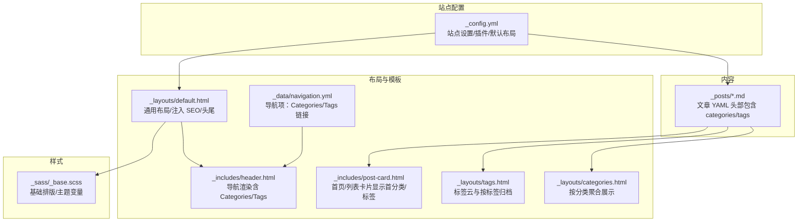
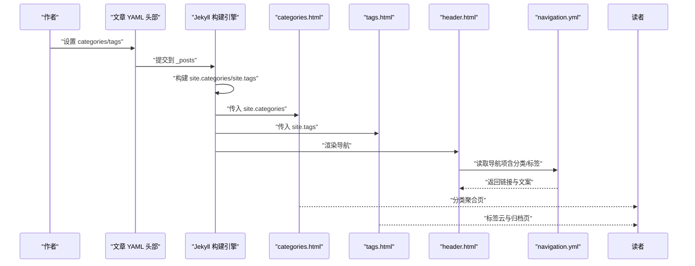
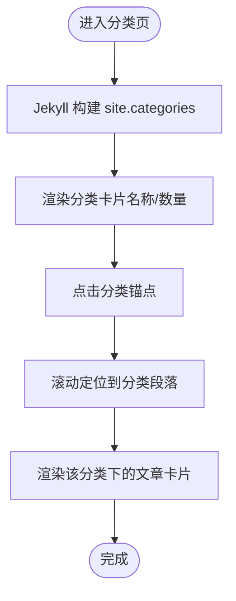
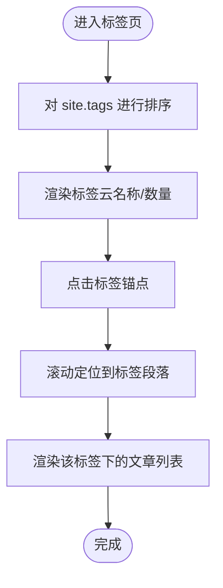
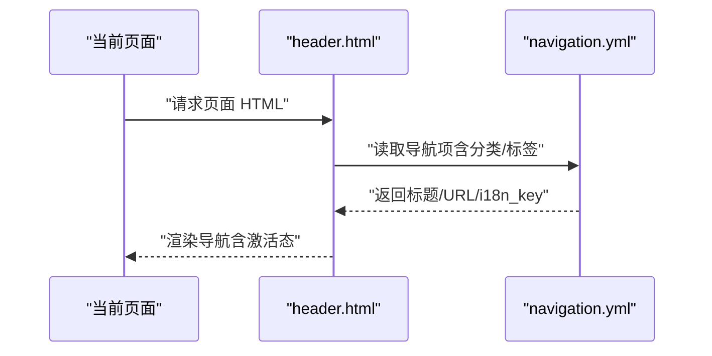
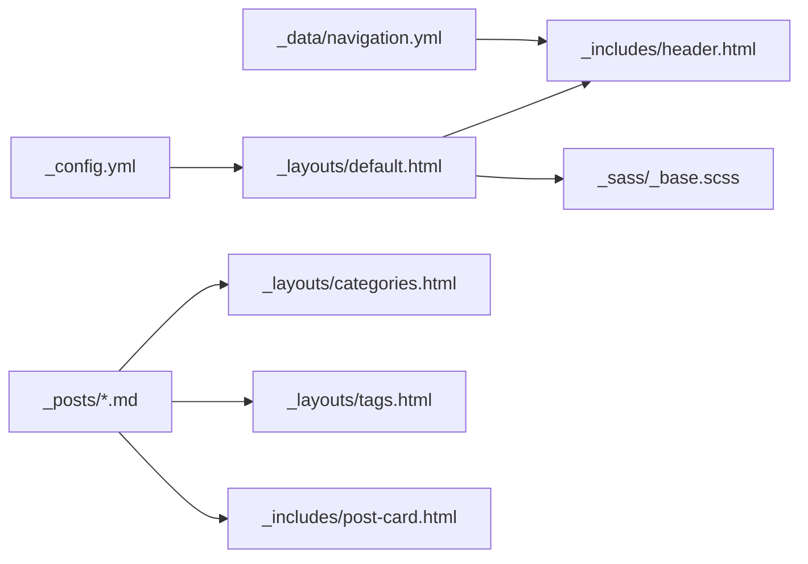

# 分类和标签系统

<cite>
**本文引用的文件**
- [_config.yml](file://_config.yml)
- [_layouts/categories.html](file://_layouts/categories.html)
- [_layouts/tags.html](file://_layouts/tags.html)
- [_layouts/default.html](file://_layouts/default.html)
- [_includes/header.html](file://_includes/header.html)
- [_data/navigation.yml](file://_data/navigation.yml)
- [_includes/post-card.html](file://_includes/post-card.html)
- [_posts/2026-01-01-2025-annual-review.md](file://_posts/2026-01-01-2025-annual-review.md)
- [_posts/2026-05-07-building-my-portfolio.md](file://_posts/2026-05-07-building-my-portfolio.md)
- [_posts/2026-05-08-github-actions-cicd.md](file://_posts/2026-05-08-github-actions-cicd.md)
- [_posts/2026-05-12-my-toolstack-2026.md](file://_posts/2026-05-12-my-toolstack-2026.md)
- [_posts/2026-05-13-css-design-system.md](file://_posts/2026-05-13-css-design-system.md)
- [_posts/2026-05-14-javascript-async-guide.md](file://_posts/2026-05-14-javascript-async-guide.md)
- [_posts/2026-05-16-modern-dev-environment.md](file://_posts/2026-05-16-modern-dev-environment.md)
- [_sass/_base.scss](file://_sass/_base.scss)
</cite>

## 目录
1. [简介](#简介)
2. [项目结构](#项目结构)
3. [核心组件](#核心组件)
4. [架构总览](#架构总览)
5. [详细组件分析](#详细组件分析)
6. [依赖分析](#依赖分析)
7. [性能考量](#性能考量)
8. [故障排查指南](#故障排查指南)
9. [结论](#结论)
10. [附录](#附录)

## 简介
本文件系统性阐述 labtab 的分类（categories）与标签（tags）体系，包括两者在概念上的区别、在文章中如何声明、如何驱动内容组织与导航、分类页与标签页的实现原理与可定制点，以及在头部导航中集成这些入口的思路。同时给出命名规范、层级设计、SEO 优化策略与最佳实践，并提供可直接对照的配置与使用示例。

## 项目结构
labtab 基于 Jekyll 构建，分类与标签能力由 Jekyll 内置集合与全局变量提供，配合自定义布局与导航数据实现内容聚合与导航入口。

**图表来源**
- [_config.yml:1-91](file://_config.yml#L1-L91)
- [_layouts/default.html:1-32](file://_layouts/default.html#L1-L32)
- [_layouts/categories.html:1-41](file://_layouts/categories.html#L1-L41)
- [_layouts/tags.html:1-45](file://_layouts/tags.html#L1-L45)
- [_includes/header.html:1-44](file://_includes/header.html#L1-L44)
- [_data/navigation.yml:1-16](file://_data/navigation.yml#L1-L16)
- [_includes/post-card.html:1-28](file://_includes/post-card.html#L1-L28)
- [_sass/_base.scss:1-172](file://_sass/_base.scss#L1-L172)

**章节来源**
- [_config.yml:1-91](file://_config.yml#L1-L91)
- [_layouts/default.html:1-32](file://_layouts/default.html#L1-L32)
- [_includes/header.html:1-44](file://_includes/header.html#L1-L44)
- [_data/navigation.yml:1-16](file://_data/navigation.yml#L1-L16)

## 核心组件
- 站点配置与默认行为
  - 默认布局与评论、目录等全局设置由配置文件统一声明，确保文章页与归档页具备一致的外观与功能基线。
- 分类与标签的数据来源
  - Jekyll 会根据文章 YAML 头部的 categories/tags 字段，自动构建全局集合 site.categories/site.tags，供布局与模板遍历使用。
- 分类页与标签页布局
  - 分类页按分类分组展示文章卡片；标签页提供标签云与按标签的标题列表。
- 导航系统
  - 导航数据包含“分类”“标签”入口，头部模板循环渲染，激活态样式与链接相对路径由数据驱动。

**章节来源**
- [_config.yml:50-64](file://_config.yml#L50-L64)
- [_layouts/categories.html:1-41](file://_layouts/categories.html#L1-L41)
- [_layouts/tags.html:1-45](file://_layouts/tags.html#L1-L45)
- [_includes/header.html:1-44](file://_includes/header.html#L1-L44)
- [_data/navigation.yml:7-12](file://_data/navigation.yml#L7-L12)

## 架构总览
下图展示了“文章 → 全局集合 → 布局渲染 → 导航入口”的端到端流程。

**图表来源**
- [_posts/2026-01-01-2025-annual-review.md:1-10](file://_posts/2026-01-01-2025-annual-review.md#L1-L10)
- [_posts/2026-05-07-building-my-portfolio.md:1-10](file://_posts/2026-05-07-building-my-portfolio.md#L1-L10)
- [_posts/2026-05-08-github-actions-cicd.md:1-10](file://_posts/2026-05-08-github-actions-cicd.md#L1-L10)
- [_layouts/categories.html:1-41](file://_layouts/categories.html#L1-L41)
- [_layouts/tags.html:1-45](file://_layouts/tags.html#L1-L45)
- [_includes/header.html:1-44](file://_includes/header.html#L1-L44)
- [_data/navigation.yml:7-12](file://_data/navigation.yml#L7-L12)

## 详细组件分析

### 分类（categories）与标签（tags）的概念与差异
- 分类（Category）
  - 通常用于表达内容的主题维度或层级，如“技术”“设计”“项目”“工具”“随笔”“DevOps”等。分类强调“主题域”的划分，有助于建立稳定的内容骨架。
- 标签（Tag）
  - 用于细化描述内容的细粒度特征，如“JavaScript”“CSS”“效率工具”“Next.js”“TailwindCSS”等。标签强调“关键词”，便于精确检索与交叉关联。
- 使用场景
  - 分类用于主导航与大板块组织；标签用于辅助筛选与交叉浏览。
  - 在首页/列表卡片中，常见做法是仅展示“首分类”以保持简洁；标签则在卡片底部展示若干代表性标签。

**章节来源**
- [_posts/2026-01-01-2025-annual-review.md:5-6](file://_posts/2026-01-01-2025-annual-review.md#L5-L6)
- [_posts/2026-05-07-building-my-portfolio.md:5-6](file://_posts/2026-05-07-building-my-portfolio.md#L5-L6)
- [_posts/2026-05-08-github-actions-cicd.md:5-6](file://_posts/2026-05-08-github-actions-cicd.md#L5-L6)
- [_posts/2026-05-12-my-toolstack-2026.md:5-6](file://_posts/2026-05-12-my-toolstack-2026.md#L5-L6)
- [_posts/2026-05-13-css-design-system.md:5-6](file://_posts/2026-05-13-css-design-system.md#L5-L6)
- [_posts/2026-05-14-javascript-async-guide.md:5-6](file://_posts/2026-05-14-javascript-async-guide.md#L5-L6)
- [_includes/post-card.html:8-25](file://_includes/post-card.html#L8-L25)

### 如何在文章中添加 categories 与 tags
- 在文章 YAML 头部添加字段
  - categories: 一个或多个分类字符串组成的数组
  - tags: 一个或多个标签字符串组成的数组
- 示例参考
  - 年度总结：包含一个分类“随笔”与多个标签
  - 个人主页：包含一个分类“项目”与多个标签
  - GitHub Actions：包含一个分类“DevOps”与多个标签
  - 工具栈：包含一个分类“工具”与多个标签
  - 设计系统：包含一个分类“设计”与多个标签
  - 异步指南：包含一个分类“技术”与多个标签
  - 现代开发环境：包含一个分类“Tech”与多个标签

**章节来源**
- [_posts/2026-01-01-2025-annual-review.md:5-6](file://_posts/2026-01-01-2025-annual-review.md#L5-L6)
- [_posts/2026-05-07-building-my-portfolio.md:5-6](file://_posts/2026-05-07-building-my-portfolio.md#L5-L6)
- [_posts/2026-05-08-github-actions-cicd.md:5-6](file://_posts/2026-05-08-github-actions-cicd.md#L5-L6)
- [_posts/2026-05-12-my-toolstack-2026.md:5-6](file://_posts/2026-05-12-my-toolstack-2026.md#L5-L6)
- [_posts/2026-05-13-css-design-system.md:5-6](file://_posts/2026-05-13-css-design-system.md#L5-L6)
- [_posts/2026-05-14-javascript-async-guide.md:5-6](file://_posts/2026-05-14-javascript-async-guide.md#L5-L6)
- [_posts/2026-05-16-modern-dev-environment.md:5-6](file://_posts/2026-05-16-modern-dev-environment.md#L5-L6)

### 分类页面（categories.html）实现原理与自定义
- 数据来源与渲染
  - 使用全局集合 site.categories 遍历，每个分类包含名称与其对应的 posts 数组。
- 页面结构
  - 顶部区域：标题与说明
  - 分类卡片区：展示各分类及其文章数量，点击锚点跳转至对应分类段落
  - 分类内容区：按分类分段展示文章卡片
- 自定义要点
  - 分类卡片样式与交互（悬停阴影、位移等）
  - 分类标题样式与渐变文字效果
  - 文章卡片复用 include 模板，确保与首页一致的展示风格
- 可扩展方向
  - 为分类卡片增加图标或颜色标识
  - 支持分类层级（如“技术/前端”）并在页面中拆分展示
  - 添加“空分类”提示或隐藏逻辑

**图表来源**
- [_layouts/categories.html:1-41](file://_layouts/categories.html#L1-L41)

**章节来源**
- [_layouts/categories.html:1-41](file://_layouts/categories.html#L1-L41)
- [_includes/post-card.html:1-28](file://_includes/post-card.html#L1-L28)

### 标签页面（tags.html）实现原理与自定义
- 数据来源与渲染
  - 使用全局集合 site.tags，先进行排序，再逐个标签渲染其文章列表
- 页面结构
  - 顶部区域：标题与说明
  - 标签云：展示所有标签，点击锚点跳转至对应标签段落
  - 标签内容区：按标签分段展示文章标题、日期与链接
- 自定义要点
  - 标签云的字号/背景/边框与悬停效果
  - 标题列表的日期格式与行内交互
- 可扩展方向
  - 按标签文章数动态调整字号
  - 提供“热门标签”排序或过滤
  - 为标签页添加面包屑导航

**图表来源**
- [_layouts/tags.html:1-45](file://_layouts/tags.html#L1-L45)

**章节来源**
- [_layouts/tags.html:1-45](file://_layouts/tags.html#L1-L45)

### 导航系统中分类与标签的显示逻辑
- 导航数据
  - 导航数据 navigation.yml 中包含“分类”“标签”两项，分别指向 /categories/ 与 /tags/ 的相对路径
- 头部模板
  - header.html 通过遍历 navigation.yml 渲染导航项，支持当前页激活态样式
- 集成方式
  - 无需额外 JS，纯 Liquid 渲染，保证加载性能与可访问性
- 自定义要点
  - 可根据页面 URL 判断激活态
  - 可在导航中加入徽标或数量提示（需在数据层扩展）

**图表来源**
- [_includes/header.html:1-44](file://_includes/header.html#L1-L44)
- [_data/navigation.yml:7-12](file://_data/navigation.yml#L7-L12)

**章节来源**
- [_includes/header.html:1-44](file://_includes/header.html#L1-L44)
- [_data/navigation.yml:7-12](file://_data/navigation.yml#L7-L12)

### 首页/列表中的分类与标签展示
- 首分类显示
  - 首页/列表卡片模板 post-card.html 优先展示文章的“首分类”，用于快速识别主题
- 标签展示
  - 卡片底部展示若干代表性标签（限制数量），帮助读者快速了解内容细节
- 一致性
  - 分类页/标签页与首页卡片共享同一模板，确保视觉与交互一致

**章节来源**
- [_includes/post-card.html:8-25](file://_includes/post-card.html#L8-L25)

## 依赖分析
- 配置层
  - _config.yml 决定默认布局、分页、插件等，间接影响分类/标签页的生成与 SEO 行为
- 数据层
  - 文章 YAML 头部的 categories/tags 是唯一数据来源
- 模板层
  - categories.html 与 tags.html 依赖 Jekyll 的全局集合
  - header.html 依赖 navigation.yml
- 样式层
  - _sass/_base.scss 提供基础排版与主题变量，影响整体观感

**图表来源**
- [_config.yml:1-91](file://_config.yml#L1-L91)
- [_layouts/default.html:1-32](file://_layouts/default.html#L1-L32)
- [_includes/header.html:1-44](file://_includes/header.html#L1-L44)
- [_data/navigation.yml:1-16](file://_data/navigation.yml#L1-L16)
- [_layouts/categories.html:1-41](file://_layouts/categories.html#L1-L41)
- [_layouts/tags.html:1-45](file://_layouts/tags.html#L1-L45)
- [_includes/post-card.html:1-28](file://_includes/post-card.html#L1-L28)
- [_sass/_base.scss:1-172](file://_sass/_base.scss#L1-L172)

**章节来源**
- [_config.yml:1-91](file://_config.yml#L1-L91)
- [_layouts/default.html:1-32](file://_layouts/default.html#L1-L32)
- [_includes/header.html:1-44](file://_includes/header.html#L1-L44)
- [_data/navigation.yml:1-16](file://_data/navigation.yml#L1-L16)
- [_layouts/categories.html:1-41](file://_layouts/categories.html#L1-L41)
- [_layouts/tags.html:1-45](file://_layouts/tags.html#L1-L45)
- [_includes/post-card.html:1-28](file://_includes/post-card.html#L1-L28)
- [_sass/_base.scss:1-172](file://_sass/_base.scss#L1-L172)

## 性能考量
- 分类/标签页均为静态生成，无需运行时查询，加载与渲染性能优异
- 标签云与分类卡片使用纯 CSS 交互，避免额外 JS
- 建议
  - 控制标签数量与长度，避免标签云过于拥挤
  - 对分类层级进行适度收敛，避免页面过长导致滚动体验下降
  - 使用相对路径与本地资源，减少跨域与第三方依赖

[本节为通用指导，无需特定文件引用]

## 故障排查指南
- 分类/标签页为空
  - 检查文章 YAML 是否正确填写 categories/tags
  - 确认布局是否为 categories.html 或 tags.html
- 导航中“分类/标签”链接无效
  - 检查 navigation.yml 中的 url 是否与布局路径一致
  - 确认 baseurl 与部署路径匹配
- 样式异常
  - 检查主题变量与 CSS 文件是否正确引入
  - 确认容器与网格类名与样式一致

**章节来源**
- [_posts/2026-01-01-2025-annual-review.md:5-6](file://_posts/2026-01-01-2025-annual-review.md#L5-L6)
- [_data/navigation.yml:7-12](file://_data/navigation.yml#L7-L12)
- [_sass/_base.scss:1-172](file://_sass/_base.scss#L1-L172)

## 结论
labtab 的分类与标签系统以 Jekyll 的全局集合为核心，结合自定义布局与导航数据，实现了简洁而强大的内容组织与导航体验。通过在文章中规范声明 categories/tags，并在分类页与标签页中进行差异化呈现，既能满足主题化的大板块组织，也能提供精细的关键词检索与交叉浏览。配合导航入口与样式体系，整体达到良好的可用性与可维护性。

[本节为总结，无需特定文件引用]

## 附录

### 最佳实践与规范
- 命名规范
  - 分类：使用中文或英文名词短语，保持语义明确、层级扁平
  - 标签：使用高频关键词，避免过长与特殊字符
- 层级设计
  - 分类优先用于主主题；如需细分，建议在分类内部用子目录或前缀区分
  - 标签用于补充说明，避免与分类重复
- SEO 优化
  - 为分类页与标签页提供清晰的标题与描述
  - 使用结构化数据与 sitemap 插件增强索引
  - 控制分页与链接权重，避免重复内容
- 配置示例与使用案例
  - 在文章 YAML 中添加 categories 与 tags 字段
  - 在 navigation.yml 中添加“分类/标签”导航项
  - 在 categories.html 与 tags.html 中按需扩展样式与交互

**章节来源**
- [_posts/2026-01-01-2025-annual-review.md:5-6](file://_posts/2026-01-01-2025-annual-review.md#L5-L6)
- [_posts/2026-05-07-building-my-portfolio.md:5-6](file://_posts/2026-05-07-building-my-portfolio.md#L5-L6)
- [_posts/2026-05-08-github-actions-cicd.md:5-6](file://_posts/2026-05-08-github-actions-cicd.md#L5-L6)
- [_posts/2026-05-12-my-toolstack-2026.md:5-6](file://_posts/2026-05-12-my-toolstack-2026.md#L5-L6)
- [_posts/2026-05-13-css-design-system.md:5-6](file://_posts/2026-05-13-css-design-system.md#L5-L6)
- [_posts/2026-05-14-javascript-async-guide.md:5-6](file://_posts/2026-05-14-javascript-async-guide.md#L5-L6)
- [_posts/2026-05-16-modern-dev-environment.md:5-6](file://_posts/2026-05-16-modern-dev-environment.md#L5-L6)
- [_data/navigation.yml:7-12](file://_data/navigation.yml#L7-L12)