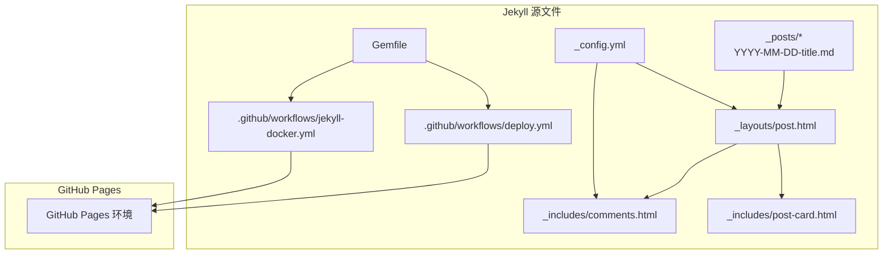
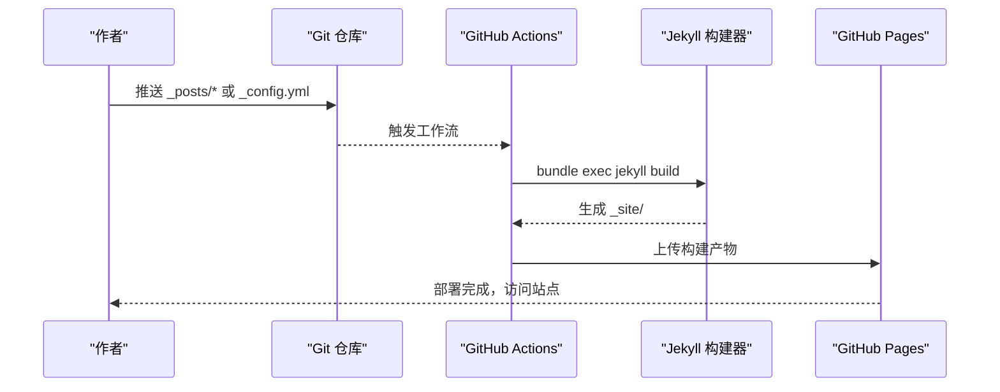
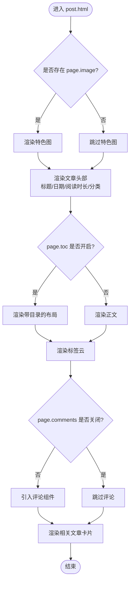
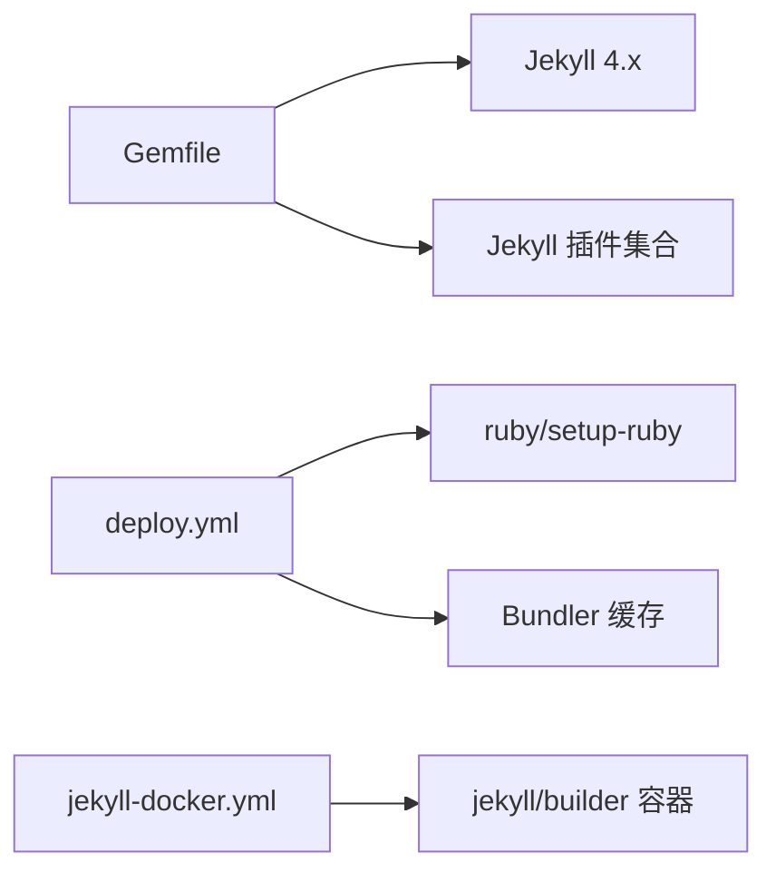

# 文章发布流程

<cite>
**本文引用的文件**
- [_config.yml](file://_config.yml)
- [Gemfile](file://Gemfile)
- [_layouts/post.html](file://_layouts/post.html)
- [_includes/comments.html](file://_includes/comments.html)
- [_includes/post-card.html](file://_includes/post-card.html)
- [_posts/2026-05-17-welcome-to-labtab.md](file://_posts/2026-05-17-welcome-to-labtab.md)
- [_posts/2026-01-01-2025-annual-review.md](file://_posts/2026-01-01-2025-annual-review.md)
- [_posts/2026-05-07-building-my-portfolio.md](file://_posts/2026-05-07-building-my-portfolio.md)
- [_posts/2026-05-08-github-actions-cicd.md](file://_posts/2026-05-08-github-actions-cicd.md)
- [.github/workflows/deploy.yml](file://.github/workflows/deploy.yml)
- [.github/workflows/jekyll-docker.yml](file://.github/workflows/jekyll-docker.yml)
- [README.md](file://README.md)
- [_data/navigation.yml](file://_data/navigation.yml)
</cite>

## 目录
1. [简介](#简介)
2. [项目结构](#项目结构)
3. [核心组件](#核心组件)
4. [架构总览](#架构总览)
5. [详细组件分析](#详细组件分析)
6. [依赖分析](#依赖分析)
7. [性能考量](#性能考量)
8. [故障排查指南](#故障排查指南)
9. [结论](#结论)
10. [附录](#附录)

## 简介
本文件面向内容创作者与维护者，系统性阐述 labtab 的 Jekyll 文章发布流程与实现细节。内容覆盖：
- Markdown 文章创建与命名规范（YYYY-MM-DD-title.md）
- Front Matter 字段说明与最佳实践
- 文章布局系统与 post.html 模板结构
- 自动化构建与部署（GitHub Actions）
- 评论系统与相关组件
- 常见问题与排障建议

## 项目结构
labtab 采用标准 Jekyll 结构，核心目录与职责如下：
- _posts：存放按日期命名的文章，Jekyll 自动识别并渲染为文章页
- _layouts：页面布局模板，post.html 用于文章详情页
- _includes：可复用片段，如评论区、文章卡片等
- _config.yml：站点配置、默认值、插件与评论系统参数
- .github/workflows：自动化构建与部署工作流
- Gemfile：Ruby 依赖与 Jekyll 插件声明
- pages、_data、assets、_sass 等：导航、样式、资源等

图表来源
- [_config.yml:1-91](file://_config.yml#L1-L91)
- [_layouts/post.html:1-83](file://_layouts/post.html#L1-L83)
- [_includes/comments.html:1-21](file://_includes/comments.html#L1-L21)
- [_includes/post-card.html:1-28](file://_includes/post-card.html#L1-L28)
- [.github/workflows/deploy.yml:1-52](file://.github/workflows/deploy.yml#L1-L52)
- [.github/workflows/jekyll-docker.yml:1-21](file://.github/workflows/jekyll-docker.yml#L1-L21)
- [Gemfile:1-14](file://Gemfile#L1-L14)

章节来源
- [_config.yml:1-91](file://_config.yml#L1-L91)
- [Gemfile:1-14](file://Gemfile#L1-L14)
- [_layouts/post.html:1-83](file://_layouts/post.html#L1-L83)
- [_includes/comments.html:1-21](file://_includes/comments.html#L1-L21)
- [_includes/post-card.html:1-28](file://_includes/post-card.html#L1-L28)
- [.github/workflows/deploy.yml:1-52](file://.github/workflows/deploy.yml#L1-L52)
- [.github/workflows/jekyll-docker.yml:1-21](file://.github/workflows/jekyll-docker.yml#L1-L21)

## 核心组件
- 文章源文件：位于 _posts，采用 YYYY-MM-DD-title.md 命名，首部包含 Front Matter
- 布局系统：post.html 作为文章详情页布局，继承 default.html
- 评论系统：通过 Giscus 提供评论，由 _includes/comments.html 引入
- 自动化：GitHub Actions 在推送 main 分支时自动构建并部署至 GitHub Pages
- 默认值与全局设置：_config.yml 定义 permalink、分页、插件、默认 Front Matter 值等

章节来源
- [_posts/2026-05-17-welcome-to-labtab.md:1-92](file://_posts/2026-05-17-welcome-to-labtab.md#L1-L92)
- [_layouts/post.html:1-83](file://_layouts/post.html#L1-L83)
- [_includes/comments.html:1-21](file://_includes/comments.html#L1-L21)
- [_config.yml:50-64](file://_config.yml#L50-L64)
- [.github/workflows/deploy.yml:1-52](file://.github/workflows/deploy.yml#L1-L52)

## 架构总览
从本地或远程推送触发，经 GitHub Actions 构建 Jekyll 站点，最终发布到 GitHub Pages。文章通过 _posts 目录中的 Markdown 文件与 Front Matter 驱动渲染。

图表来源
- [.github/workflows/deploy.yml:1-52](file://.github/workflows/deploy.yml#L1-L52)
- [_config.yml:1-91](file://_config.yml#L1-L91)

## 详细组件分析

### 文章命名与 Front Matter 规范
- 命名规范：YYYY-MM-DD-title.md，确保 Jekyll 能正确解析日期与排序
- Front Matter 字段（示例来自现有文章）：
  - layout：固定为 post
  - title：文章标题
  - date：发布时间（含时区偏移）
  - categories：分类数组
  - tags：标签数组
  - toc：是否显示目录
  - comments：是否启用评论
  - excerpt：摘要（用于列表页预览）

章节来源
- [_posts/2026-05-17-welcome-to-labtab.md:1-92](file://_posts/2026-05-17-welcome-to-labtab.md#L1-L92)
- [_posts/2026-01-01-2025-annual-review.md:1-162](file://_posts/2026-01-01-2025-annual-review.md#L1-L162)
- [_posts/2026-05-07-building-my-portfolio.md:1-232](file://_posts/2026-05-07-building-my-portfolio.md#L1-L232)
- [_posts/2026-05-08-github-actions-cicd.md:1-214](file://_posts/2026-05-08-github-actions-cicd.md#L1-L214)

### 文章布局系统与 post.html 模板
post.html 作为文章详情页布局，负责：
- 特色图（可选）：若 page.image 存在则渲染
- 文章头部：标题、日期、阅读时长、分类链接
- 文章主体：根据 page.toc 渲染带目录或纯正文
- 文章底部：标签云
- 评论区：根据 page.comments 控制是否引入
- 相关文章：基于 site.related_posts 渲染卡片

图表来源
- [_layouts/post.html:1-83](file://_layouts/post.html#L1-L83)
- [_includes/post-card.html:1-28](file://_includes/post-card.html#L1-L28)
- [_includes/comments.html:1-21](file://_includes/comments.html#L1-L21)

章节来源
- [_layouts/post.html:1-83](file://_layouts/post.html#L1-L83)
- [_includes/post-card.html:1-28](file://_includes/post-card.html#L1-L28)
- [_includes/comments.html:1-21](file://_includes/comments.html#L1-L21)

### 评论系统（Giscus）
- 通过 _includes/comments.html 引入
- 依赖 _config.yml 中 comments.giscus 的配置项
- 支持主题、反应、输入位置等参数
- 需要在仓库启用 GitHub Discussions，并创建“Blog Comments”分类

章节来源
- [_includes/comments.html:1-21](file://_includes/comments.html#L1-L21)
- [_config.yml:65-79](file://_config.yml#L65-L79)

### 自动化构建与部署
- deploy.yml：在 main 推送时，使用 Ruby 环境与 Bundler 缓存，构建 Jekyll 并上传到 Pages
- jekyll-docker.yml：使用 jekyll/builder 容器进行构建，适合跨平台一致性

章节来源
- [.github/workflows/deploy.yml:1-52](file://.github/workflows/deploy.yml#L1-L52)
- [.github/workflows/jekyll-docker.yml:1-21](file://.github/workflows/jekyll-docker.yml#L1-L21)

### 默认 Front Matter 与站点配置
- _config.yml 中通过 defaults 为 posts 设置默认 layout、comments、toc
- permalink 为 /:year/:month/:day/:title/，便于 SEO 与可读性
- plugins 包含 jekyll-feed、jekyll-seo-tag、jekyll-sitemap、jekyll-paginate-v2
- pagination 每页 6 篇，按日期倒序

章节来源
- [_config.yml:50-64](file://_config.yml#L50-L64)
- [_config.yml:10-33](file://_config.yml#L10-L33)
- [_config.yml:34-40](file://_config.yml#L34-L40)

## 依赖分析
- Ruby 与 Jekyll：Gemfile 指定 jekyll 版本及插件组
- 构建环境：GitHub Actions 使用 ruby/setup-ruby 与 Bundler 缓存
- 容器构建：jekyll/builder 容器镜像用于一致化构建

图表来源
- [Gemfile:1-14](file://Gemfile#L1-L14)
- [.github/workflows/deploy.yml:24-28](file://.github/workflows/deploy.yml#L24-L28)
- [.github/workflows/jekyll-docker.yml:18-20](file://.github/workflows/jekyll-docker.yml#L18-L20)

章节来源
- [Gemfile:1-14](file://Gemfile#L1-L14)
- [.github/workflows/deploy.yml:1-52](file://.github/workflows/deploy.yml#L1-L52)
- [.github/workflows/jekyll-docker.yml:1-21](file://.github/workflows/jekyll-docker.yml#L1-L21)

## 性能考量
- 构建缓存：ruby/setup-ruby 的 bundler-cache 与 Actions 缓存可显著缩短构建时间
- 语法高亮：kramdown + rouge，支持 GFM 输入
- 分页：每页 6 篇，减少首页渲染压力
- 目录与阅读时长：仅在需要时渲染，避免冗余 DOM

## 故障排查指南
- 评论未显示
  - 检查 _config.yml 中 comments.giscus 的 repo、repo_id、category、category_id 是否正确
  - 确认仓库已启用 GitHub Discussions，并存在“Blog Comments”分类
  - 确认文章 Front Matter 中 comments 未显式设为 false
- 文章未出现在首页或归档
  - 确认文件名符合 YYYY-MM-DD-title.md
  - 确认 Front Matter 中 layout 为 post
  - 确认 date 时间早于当前时间
- 构建失败
  - 检查 Gemfile 与 Gemfile.lock 是否匹配
  - 在本地使用 bundle install 与 bundle exec jekyll serve 验证
  - 关注 GitHub Actions 日志中的 Ruby/Bundle/Jekyll 错误
- 目录不显示
  - 确认文章 Front Matter 中 toc 为 true
  - 确认 post.html 中 toc 条件渲染逻辑生效

章节来源
- [_includes/comments.html:1-21](file://_includes/comments.html#L1-L21)
- [_config.yml:65-79](file://_config.yml#L65-L79)
- [_posts/2026-05-17-welcome-to-labtab.md:31-51](file://_posts/2026-05-17-welcome-to-labtab.md#L31-L51)
- [_layouts/post.html:38-52](file://_layouts/post.html#L38-L52)
- [.github/workflows/deploy.yml:1-52](file://.github/workflows/deploy.yml#L1-L52)

## 结论
labtab 的文章发布流程以 Jekyll 为核心，结合 GitHub Actions 实现自动化构建与部署。通过规范化的命名与 Front Matter、清晰的布局与评论系统、以及完善的默认配置，内容创作者可以高效地创建与发布高质量文章。遵循本文档的规范与最佳实践，可显著降低发布门槛并提升维护效率。

## 附录

### Front Matter 字段说明与示例
- layout：post（固定）
- title：文章标题
- date：发布时间（含时区偏移）
- categories：分类数组
- tags：标签数组
- toc：true/false（是否显示目录）
- comments：true/false（是否启用评论）
- excerpt：摘要文本（用于列表页预览）

示例参考
- [文章 Front Matter 示例:1-51](file://_posts/2026-05-17-welcome-to-labtab.md#L1-L51)
- [完整文章示例:1-162](file://_posts/2026-01-01-2025-annual-review.md#L1-L162)

章节来源
- [_posts/2026-05-17-welcome-to-labtab.md:1-92](file://_posts/2026-05-17-welcome-to-labtab.md#L1-L92)
- [_posts/2026-01-01-2025-annual-review.md:1-162](file://_posts/2026-01-01-2025-annual-review.md#L1-L162)

### 发布步骤清单
- 在 _posts 下创建 YYYY-MM-DD-title.md
- 在 Front Matter 中填写 layout、title、date、categories、tags、toc、comments、excerpt
- 在文章正文编写 Markdown 内容
- 本地验证：bundle install 与 bundle exec jekyll serve
- 推送到 main 分支，等待 GitHub Actions 自动构建与部署

章节来源
- [README.md:14-32](file://README.md#L14-L32)
- [.github/workflows/deploy.yml:1-52](file://.github/workflows/deploy.yml#L1-L52)