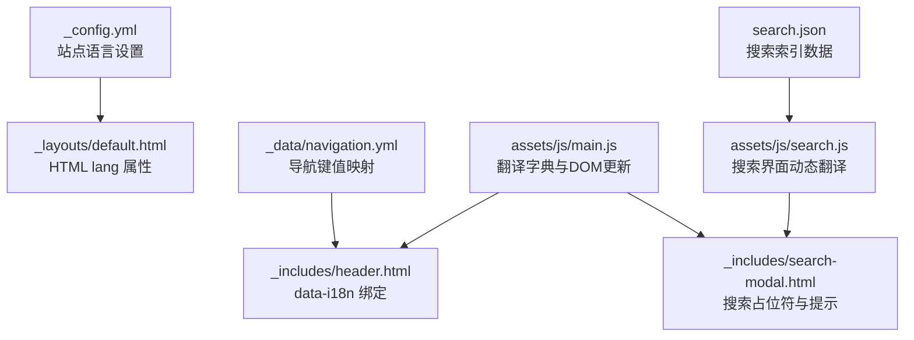
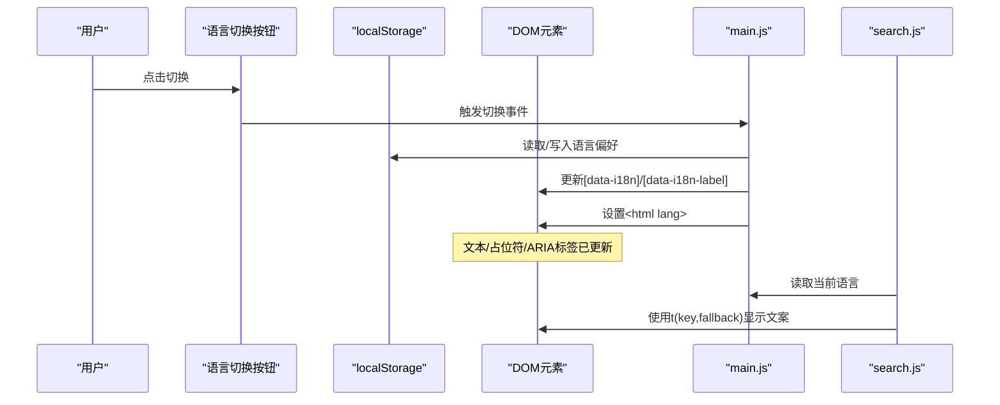
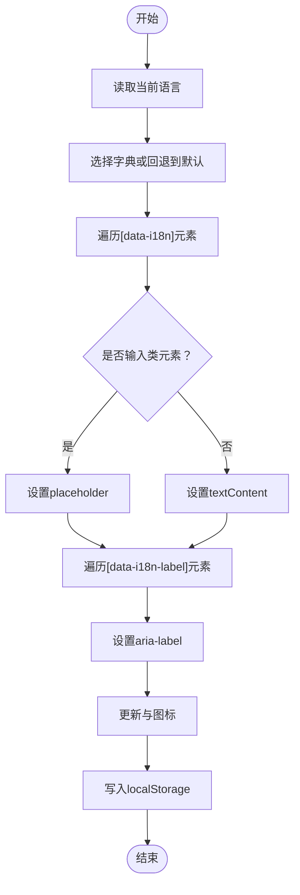
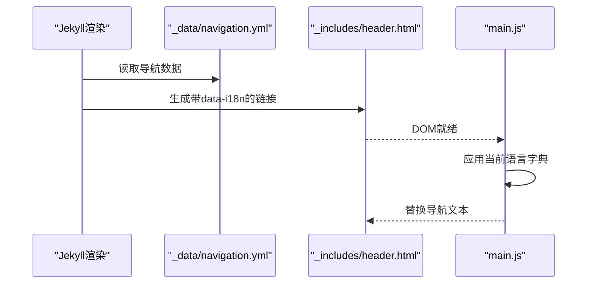
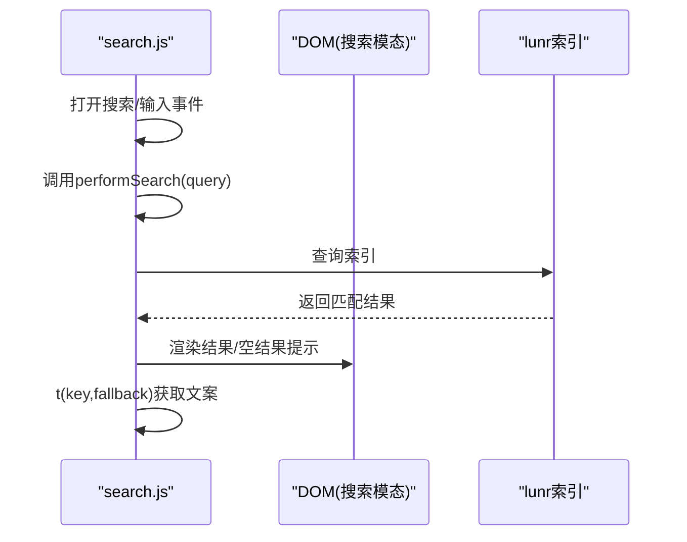
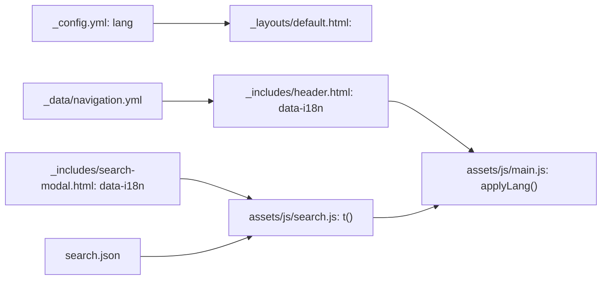

# 国际化系统

<cite>
**本文引用的文件**
- [README.md](file://README.md)
- [_config.yml](file://_config.yml)
- [assets/js/main.js](file://assets/js/main.js)
- [assets/js/search.js](file://assets/js/search.js)
- [assets/js/effects.js](file://assets/js/effects.js)
- [_includes/header.html](file://_includes/header.html)
- [_includes/footer.html](file://_includes/footer.html)
- [_includes/search-modal.html](file://_includes/search-modal.html)
- [_includes/head.html](file://_includes/head.html)
- [_layouts/default.html](file://_layouts/default.html)
- [_layouts/home.html](file://_layouts/home.html)
- [_data/navigation.yml](file://_data/navigation.yml)
- [search.json](file://search.json)
- [assets/css/main.scss](file://assets/css/main.scss)
- [_sass/_variables.scss](file://_sass/_variables.scss)
</cite>

## 目录
1. [简介](#简介)
2. [项目结构](#项目结构)
3. [核心组件](#核心组件)
4. [架构总览](#架构总览)
5. [详细组件分析](#详细组件分析)
6. [依赖关系分析](#依赖关系分析)
7. [性能考量](#性能考量)
8. [故障排查指南](#故障排查指南)
9. [结论](#结论)
10. [附录](#附录)

## 简介
本文件系统性阐述 labtab 的国际化（i18n）实现方案，覆盖中英文双语支持的数据结构与动态切换机制、DOM 文本与占位符更新、本地存储持久化、浏览器语言检测、无障碍访问（ARIA、键盘导航、屏幕阅读器兼容）、以及多语言内容维护与扩展流程。文档以仓库现有实现为依据，结合 Jekyll 前端渲染与客户端脚本协同工作的方式进行说明。

## 项目结构
labtab 的国际化能力由以下层次构成：
- 配置层：站点语言设置与构建配置
- 模板层：Jekyll 模板通过数据驱动生成可翻译的导航与页脚文本
- 数据层：导航键值映射，用于统一的 i18n 键命名
- 客户端层：翻译字典、DOM 更新、本地存储与主题联动
- 搜索层：搜索界面文案的动态翻译与回退机制

图表来源
- [_config.yml:7](file://_config.yml#L7)
- [_layouts/default.html:2](file://_layouts/default.html#L2)
- [_data/navigation.yml:1-16](file://_data/navigation.yml#L1-L16)
- [_includes/header.html:8](file://_includes/header.html#L8)
- [assets/js/main.js:52-129](file://assets/js/main.js#L52-L129)
- [_includes/search-modal.html:8](file://_includes/search-modal.html#L8)
- [assets/js/search.js:72-110](file://assets/js/search.js#L72-L110)
- [search.json:1-15](file://search.json#L1-L15)

章节来源
- [_config.yml:1-91](file://_config.yml#L1-L91)
- [_layouts/default.html:1-32](file://_layouts/default.html#L1-L32)
- [_data/navigation.yml:1-16](file://_data/navigation.yml#L1-L16)
- [_includes/header.html:1-44](file://_includes/header.html#L1-L44)
- [_includes/search-modal.html:1-24](file://_includes/search-modal.html#L1-L24)
- [assets/js/main.js:1-324](file://assets/js/main.js#L1-L324)
- [assets/js/search.js:1-160](file://assets/js/search.js#L1-L160)
- [search.json:1-15](file://search.json#L1-L15)

## 核心组件
- 翻译字典与运行时切换
  - 字典结构：以语言代码为键，映射到键值对集合；键采用“域.标识”形式，如 nav.home、search.placeholder 等
  - 运行时切换：监听语言按钮点击，读取当前语言，计算下一个语言，调用应用函数更新 DOM 文本、占位符、ARIA 标签、语言属性与本地存储
  - 本地存储：使用 localStorage 保存语言偏好，页面加载时优先应用本地存储的语言
  - DOM 更新策略：遍历带 data-i18n/data-i18n-label 的元素，分别处理文本与 aria-label；对 INPUT/TEXTAREA 使用 placeholder
  - 语言属性：设置 documentElement.lang 为 zh-CN 或 en，便于辅助技术识别
- 导航与页脚的 i18n 绑定
  - 导航项通过 data-i18n 绑定到翻译键，键名来自 navigation.yml 的 i18n_key 或标题
  - 页脚版权信息等文本通过 data-i18n 动态替换
- 搜索界面的动态翻译
  - 搜索模态框的占位符与空结果提示通过 data-i18n 绑定
  - 搜索脚本提供 t(key, fallback) 函数，优先从全局字典取值，否则回退到传入的默认文案
- HTML lang 属性
  - 默认模板在 <html> 上设置 lang 属性，初始值来自站点配置；运行时切换会更新该属性

章节来源
- [assets/js/main.js:52-129](file://assets/js/main.js#L52-L129)
- [_includes/header.html:8](file://_includes/header.html#L8)
- [_includes/footer.html:4-7](file://_includes/footer.html#L4-L7)
- [_includes/search-modal.html:8](file://_includes/search-modal.html#L8)
- [assets/js/search.js:72-110](file://assets/js/search.js#L72-L110)
- [_layouts/default.html:2](file://_layouts/default.html#L2)
- [_config.yml:7](file://_config.yml#L7)

## 架构总览
下图展示国际化从配置到前端渲染与运行时切换的整体流程：

图表来源
- [assets/js/main.js:106-129](file://assets/js/main.js#L106-L129)
- [assets/js/search.js:72-76](file://assets/js/search.js#L72-L76)
- [_layouts/default.html:2](file://_layouts/default.html#L2)

## 详细组件分析

### 翻译字典与 DOM 更新机制
- 数据结构
  - 语言代码作为顶层键（如 zh/en）
  - 每个语言下为“域.标识”到具体文案的映射
- 更新流程
  - 选择目标语言字典
  - 遍历所有带 data-i18n 的元素：若为输入类元素则设置 placeholder，否则设置 textContent
  - 遍历带 data-i18n-label 的元素：设置 aria-label
  - 更新语言图标与 documentElement.lang
  - 写入 localStorage 保存偏好
- 语言属性与无障碍
  - 通过设置 <html lang> 提升屏幕阅读器体验
  - 搜索按钮提供 aria-label，增强可访问性

图表来源
- [assets/js/main.js:106-129](file://assets/js/main.js#L106-L129)

章节来源
- [assets/js/main.js:52-129](file://assets/js/main.js#L52-L129)

### 导航与页脚的 i18n 绑定
- 导航
  - 通过 Jekyll 循环 _data/navigation.yml，将每个菜单项的 i18n_key 或标题转换为 data-i18n 键
  - 渲染后由 main.js 在运行时根据当前语言替换文本
- 页脚
  - 版权信息中的“由...提供”等文案通过 data-i18n 动态替换

图表来源
- [_data/navigation.yml:1-16](file://_data/navigation.yml#L1-L16)
- [_includes/header.html:8](file://_includes/header.html#L8)
- [assets/js/main.js:106-129](file://assets/js/main.js#L106-L129)

章节来源
- [_data/navigation.yml:1-16](file://_data/navigation.yml#L1-L16)
- [_includes/header.html:1-44](file://_includes/header.html#L1-L44)
- [_includes/footer.html:1-16](file://_includes/footer.html#L1-L16)

### 搜索界面的动态翻译
- 占位符与提示
  - 搜索输入框与空结果提示通过 data-i18n 绑定
- 动态翻译函数
  - t(key, fallback) 优先从 window.__i18n[lang] 取值，否则回退到 fallback
  - 若未设置语言或字典缺失，则回退到默认文案
- 搜索索引加载
  - 通过 meta 或样式表路径推断 /search.json 的绝对地址
  - 使用 fetch 加载并构建 lunr 索引

图表来源
- [_includes/search-modal.html:8](file://_includes/search-modal.html#L8)
- [assets/js/search.js:72-110](file://assets/js/search.js#L72-L110)
- [search.json:1-15](file://search.json#L1-L15)

章节来源
- [_includes/search-modal.html:1-24](file://_includes/search-modal.html#L1-L24)
- [assets/js/search.js:1-160](file://assets/js/search.js#L1-L160)
- [search.json:1-15](file://search.json#L1-L15)

### HTML lang 属性与主题联动
- HTML lang
  - 默认模板在 <html> 上设置 lang 属性，初始值来自站点配置
  - 切换语言时更新该属性，确保可访问性工具正确识别
- 主题联动
  - 切换语言时同步更新 giscus 主题（通过 postMessage），保持评论区主题一致

章节来源
- [_layouts/default.html:2](file://_layouts/default.html#L2)
- [_config.yml:7](file://_config.yml#L7)
- [assets/js/main.js:13-27](file://assets/js/main.js#L13-L27)

## 依赖关系分析
- 配置依赖
  - _config.yml 的 lang 决定默认语言，default.html 的 <html lang> 初始化该值
- 模板依赖
  - header.html 与 navigation.yml 通过 data-i18n 键绑定，依赖 main.js 的运行时替换
  - search-modal.html 的占位符与提示依赖 main.js 与 search.js 的翻译函数
- 客户端依赖
  - main.js 提供翻译字典、DOM 更新与本地存储
  - search.js 依赖 main.js 的全局字典与语言状态
- 数据依赖
  - search.json 为搜索索引，search.js 依赖其结构进行查询与展示

图表来源
- [_config.yml:7](file://_config.yml#L7)
- [_layouts/default.html:2](file://_layouts/default.html#L2)
- [_data/navigation.yml:1-16](file://_data/navigation.yml#L1-L16)
- [_includes/header.html:8](file://_includes/header.html#L8)
- [assets/js/main.js:106-129](file://assets/js/main.js#L106-L129)
- [_includes/search-modal.html:8](file://_includes/search-modal.html#L8)
- [assets/js/search.js:72-110](file://assets/js/search.js#L72-L110)
- [search.json:1-15](file://search.json#L1-L15)

章节来源
- [_config.yml:1-91](file://_config.yml#L1-L91)
- [_layouts/default.html:1-32](file://_layouts/default.html#L1-L32)
- [_data/navigation.yml:1-16](file://_data/navigation.yml#L1-L16)
- [_includes/header.html:1-44](file://_includes/header.html#L1-L44)
- [_includes/search-modal.html:1-24](file://_includes/search-modal.html#L1-L24)
- [assets/js/main.js:1-324](file://assets/js/main.js#L1-L324)
- [assets/js/search.js:1-160](file://assets/js/search.js#L1-L160)
- [search.json:1-15](file://search.json#L1-L15)

## 性能考量
- DOM 遍历与更新
  - 每次切换语言时遍历带 data-i18n/data-i18n-label 的元素，建议控制元素数量或按需更新特定容器
- 本地存储
  - 仅进行一次读取与一次写入，开销极低
- 搜索索引加载
  - 仅在首次打开搜索时加载，后续复用内存中的索引
- CSS 变量与主题
  - 通过 CSS 自定义属性实现主题与语言解耦，避免额外脚本开销

## 故障排查指南
- 切换后文案未更新
  - 检查元素是否带有 data-i18n 或 data-i18n-label
  - 确认键名与翻译字典一致
  - 查看控制台是否有错误（如 window.__i18n 未定义）
- 搜索文案不随语言变化
  - 确认 search-modal.html 中的 data-i18n 是否存在
  - 检查 search.js 的 t() 函数是否能正确读取当前语言
- HTML lang 属性未更新
  - 确认 main.js 的 applyLang() 是否被调用
  - 检查浏览器是否禁用 localStorage
- 辅助功能问题
  - 确保按钮具备 aria-label
  - 检查键盘快捷键（Ctrl+K/Cmd+K）是否生效

章节来源
- [assets/js/main.js:106-129](file://assets/js/main.js#L106-L129)
- [_includes/search-modal.html:8](file://_includes/search-modal.html#L8)
- [assets/js/search.js:72-110](file://assets/js/search.js#L72-L110)
- [_layouts/default.html:2](file://_layouts/default.html#L2)

## 结论
labtab 的国际化系统以简洁的键值字典为核心，结合 Jekyll 模板与客户端脚本，在运行时完成 DOM 文本与占位符的动态替换，并通过本地存储实现持久化偏好。系统同时关注无障碍访问与性能，具备良好的可维护性与扩展性。

## 附录

### 无障碍访问支持
- ARIA 标签
  - 搜索按钮提供 aria-label，提升屏幕阅读器可用性
- 键盘导航
  - 支持 Ctrl+K/Cmd+K 打开搜索，Esc 关闭，方向键与 Enter 用于导航与打开结果
- 语言属性
  - 动态设置 <html lang>，帮助辅助技术识别语言

章节来源
- [_includes/header.html:25](file://_includes/header.html#L25)
- [assets/js/search.js:133-148](file://assets/js/search.js#L133-L148)
- [assets/js/main.js:127](file://assets/js/main.js#L127)

### 多语言内容维护指南
- 翻译更新流程
  - 在 main.js 的 translations 对象中添加或修改键值
  - 确保所有 data-i18n 键在新语言下均有对应条目
- 语言包管理
  - 将不同语言的键值集中管理，避免分散在模板中
  - 为新增语言创建独立键空间，减少冲突
- 内容同步策略
  - 通过 navigation.yml 的 i18n_key 统一导航键名
  - 搜索界面文案通过 t(key, fallback) 实现回退，保证健壮性

章节来源
- [assets/js/main.js:52-97](file://assets/js/main.js#L52-L97)
- [_data/navigation.yml:1-16](file://_data/navigation.yml#L1-L16)
- [assets/js/search.js:72-76](file://assets/js/search.js#L72-L76)

### 添加自定义语言的步骤
- 步骤 1：在 translations 中新增语言对象，填充所需键值
- 步骤 2：在 DOM 中为需要翻译的元素添加 data-i18n 或 data-i18n-label
- 步骤 3：在搜索模态框中为输入框与提示文本添加 data-i18n
- 步骤 4：测试切换逻辑，确认 DOM 文本、占位符、ARIA 标签与 <html lang> 均正确更新
- 步骤 5：验证搜索界面文案随语言切换而更新

章节来源
- [assets/js/main.js:52-129](file://assets/js/main.js#L52-L129)
- [_includes/search-modal.html:8](file://_includes/search-modal.html#L8)