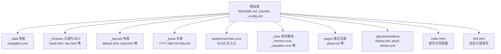
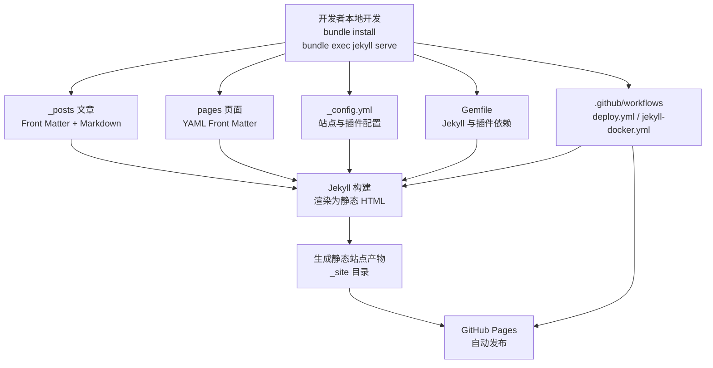
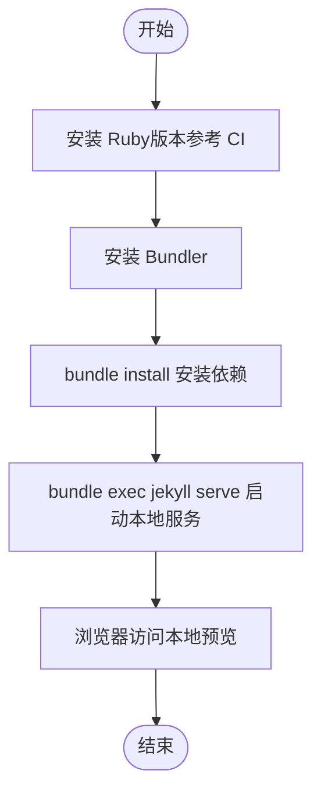
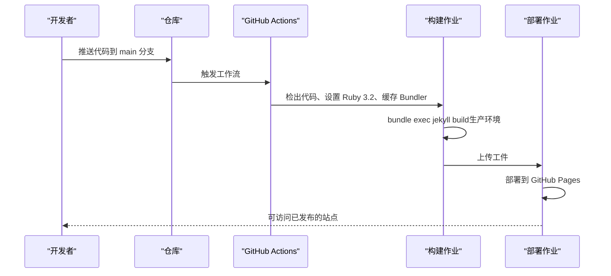
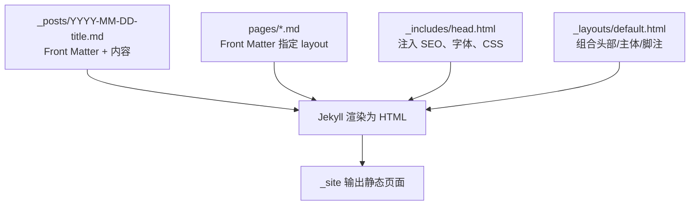
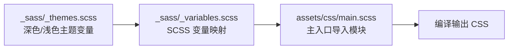
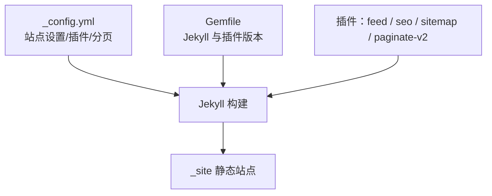

# 快速开始

<cite>
**本文引用的文件**
- [README.md](file://README.md)
- [_config.yml](file://_config.yml)
- [Gemfile](file://Gemfile)
- [.github/workflows/deploy.yml](file://.github/workflows/deploy.yml)
- [.github/workflows/jekyll-docker.yml](file://.github/workflows/jekyll-docker.yml)
- [_data/navigation.yml](file://_data/navigation.yml)
- [_layouts/default.html](file://_layouts/default.html)
- [_includes/head.html](file://_includes/head.html)
- [assets/css/main.scss](file://assets/css/main.scss)
- [index.html](file://index.html)
- [_posts/2026-05-17-welcome-to-labtab.md](file://_posts/2026-05-17-welcome-to-labtab.md)
- [pages/about.md](file://pages/about.md)
- [404.html](file://404.html)
- [_sass/_themes.scss](file://_sass/_themes.scss)
- [_sass/_variables.scss](file://_sass/_variables.scss)
</cite>

## 目录
1. [简介](#简介)
2. [项目结构](#项目结构)
3. [核心组件](#核心组件)
4. [架构总览](#架构总览)
5. [详细组件分析](#详细组件分析)
6. [依赖分析](#依赖分析)
7. [性能考虑](#性能考虑)
8. [故障排除指南](#故障排除指南)
9. [结论](#结论)
10. [附录](#附录)

## 简介
labtab 是一个基于 Jekyll 的个人技术博客，采用静态站点生成与 GitHub Pages 部署。它提供了深色主题、Neumorphism 与 Glassmorphism 设计风格、客户端搜索（支持 Ctrl+K）、分类与标签、评论系统（Giscus）、响应式布局、RSS 订阅与 SEO 优化等特性。本快速开始指南将帮助你完成环境搭建、本地开发与自动化部署，并提供常见问题排查建议。

## 项目结构
labtab 采用 Jekyll 标准目录组织，结合自定义布局、样式与数据文件，形成清晰的层次结构：
- 根目录包含站点配置、Gemfile、工作流配置与入口页面
- _config.yml 定义站点元信息、构建设置、分页、插件与默认值
- Gemfile 声明 Jekyll 与插件依赖
- .github/workflows 提供 GitHub Actions 自动化部署与 CI 检查
- _data 存放导航等数据
- _includes 提供可复用的 HTML 片段
- _layouts 定义页面与文章布局
- _posts 存放按日期命名的文章
- _sass 与 assets/css 组合 SCSS 构建样式
- pages 放置独立页面（如关于）
- 404.html 提供自定义 404 页面

图表来源
- [README.md](file://README.md)
- [_config.yml](file://_config.yml)
- [_data/navigation.yml](file://_data/navigation.yml)
- [_includes/head.html](file://_includes/head.html)
- [_layouts/default.html](file://_layouts/default.html)
- [_posts/2026-05-17-welcome-to-labtab.md](file://_posts/2026-05-17-welcome-to-labtab.md)
- [assets/css/main.scss](file://assets/css/main.scss)
- [_sass/_themes.scss](file://_sass/_themes.scss)
- [pages/about.md](file://pages/about.md)
- [404.html](file://404.html)
- [.github/workflows/deploy.yml](file://.github/workflows/deploy.yml)
- [.github/workflows/jekyll-docker.yml](file://.github/workflows/jekyll-docker.yml)
- [index.html](file://index.html)

章节来源
- [README.md](file://README.md)
- [_config.yml](file://_config.yml)
- [Gemfile](file://Gemfile)
- [_data/navigation.yml](file://_data/navigation.yml)
- [_includes/head.html](file://_includes/head.html)
- [_layouts/default.html](file://_layouts/default.html)
- [assets/css/main.scss](file://assets/css/main.scss)
- [_sass/_themes.scss](file://_sass/_themes.scss)
- [_sass/_variables.scss](file://_sass/_variables.scss)
- [pages/about.md](file://pages/about.md)
- [404.html](file://404.html)
- [index.html](file://index.html)
- [.github/workflows/deploy.yml](file://.github/workflows/deploy.yml)
- [.github/workflows/jekyll-docker.yml](file://.github/workflows/jekyll-docker.yml)

## 核心组件
- 站点配置：通过 _config.yml 设置标题、描述、语言、链接、分页、插件与默认布局等
- 依赖管理：Gemfile 声明 Jekyll 与插件版本，确保本地与 CI 环境一致
- 自动化部署：deploy.yml 在推送到 main 分支时自动构建并部署到 GitHub Pages；jekyll-docker.yml 提供容器化构建的 CI 流程
- 内容模型：文章以 _posts 下的 YYYY-MM-DD-title.md 命名，使用 YAML Front Matter；页面位于 pages 目录
- 视图层：default.html 作为基础模板，head.html 注入 SEO、字体与样式；post.html 用于文章详情
- 样式系统：SCSS 主入口导入主题、变量、布局、组件等模块，支持深色/浅色主题切换与响应式设计

章节来源
- [_config.yml](file://_config.yml)
- [Gemfile](file://Gemfile)
- [.github/workflows/deploy.yml](file://.github/workflows/deploy.yml)
- [.github/workflows/jekyll-docker.yml](file://.github/workflows/jekyll-docker.yml)
- [_posts/2026-05-17-welcome-to-labtab.md](file://_posts/2026-05-17-welcome-to-labtab.md)
- [pages/about.md](file://pages/about.md)
- [_layouts/default.html](file://_layouts/default.html)
- [_includes/head.html](file://_includes/head.html)
- [assets/css/main.scss](file://assets/css/main.scss)
- [_sass/_themes.scss](file://_sass/_themes.scss)
- [_sass/_variables.scss](file://_sass/_variables.scss)

## 架构总览
下图展示了从本地开发到 GitHub Pages 自动部署的整体流程，以及关键配置与文件的作用。

图表来源
- [README.md](file://README.md)
- [_config.yml](file://_config.yml)
- [Gemfile](file://Gemfile)
- [_posts/2026-05-17-welcome-to-labtab.md](file://_posts/2026-05-17-welcome-to-labtab.md)
- [pages/about.md](file://pages/about.md)
- [.github/workflows/deploy.yml](file://.github/workflows/deploy.yml)
- [.github/workflows/jekyll-docker.yml](file://.github/workflows/jekyll-docker.yml)

## 详细组件分析

### 环境搭建与本地开发
- Ruby 与 Bundler 安装
  - 使用包管理器或官方安装程序安装 Ruby（推荐版本在 CI 中指定为 3.2）
  - 安装 Bundler：gem install bundler
- 依赖安装
  - 在项目根目录执行 bundle install，根据 Gemfile 安装 Jekyll 与插件
- 启动本地服务
  - 执行 bundle exec jekyll serve，访问本地预览地址（通常为 http://localhost:4000）

图表来源
- [README.md](file://README.md)
- [Gemfile](file://Gemfile)
- [_config.yml](file://_config.yml)

章节来源
- [README.md](file://README.md)
- [Gemfile](file://Gemfile)
- [_config.yml](file://_config.yml)

### GitHub Actions 自动化部署
- 工作流触发
  - 推送至 main 分支或手动触发 workflow_dispatch
- 构建阶段
  - 检出代码、设置 Ruby（版本 3.2）、缓存 Bundler 依赖
  - 使用 bundle exec jekyll build 构建站点，并设置 JEKYLL_ENV=production
- 部署阶段
  - 将构建产物上传为页面工件并部署到 GitHub Pages

图表来源
- [.github/workflows/deploy.yml](file://.github/workflows/deploy.yml)

章节来源
- [.github/workflows/deploy.yml](file://.github/workflows/deploy.yml)

### 内容与布局
- 文章规范
  - 文件命名：YYYY-MM-DD-title.md
  - Front Matter 包含 layout、title、date、categories、tags、toc、comments 等
- 页面规范
  - 页面位于 pages 目录，使用 YAML Front Matter 指定 layout 与 permalink
- 基础布局
  - default.html 引入 head.html、seo.html、header.html、footer.html、search-modal.html
  - 通过 include 方式组合头部、主体与脚注，统一主题与脚本加载

图表来源
- [_posts/2026-05-17-welcome-to-labtab.md](file://_posts/2026-05-17-welcome-to-labtab.md)
- [pages/about.md](file://pages/about.md)
- [_includes/head.html](file://_includes/head.html)
- [_layouts/default.html](file://_layouts/default.html)

章节来源
- [_posts/2026-05-17-welcome-to-labtab.md](file://_posts/2026-05-17-welcome-to-labtab.md)
- [pages/about.md](file://pages/about.md)
- [_layouts/default.html](file://_layouts/default.html)
- [_includes/head.html](file://_includes/head.html)

### 样式系统与主题
- SCSS 主入口
  - main.scss 导入主题、变量、基础、布局、组件等模块，实现模块化样式组织
- 主题与变量
  - _themes.scss 定义深色/浅色主题的 CSS 自定义属性，支持平滑过渡
  - _variables.scss 将 CSS 变量映射为 SCSS 变量，便于在 SCSS 中使用颜色、排版、间距、圆角与层级
- 响应式与组件
  - 通过模块化导入实现响应式、卡片、文章、代码高亮、搜索与动画等组件样式

图表来源
- [_sass/_themes.scss](file://_sass/_themes.scss)
- [_sass/_variables.scss](file://_sass/_variables.scss)
- [assets/css/main.scss](file://assets/css/main.scss)

章节来源
- [_sass/_themes.scss](file://_sass/_themes.scss)
- [_sass/_variables.scss](file://_sass/_variables.scss)
- [assets/css/main.scss](file://assets/css/main.scss)

### 导航与页面
- 导航数据
  - _data/navigation.yml 定义主导航项（首页、归档、分类、标签、关于）
- 首页与分页
  - index.html 使用 home 布局并启用分页，控制每页显示数量与分页路径
- 错误页
  - 404.html 使用 default 布局并提供返回首页的按钮

章节来源
- [_data/navigation.yml](file://_data/navigation.yml)
- [index.html](file://index.html)
- [404.html](file://404.html)
- [_layouts/default.html](file://_layouts/default.html)

## 依赖分析
- 站点配置与构建
  - _config.yml 指定 markdown 解析器、语法高亮、永久链接格式、Sass 编译选项、分页参数与插件列表
  - exclude 列表避免不必要的文件进入构建产物
- 依赖声明与版本
  - Gemfile 固定 Jekyll 版本与插件版本，确保本地与 CI 环境一致性
- 插件生态
  - jekyll-feed、jekyll-seo-tag、jekyll-sitemap、jekyll-paginate-v2 等插件增强功能与 SEO

图表来源
- [_config.yml](file://_config.yml)
- [Gemfile](file://Gemfile)

章节来源
- [_config.yml](file://_config.yml)
- [Gemfile](file://Gemfile)

## 性能考虑
- 构建优化
  - 使用压缩样式（style: compressed），减少 CSS 体积
  - 合理拆分 SCSS 模块，避免重复导入与冗余样式
- 资源加载
  - 通过 include 复用头部与 SEO 片段，减少重复计算
  - 使用相对路径与 CDN 字体，降低首屏阻塞
- 分页与缓存
  - 启用分页减少单页内容密度，提升加载速度
  - GitHub Pages 默认缓存策略与静态托管特性有利于性能

## 故障排除指南
- 本地无法启动 jekyll serve
  - 确认已安装 Ruby 且版本与 CI 一致（3.2）
  - 执行 bundle install 并确保无依赖冲突
  - 清理缓存后重试：删除 _site 目录并重新构建
- 修改样式不生效
  - 确认 main.scss 已导入对应模块
  - 检查 _sass/_themes.scss 与 _sass/_variables.scss 是否正确更新
  - 清除浏览器缓存或强制刷新
- GitHub Pages 部署失败
  - 查看工作流日志中的构建错误（Ruby 版本、Bundler 缓存、JEKYLL_ENV）
  - 确保 _config.yml 中 baseurl 与 GitHub Pages 环境匹配
  - 如使用自定义域名，请检查 DNS 与 SSL 配置
- 文章未显示或分页异常
  - 检查文章文件命名是否符合 YYYY-MM-DD-title.md
  - 确认 Front Matter 中 layout、date、categories、tags 等字段完整
  - 核对 index.html 的分页配置与 _config.yml 的分页参数

章节来源
- [README.md](file://README.md)
- [_config.yml](file://_config.yml)
- [Gemfile](file://Gemfile)
- [.github/workflows/deploy.yml](file://.github/workflows/deploy.yml)

## 结论
通过本快速开始指南，你可以完成 labtab 的环境搭建、本地开发与自动化部署。建议在本地充分验证后再推送至 main 分支，以确保 GitHub Actions 能顺利构建并发布。随着内容增长，可进一步完善导航、样式与插件配置，持续优化性能与用户体验。

## 附录
- 新增文章步骤
  - 在 _posts 目录创建 YYYY-MM-DD-title.md
  - 在 Front Matter 中设置 layout、title、date、categories、tags、toc、comments 等
  - 编写 Markdown 内容并提交到 main 分支，等待自动部署
- 评论系统（Giscus）
  - 在仓库开启 GitHub Discussions，创建“Blog Comments”分类
  - 在 giscus.app 获取 repo_id 与 category_id，并更新 _config.yml 中的 comments 配置

章节来源
- [README.md](file://README.md)
- [_config.yml](file://_config.yml)