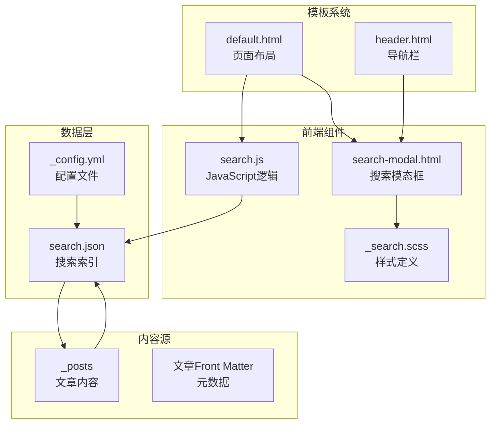
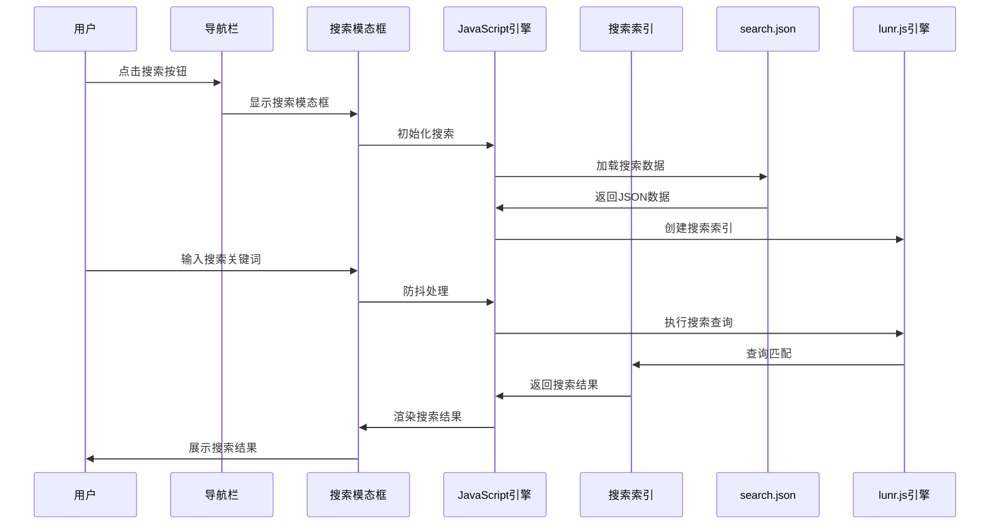
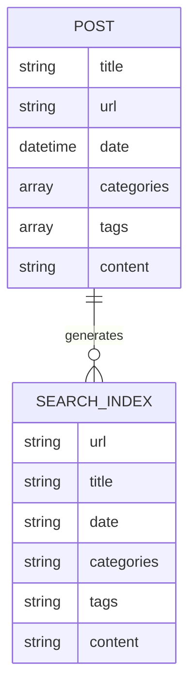
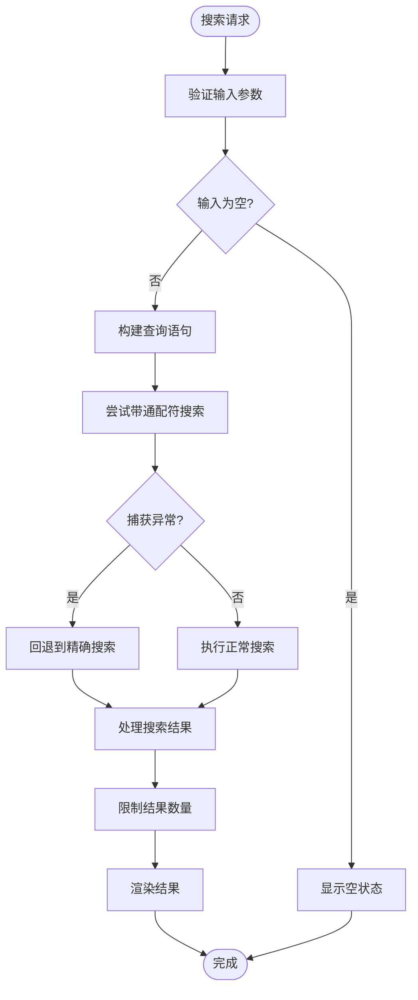
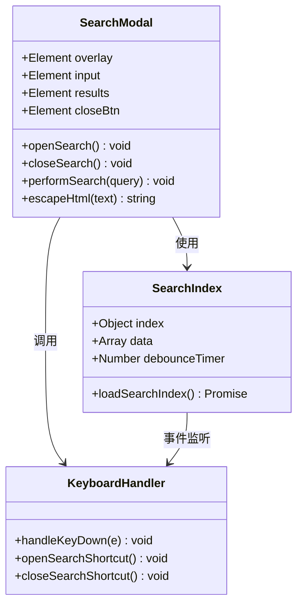
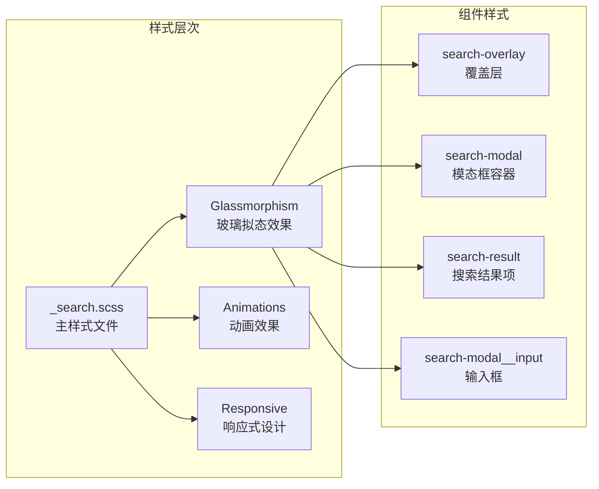
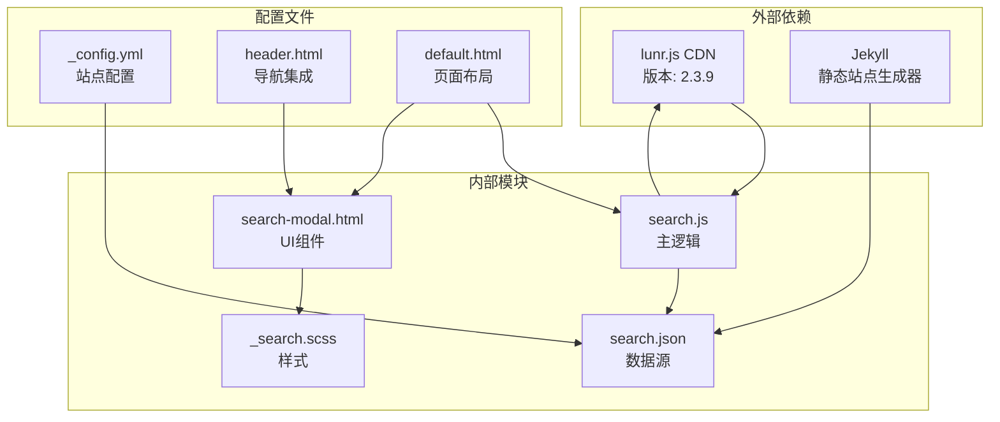
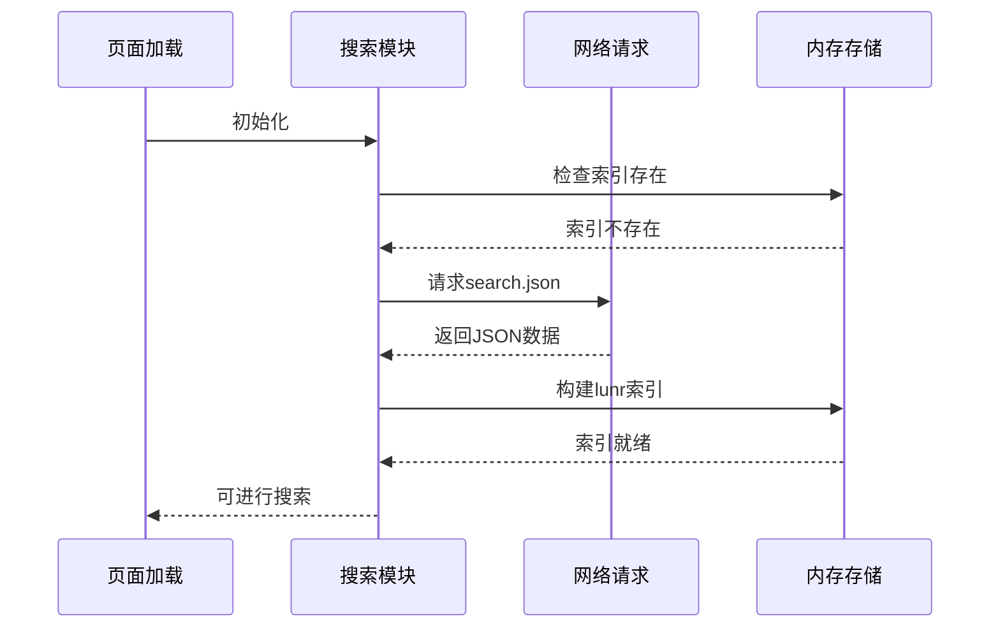

# 搜索功能

<cite>
**本文档引用的文件**
- [search.js](file://assets/js/search.js)
- [search-modal.html](file://_includes/search-modal.html)
- [search.json](file://search.json)
- [_search.scss](file://_sass/_search.scss)
- [default.html](file://_layouts/default.html)
- [header.html](file://_includes/header.html)
- [_config.yml](file://_config.yml)
- [2026-05-17-welcome-to-labtab.md](file://_posts/2026-05-17-welcome-to-labtab.md)
- [2026-05-16-modern-dev-environment.md](file://_posts/2026-05-16-modern-dev-environment.md)
</cite>

## 目录
1. [简介](#简介)
2. [项目结构](#项目结构)
3. [核心组件](#核心组件)
4. [架构概览](#架构概览)
5. [详细组件分析](#详细组件分析)
6. [依赖关系分析](#依赖关系分析)
7. [性能考虑](#性能考虑)
8. [故障排除指南](#故障排除指南)
9. [结论](#结论)

## 简介

labtab 的搜索功能是一个基于 lunr.js 的客户端搜索实现，提供了快速、高效的全文搜索体验。该系统采用静态站点生成器 Jekyll 构建，在客户端使用 lunr.js 进行全文检索，支持键盘快捷键、防抖处理和响应式设计。

## 项目结构

搜索功能涉及以下关键文件和组件：

**图表来源**
- [search-modal.html:1-24](file://_includes/search-modal.html#L1-L24)
- [search.js:1-160](file://assets/js/search.js#L1-L160)
- [search.json:1-15](file://search.json#L1-L15)
- [default.html:1-32](file://_layouts/default.html#L1-L32)

**章节来源**
- [search-modal.html:1-24](file://_includes/search-modal.html#L1-L24)
- [search.js:1-160](file://assets/js/search.js#L1-L160)
- [search.json:1-15](file://search.json#L1-L15)
- [default.html:1-32](file://_layouts/default.html#L1-L32)

## 核心组件

### 搜索索引生成器

搜索索引通过 Jekyll 在构建时生成，包含以下字段：
- **title**: 文章标题（权重：10）
- **tags**: 标签列表（权重：5）
- **categories**: 分类目录（权重：3）
- **content**: 文章内容摘要（权重：1）

### 搜索模态框

提供完整的搜索界面，包括输入框、结果展示区域和键盘快捷键提示。

### 客户端搜索引擎

基于 lunr.js 实现的高性能客户端搜索，支持模糊匹配和权重排序。

**章节来源**
- [search.js:55-65](file://assets/js/search.js#L55-L65)
- [search.json:4-14](file://search.json#L4-L14)
- [search-modal.html:1-24](file://_includes/search-modal.html#L1-L24)

## 架构概览

搜索系统的整体架构如下：

**图表来源**
- [search.js:19-70](file://assets/js/search.js#L19-L70)
- [search.js:78-110](file://assets/js/search.js#L78-L110)
- [search-modal.html:1-24](file://_includes/search-modal.html#L1-L24)

## 详细组件分析

### 搜索索引数据结构

search.json 文件定义了完整的搜索索引数据结构：

**图表来源**
- [search.json:4-14](file://search.json#L4-L14)

每个搜索条目包含以下字段：
- **url**: 文章的相对URL路径
- **title**: 文章标题（用于高权重匹配）
- **date**: 发布日期格式化字符串
- **categories**: 分类名称列表
- **tags**: 标签列表
- **content**: 去除HTML标签后的内容摘要

**章节来源**
- [search.json:4-14](file://search.json#L4-L14)
- [2026-05-17-welcome-to-labtab.md:1-10](file://_posts/2026-05-17-welcome-to-labtab.md#L1-L10)

### 搜索算法实现

搜索算法采用多字段加权匹配策略：

**图表来源**
- [search.js:78-110](file://assets/js/search.js#L78-L110)

搜索算法特点：
- **权重分配**: 标题权重最高（10），标签次之（5），分类（3），内容最低（1）
- **模糊匹配**: 自动添加通配符支持部分匹配
- **结果限制**: 最多返回8个结果
- **错误处理**: 具备异常捕获和回退机制

**章节来源**
- [search.js:55-65](file://assets/js/search.js#L55-L65)
- [search.js:78-110](file://assets/js/search.js#L78-L110)

### 搜索模态框实现

搜索模态框采用玻璃拟态设计，提供完整的用户交互体验：

**图表来源**
- [search.js:7-17](file://assets/js/search.js#L7-L17)
- [search.js:119-157](file://assets/js/search.js#L119-L157)

模态框特性：
- **键盘快捷键**: Ctrl+K/Cmd+K 打开，Esc 关闭
- **点击外部关闭**: 支持点击模态框外部区域关闭
- **防抖处理**: 输入防抖延迟200毫秒
- **响应式设计**: 支持不同屏幕尺寸

**章节来源**
- [search-modal.html:1-24](file://_includes/search-modal.html#L1-L24)
- [search.js:119-157](file://assets/js/search.js#L119-L157)

### 样式系统

搜索模态框采用 SCSS 构建，支持主题切换和动画效果：

**图表来源**
- [_search.scss:5-155](file://_sass/_search.scss#L5-L155)

样式特点：
- **玻璃拟态**: 使用半透明和阴影效果
- **动画过渡**: 模态框打开时的滑入动画
- **悬停效果**: 结果项的高亮显示
- **响应式布局**: 支持移动端适配

**章节来源**
- [_search.scss:5-155](file://_sass/_search.scss#L5-L155)

## 依赖关系分析

搜索功能的依赖关系如下：

**图表来源**
- [search.js:23](file://assets/js/search.js#L23)
- [search-modal.html:22-23](file://_includes/search-modal.html#L22-L23)
- [default.html:25](file://_layouts/default.html#L25)

**章节来源**
- [search.js:23](file://assets/js/search.js#L23)
- [search-modal.html:22-23](file://_includes/search-modal.html#L22-L23)
- [default.html:25](file://_layouts/default.html#L25)

## 性能考虑

### 异步加载策略

搜索索引采用懒加载模式，仅在用户首次打开搜索时才加载：

**图表来源**
- [search.js:36-70](file://assets/js/search.js#L36-L70)

### 内存管理

- **索引复用**: 一旦加载的索引会缓存在内存中，避免重复构建
- **DOM清理**: 关闭搜索时清空输入框和结果区域
- **事件解绑**: 合理管理事件监听器，防止内存泄漏

### 缓存机制

- **浏览器缓存**: search.json 文件利用浏览器缓存机制
- **本地存储**: lunr.js 索引在内存中的缓存
- **CDN加速**: lunr.js 从 CDN 加载，减少服务器压力

**章节来源**
- [search.js:15-17](file://assets/js/search.js#L15-L17)
- [search.js:28-33](file://assets/js/search.js#L28-L33)

## 故障排除指南

### 常见问题及解决方案

#### 搜索索引加载失败

**问题症状**: 控制台出现 "Search index load failed" 警告

**可能原因**:
- search.json 文件路径不正确
- 网络请求被阻止
- JSON 格式错误

**解决方法**:
1. 检查 search.json 文件是否存在且可访问
2. 验证 baseurl 配置是否正确
3. 确认 JSON 格式符合预期

#### 搜索结果为空

**问题症状**: 输入任何关键词都无结果

**可能原因**:
- 搜索索引未正确构建
- 字段权重设置不当
- 查询语法错误

**解决方法**:
1. 检查 search.json 中的数据完整性
2. 验证 lunr.js 字段配置
3. 测试基本查询语法

#### 键盘快捷键无效

**问题症状**: Ctrl+K 无法打开搜索

**可能原因**:
- 事件监听器未正确绑定
- 浏览器兼容性问题
- 其他元素阻止了键盘事件

**解决方法**:
1. 检查控制台是否有 JavaScript 错误
2. 验证事件监听器绑定
3. 测试其他浏览器的兼容性

**章节来源**
- [search.js:67-69](file://assets/js/search.js#L67-L69)
- [search.js:133-148](file://assets/js/search.js#L133-L148)

### 性能优化建议

#### 搜索性能调优

1. **调整防抖时间**: 根据内容量调整防抖延迟
2. **优化字段权重**: 根据实际使用情况调整字段重要性
3. **限制结果数量**: 控制每次搜索返回的结果数

#### 内存优化

1. **索引压缩**: 考虑对大型索引进行压缩
2. **按需加载**: 实现更精细的懒加载策略
3. **定期清理**: 实现索引的定期重建机制

## 结论

labtab 的搜索功能通过 Jekyll 和 lunr.js 的结合，实现了高效、响应式的客户端搜索体验。该系统具有以下优势：

- **性能优异**: 客户端搜索避免了服务器端查询开销
- **用户体验**: 提供流畅的键盘快捷键和实时搜索反馈
- **可扩展性**: 支持自定义字段权重和搜索范围
- **维护简便**: 基于静态生成的索引易于部署和维护

通过合理的数据结构设计、算法优化和性能考量，该搜索系统能够满足个人博客的搜索需求，并为未来的功能扩展奠定了良好的基础。