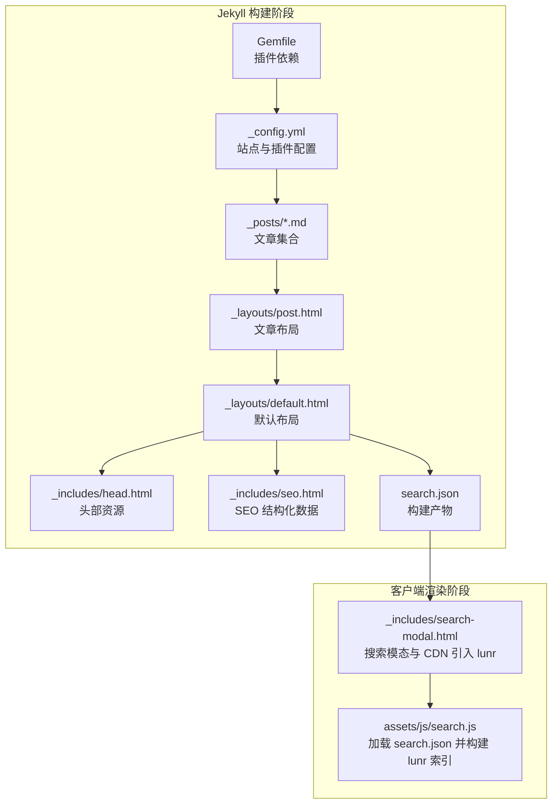
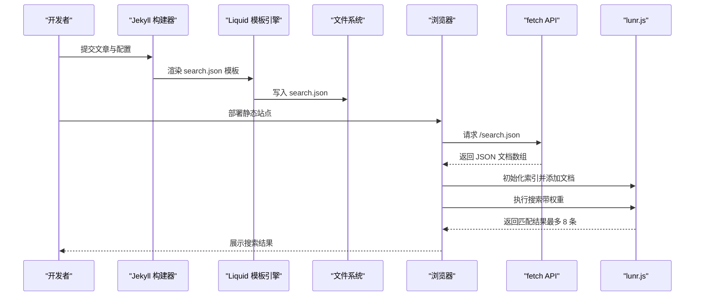
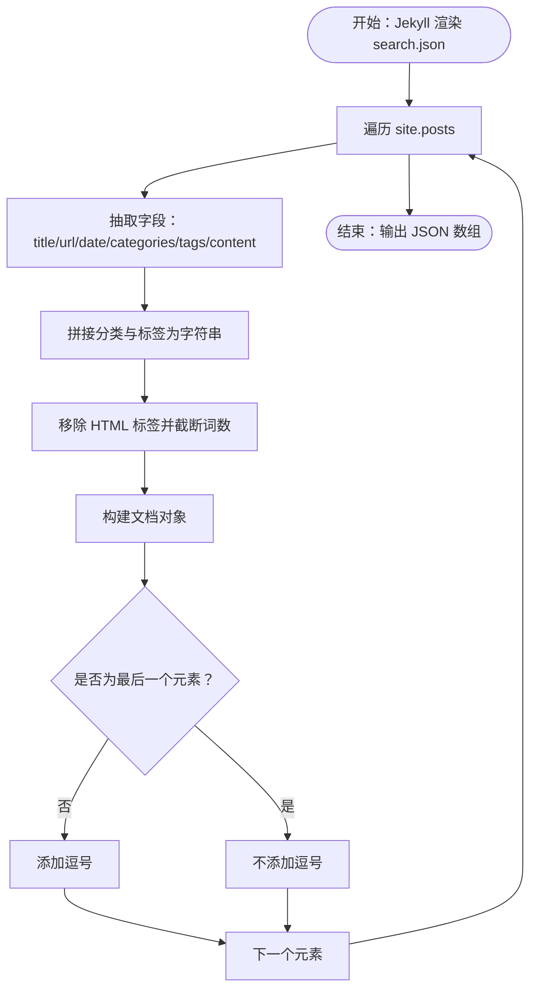
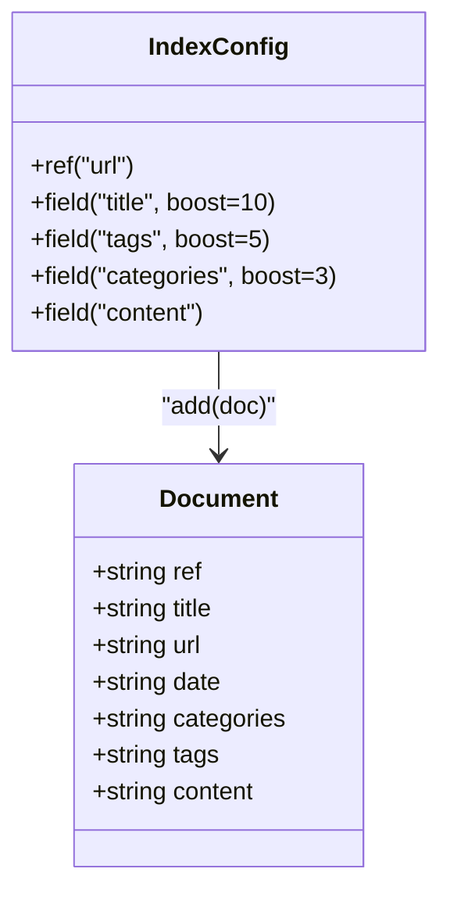
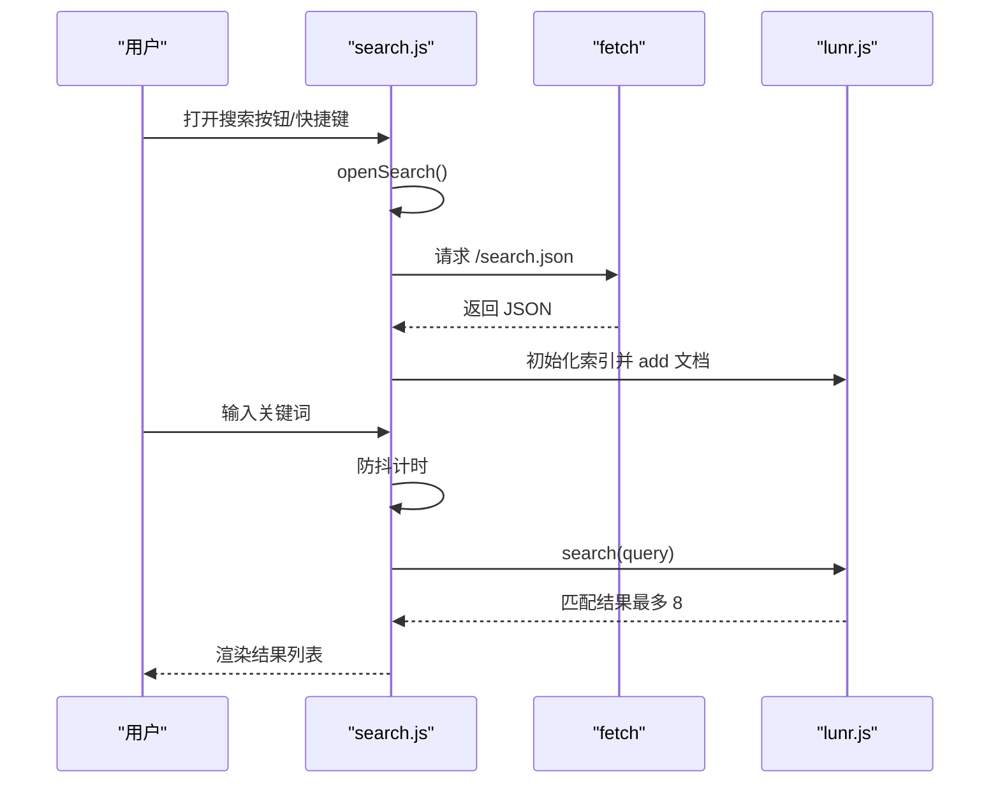
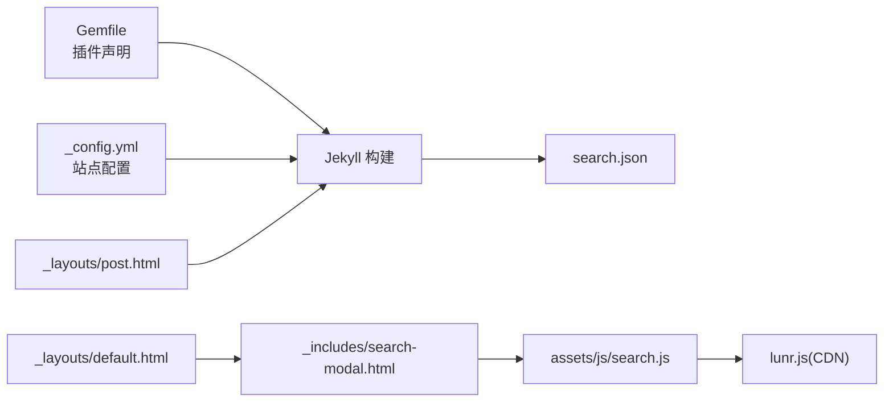

# 搜索索引生成

<cite>
**本文引用的文件**
- [search.json](file://search.json)
- [search.js](file://assets/js/search.js)
- [search-modal.html](file://_includes/search-modal.html)
- [_config.yml](file://_config.yml)
- [Gemfile](file://Gemfile)
- [post.html](file://_layouts/post.html)
- [default.html](file://_layouts/default.html)
- [_includes/head.html](file://_includes/head.html)
- [_includes/seo.html](file://_includes/seo.html)
- [2026-01-01-2025-annual-review.md](file://_posts/2026-01-01-2025-annual-review.md)
- [index.html](file://index.html)
- [navigation.yml](file://_data/navigation.yml)
</cite>

## 目录
1. [简介](#简介)
2. [项目结构](#项目结构)
3. [核心组件](#核心组件)
4. [架构总览](#架构总览)
5. [详细组件分析](#详细组件分析)
6. [依赖关系分析](#依赖关系分析)
7. [性能考量](#性能考量)
8. [故障排查指南](#故障排查指南)
9. [结论](#结论)
10. [附录](#附录)

## 简介
本文件系统性阐述 labtab 的搜索索引生成机制，覆盖以下要点：
- search.json 的生成流程：Jekyll 构建期间如何从文章集合抽取字段并输出 JSON。
- lunr.js 索引配置与权重：标题10倍、标签5倍、分类3倍、内容默认权重的设计意图与实现。
- 索引数据结构与字段作用：ref、title、tags、categories、content、date、url 的用途与来源。
- 自定义选项：可扩展的字段、权重调整、过滤规则建议。
- 维护最佳实践与性能优化策略。

## 项目结构
与搜索索引直接相关的文件分布如下：
- Jekyll 数据源与构建配置：_config.yml、Gemfile、_posts/*、_layouts/post.html、_layouts/default.html、_includes/head.html、_includes/seo.html
- 搜索前端：assets/js/search.js、_includes/search-modal.html
- 输出产物：search.json（由 Jekyll 渲染生成）

图表来源
- [_config.yml:1-91](file://_config.yml#L1-L91)
- [Gemfile:1-14](file://Gemfile#L1-L14)
- [post.html:1-83](file://_layouts/post.html#L1-L83)
- [default.html:1-32](file://_layouts/default.html#L1-L32)
- [_includes/head.html:1-30](file://_includes/head.html#L1-L30)
- [_includes/seo.html:1-26](file://_includes/seo.html#L1-L26)
- [search.json:1-15](file://search.json#L1-L15)
- [search-modal.html:1-24](file://_includes/search-modal.html#L1-L24)
- [search.js:1-160](file://assets/js/search.js#L1-L160)

章节来源
- [_config.yml:1-91](file://_config.yml#L1-L91)
- [Gemfile:1-14](file://Gemfile#L1-L14)
- [post.html:1-83](file://_layouts/post.html#L1-L83)
- [default.html:1-32](file://_layouts/default.html#L1-L32)
- [_includes/head.html:1-30](file://_includes/head.html#L1-L30)
- [_includes/seo.html:1-26](file://_includes/seo.html#L1-L26)
- [search.json:1-15](file://search.json#L1-L15)
- [search-modal.html:1-24](file://_includes/search-modal.html#L1-L24)
- [search.js:1-160](file://assets/js/search.js#L1-L160)

## 核心组件
- Jekyll 模板生成器：通过 Liquid 模板遍历文章集合，输出 search.json。
- 客户端搜索引擎：使用 lunr.js 加载 search.json，按字段权重进行检索。
- 搜索 UI：搜索模态框与键盘快捷键交互，结果展示与高亮提示。

章节来源
- [search.json:1-15](file://search.json#L1-L15)
- [search.js:1-160](file://assets/js/search.js#L1-L160)
- [search-modal.html:1-24](file://_includes/search-modal.html#L1-L24)

## 架构总览
下图展示了从 Jekyll 构建到客户端检索的整体流程：

图表来源
- [search.json:1-15](file://search.json#L1-L15)
- [search.js:35-70](file://assets/js/search.js#L35-L70)

## 详细组件分析

### 1) search.json 生成流程（Jekyll 构建）
- 数据来源：site.posts（所有文章），每篇文章来自 _posts 下的 Markdown 文件，包含 YAML Front Matter。
- 字段抽取：
  - title：文章标题
  - url：相对链接（relative_url）
  - date：发布日期（格式化为“年-月-日”）
  - categories：分类列表拼接为逗号分隔字符串
  - tags：标签列表拼接为逗号分隔字符串
  - content：去除 HTML 标签后截断为固定词数（用于摘要）
- 输出结构：JSON 数组，每个元素为一个文档对象；末尾元素后不追加逗号，确保语法正确。

图表来源
- [search.json:4-14](file://search.json#L4-L14)

章节来源
- [search.json:1-15](file://search.json#L1-L15)
- [2026-01-01-2025-annual-review.md:1-162](file://_posts/2026-01-01-2025-annual-review.md#L1-L162)
- [post.html:1-83](file://_layouts/post.html#L1-L83)

### 2) lunr.js 索引配置与权重
- 索引字段与权重：
  - title：boost 10（最高优先级）
  - tags：boost 5
  - categories：boost 3
  - content：默认权重（不显式 boost）
- 文档引用：使用 url 作为 ref，便于结果回查原始文档。
- 索引构建：在客户端加载 search.json 后，逐条 add 文档，形成内存中的倒排索引。

图表来源
- [search.js:55-65](file://assets/js/search.js#L55-L65)

章节来源
- [search.js:55-65](file://assets/js/search.js#L55-L65)

### 3) 搜索 UI 与交互
- 打开/关闭：点击按钮或按 Ctrl/Cmd+K 打开，ESC 关闭；遮罩外点击关闭。
- 输入处理：输入事件采用防抖（约 200ms），避免频繁重建索引。
- 结果展示：最多返回 8 条，显示标题、摘要片段与元信息。
- 错误处理：加载失败时控制台警告，不影响页面其他功能。

图表来源
- [search.js:19-157](file://assets/js/search.js#L19-L157)
- [search-modal.html:1-24](file://_includes/search-modal.html#L1-L24)

章节来源
- [search.js:1-160](file://assets/js/search.js#L1-L160)
- [search-modal.html:1-24](file://_includes/search-modal.html#L1-L24)

### 4) 数据模型与字段说明
- ref：文档唯一标识（使用 url），用于从原始数据集中定位对应文章。
- title：文章标题，权重最高，直接影响命中排序。
- url：文章链接，用于结果点击跳转。
- date：发布日期，用于结果展示与排序参考。
- categories：分类字符串，权重中等，辅助分类筛选。
- tags：标签字符串，权重较高，提升相关性。
- content：摘要文本，来源于正文去 HTML 标签并截断，用于全文检索与结果预览。

章节来源
- [search.json:5-11](file://search.json#L5-L11)
- [search.js:55-65](file://assets/js/search.js#L55-L65)

### 5) 自定义选项与扩展建议
- 字段扩展：
  - 可在 search.json 中新增字段（如 excerpt、image、reading_time 等），并在客户端读取时使用。
  - 注意：新增字段需同步更新 lunr.js 的 field 声明与权重配置。
- 权重调整：
  - 根据业务需求修改 boost 值（例如提高 tags 或 content 权重）。
  - 调整后需重新构建并部署。
- 过滤规则：
  - 可在客户端对结果进行二次过滤（如按日期范围、分类标签过滤）。
  - 也可在 Jekyll 侧通过条件判断仅输出满足条件的文章到索引。
- 多语言支持：
  - 当前搜索 UI 使用本地化字典键值，可结合站点语言切换动态调整权重或结果文案。

章节来源
- [search.json:4-14](file://search.json#L4-L14)
- [search.js:55-65](file://assets/js/search.js#L55-L65)

### 6) 与站点其他模块的集成
- 默认布局：default.html 引入搜索模态与脚本，确保所有页面具备搜索能力。
- 头部资源：head.html 提供字体、图标与主样式，保证搜索 UI 视觉一致。
- SEO 结构化数据：seo.html 为文章页注入结构化数据，与搜索索引互补（SEO 与站内检索）。

章节来源
- [default.html:13-31](file://_layouts/default.html#L13-L31)
- [_includes/head.html:1-30](file://_includes/head.html#L1-L30)
- [_includes/seo.html:1-26](file://_includes/seo.html#L1-L26)

## 依赖关系分析
- Jekyll 插件链路：Gemfile 声明的插件（如 jekyll-feed、jekyll-seo-tag、jekyll-sitemap、jekyll-paginate-v2）影响站点构建与 SEO，间接影响搜索索引的可用性与一致性。
- 模板依赖：search.json 依赖 post 布局与文章 Front Matter；default.html 依赖 head.html 与 seo.html。
- 客户端依赖：search.js 依赖 search-modal.html 中的 CDN 引入的 lunr.js。

图表来源
- [Gemfile:1-14](file://Gemfile#L1-L14)
- [_config.yml:1-91](file://_config.yml#L1-L91)
- [post.html:1-83](file://_layouts/post.html#L1-L83)
- [default.html:1-32](file://_layouts/default.html#L1-L32)
- [search-modal.html:1-24](file://_includes/search-modal.html#L1-L24)
- [search.js:1-160](file://assets/js/search.js#L1-L160)

章节来源
- [Gemfile:1-14](file://Gemfile#L1-L14)
- [_config.yml:1-91](file://_config.yml#L1-L91)
- [post.html:1-83](file://_layouts/post.html#L1-L83)
- [default.html:1-32](file://_layouts/default.html#L1-L32)
- [search-modal.html:1-24](file://_includes/search-modal.html#L1-L24)
- [search.js:1-160](file://assets/js/search.js#L1-L160)

## 性能考量
- 客户端索引构建：
  - 一次性加载 search.json 并在内存中构建 lunr 索引，适合中小型站点。
  - 若文章数量增长，可考虑服务端预构建索引并提供 API，或启用 CDN 缓存。
- 防抖与结果限制：
  - 输入防抖减少频繁搜索与 DOM 更新；限制结果数量（当前 8）降低渲染压力。
- 内容截断：
  - 对 content 进行截断可显著减小索引体积，但可能影响摘要质量，可根据需要调整词数。
- 网络与缓存：
  - 确保 search.json 与静态资源可被浏览器缓存；必要时为 search.json 设置合适的缓存头。
- 体积优化：
  - 移除不必要的字段与 HTML 标签，避免索引膨胀。
  - 对高频词与停用词进行过滤（可在 Jekyll 侧预处理或在 lunr.js 中引入 pipeline 过滤器）。

## 故障排查指南
- 搜索无结果或报错：
  - 检查 search.json 是否存在且格式正确（Jekyll 构建是否成功）。
  - 浏览器控制台查看 fetch 错误与 lunr 初始化异常。
- 权重不符合预期：
  - 确认 search.js 中的字段与 boost 设置是否与 search.json 字段一致。
- 结果不准确：
  - 检查 content 字段是否被过度截断；适当增加词数或改用更短摘要。
- 快捷键无效：
  - 确认搜索模态与脚本已正确引入；检查键盘事件绑定是否生效。
- 基础路径问题：
  - 若部署在子路径，确认 meta 中的 baseurl 与 search.js 中的路径拼接逻辑一致。

章节来源
- [search.js:35-70](file://assets/js/search.js#L35-L70)
- [search-modal.html:1-24](file://_includes/search-modal.html#L1-L24)

## 结论
labtab 的搜索索引生成采用“Jekyll 生成 + 客户端检索”的轻量方案：Jekyll 在构建期将文章数据序列化为 search.json，客户端通过 lunr.js 实现高性能的全文检索。该方案易于维护、部署简单，适合个人博客与中小型站点。随着内容规模增长，可逐步引入服务端索引、CDN 缓存与更精细的权重与过滤策略。

## 附录
- 关键路径速览：
  - 搜索数据生成：[search.json:1-15](file://search.json#L1-L15)
  - 客户端索引与检索：[search.js:35-110](file://assets/js/search.js#L35-L110)
  - 搜索 UI 模板：[search-modal.html:1-24](file://_includes/search-modal.html#L1-L24)
  - 站点配置与插件：[_config.yml:1-91](file://_config.yml#L1-L91)、[Gemfile:1-14](file://Gemfile#L1-L14)
  - 文章布局与 Front Matter：[post.html:1-83](file://_layouts/post.html#L1-L83)、[2026-01-01-2025-annual-review.md:1-162](file://_posts/2026-01-01-2025-annual-review.md#L1-L162)
  - 布局与头部资源：[default.html:1-32](file://_layouts/default.html#L1-L32)、[_includes/head.html:1-30](file://_includes/head.html#L1-L30)、[_includes/seo.html:1-26](file://_includes/seo.html#L1-L26)
  - 导航与首页：[navigation.yml:1-16](file://_data/navigation.yml#L1-L16)、[index.html:1-6](file://index.html#L1-L6)