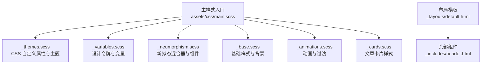
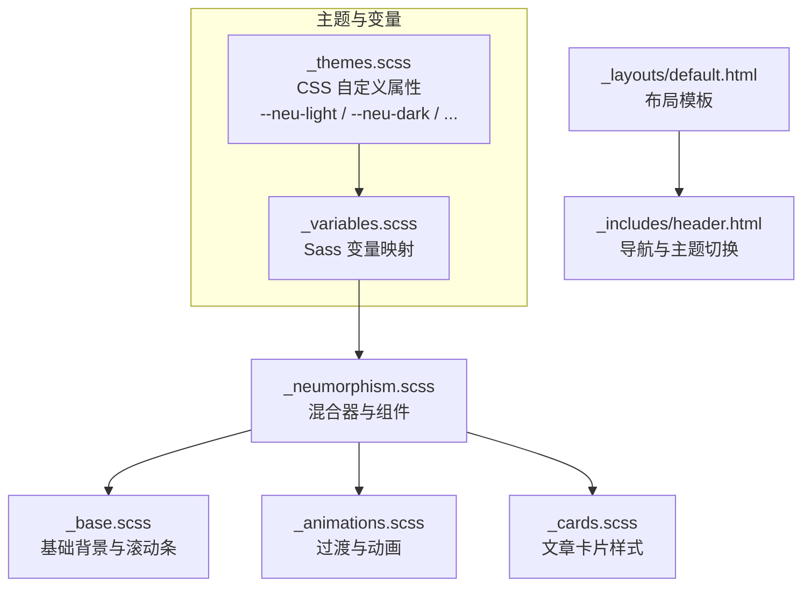
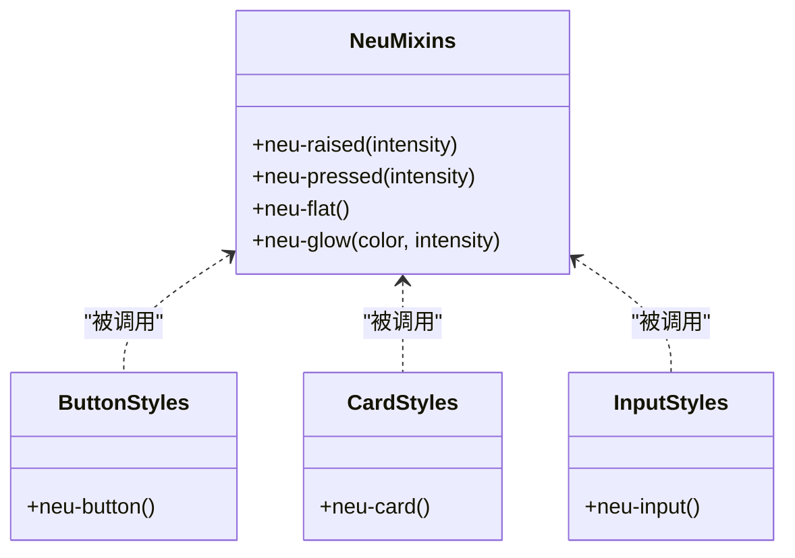
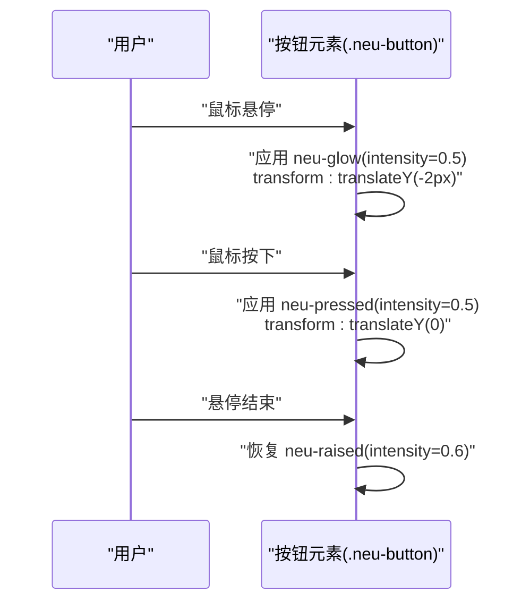
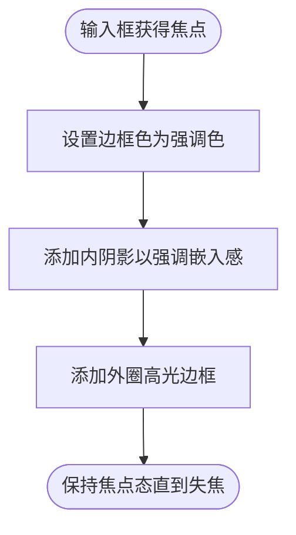
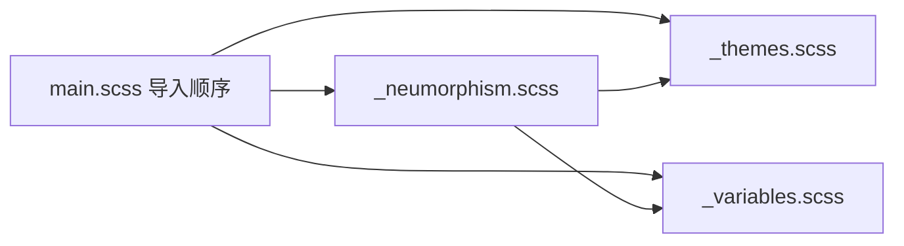

# Neumorphism 设计风格

<cite>
**本文引用的文件**
- [_sass/_neumorphism.scss](file://_sass/_neumorphism.scss)
- [_sass/_variables.scss](file://_sass/_variables.scss)
- [_sass/_themes.scss](file://_sass/_themes.scss)
- [assets/css/main.scss](file://assets/css/main.scss)
- [_sass/_base.scss](file://_sass/_base.scss)
- [_sass/_animations.scss](file://_sass/_animations.scss)
- [_sass/_cards.scss](file://_sass/_cards.scss)
- [_layouts/default.html](file://_layouts/default.html)
- [_includes/header.html](file://_includes/header.html)
- [README.md](file://README.md)
</cite>

## 目录
1. [简介](#简介)
2. [项目结构](#项目结构)
3. [核心组件](#核心组件)
4. [架构总览](#架构总览)
5. [详细组件分析](#详细组件分析)
6. [依赖关系分析](#依赖关系分析)
7. [性能考量](#性能考量)
8. [故障排查指南](#故障排查指南)
9. [结论](#结论)
10. [附录](#附录)

## 简介
本文件面向希望在 labtab 中理解并应用 neumorphism（新拟态）设计风格的开发者与设计师。文档基于仓库中的 Sass 源码与主题系统，系统阐述了 neumorphism 混合器的实现原理、组件样式与状态动画、色彩体系与变量使用，并给出最佳实践与排障建议。

## 项目结构
labtab 的样式组织以 Sass 分层模块为主，neumorphism 样式位于独立模块中，通过主入口文件统一导入。整体结构如下：

图示来源
- [assets/css/main.scss:1-17](file://assets/css/main.scss#L1-L17)
- [_sass/_themes.scss:1-150](file://_sass/_themes.scss#L1-L150)
- [_sass/_variables.scss:1-91](file://_sass/_variables.scss#L1-L91)
- [_sass/_neumorphism.scss:1-92](file://_sass/_neumorphism.scss#L1-L92)
- [_sass/_base.scss:1-172](file://_sass/_base.scss#L1-L172)
- [_sass/_animations.scss:1-78](file://_sass/_animations.scss#L1-L78)
- [_sass/_cards.scss:1-126](file://_sass/_cards.scss#L1-L126)
- [_layouts/default.html:1-32](file://_layouts/default.html#L1-L32)
- [_includes/header.html:1-44](file://_includes/header.html#L1-L44)

章节来源
- [assets/css/main.scss:1-17](file://assets/css/main.scss#L1-L17)
- [_sass/_neumorphism.scss:1-92](file://_sass/_neumorphism.scss#L1-L92)
- [_sass/_variables.scss:1-91](file://_sass/_variables.scss#L1-L91)
- [_sass/_themes.scss:1-150](file://_sass/_themes.scss#L1-L150)
- [_sass/_base.scss:1-172](file://_sass/_base.scss#L1-L172)
- [_sass/_animations.scss:1-78](file://_sass/_animations.scss#L1-L78)
- [_sass/_cards.scss:1-126](file://_sass/_cards.scss#L1-L126)
- [_layouts/default.html:1-32](file://_layouts/default.html#L1-L32)
- [_includes/header.html:1-44](file://_includes/header.html#L1-L44)

## 核心组件
本节聚焦 neumorphism 混合器与关键组件的实现要点，包括 raised、pressed、flat、glow 等状态的阴影计算方式，以及按钮、卡片、输入框的样式与过渡动画。

- raised（抬起）状态
  - 通过两个方向相反的外阴影模拟“浮起”效果，强度由参数控制，分别对应明暗两组色值。
  - 关键路径：[raised 混合器:6-10](file://_sass/_neumorphism.scss#L6-L10)

- pressed（按入）状态
  - 使用内阴影（inset）模拟“按压”凹陷，同样由强度参数与明暗色值组合。
  - 关键路径：[pressed 混合器:13-17](file://_sass/_neumorphism.scss#L13-L17)

- flat（平面）状态
  - 清空阴影，作为基础态。
  - 关键路径：[flat 混合器:20-22](file://_sass/_neumorphism.scss#L20-L22)

- glow（发光）状态
  - 在 raised 基础上叠加一圈柔和的发光阴影，用于强调悬停或焦点。
  - 关键路径：[glow 混合器:25-30](file://_sass/_neumorphism.scss#L25-L30)

- 按钮（neu-button）
  - 默认使用轻微的 raised；hover 时切换到 glow 并轻微上移；active 时切换到 pressed。
  - 关键路径：[按钮混合器:33-51](file://_sass/_neumorphism.scss#L33-L51)

- 卡片（neu-card）
  - 默认使用较明显的 raised；hover 时 glow 并更显著的上移，增强交互反馈。
  - 关键路径：[卡片混合器:54-66](file://_sass/_neumorphism.scss#L54-L66)

- 输入框（neu-input）
  - 默认使用 pressed，强调“嵌入”感；focus 时更新边框色与内阴影，并添加高亮边框。
  - 关键路径：[输入框混合器:69-91](file://_sass/_neumorphism.scss#L69-L91)

章节来源
- [_sass/_neumorphism.scss:1-92](file://_sass/_neumorphism.scss#L1-L92)

## 架构总览
下图展示 neumorphism 样式在主题与变量系统之上的装配关系，以及组件状态切换的流程。

图示来源
- [_sass/_themes.scss:62-66](file://_sass/_themes.scss#L62-L66)
- [_sass/_variables.scss:27-30](file://_sass/_variables.scss#L27-L30)
- [_sass/_neumorphism.scss:1-30](file://_sass/_neumorphism.scss#L1-L30)
- [_sass/_base.scss:1-29](file://_sass/_base.scss#L1-L29)
- [_sass/_animations.scss:68-77](file://_sass/_animations.scss#L68-L77)
- [_sass/_cards.scss:1-31](file://_sass/_cards.scss#L1-L31)
- [_layouts/default.html:1-32](file://_layouts/default.html#L1-L32)
- [_includes/header.html:1-44](file://_includes/header.html#L1-L44)

## 详细组件分析

### 混合器类图（代码级）

图示来源
- [_sass/_neumorphism.scss:6-30](file://_sass/_neumorphism.scss#L6-L30)
- [_sass/_neumorphism.scss:33-51](file://_sass/_neumorphism.scss#L33-L51)
- [_sass/_neumorphism.scss:54-66](file://_sass/_neumorphism.scss#L54-L66)
- [_sass/_neumorphism.scss:69-91](file://_sass/_neumorphism.scss#L69-L91)

### 按钮状态切换序列图

图示来源
- [_sass/_neumorphism.scss:33-51](file://_sass/_neumorphism.scss#L33-L51)

### 输入框焦点流程图

图示来源
- [_sass/_neumorphism.scss:81-86](file://_sass/_neumorphism.scss#L81-L86)

### 色彩体系与变量使用
- 主题变量
  - 通过 CSS 自定义属性定义深浅主题下的核心色、表面色、文本色与 neumorphism 阴影色。
  - 关键路径：[深色主题阴影变量:62-66](file://_sass/_themes.scss#L62-L66)、[浅色主题阴影变量:134-138](file://_sass/_themes.scss#L134-L138)

- Sass 变量映射
  - 将 CSS 变量映射为 Sass 变量，供混合器与组件使用。
  - 关键路径：[neumorphism 变量映射:27-30](file://_sass/_variables.scss#L27-L30)

- 过渡与动画
  - 全局过渡时长与减少动效偏好设置，确保 neumorphism 动画自然且尊重用户偏好。
  - 关键路径：[全局过渡:147-149](file://_sass/_themes.scss#L147-L149)、[减少动效处理:68-77](file://_sass/_animations.scss#L68-L77)

章节来源
- [_sass/_themes.scss:62-66](file://_sass/_themes.scss#L62-L66)
- [_sass/_themes.scss:134-138](file://_sass/_themes.scss#L134-L138)
- [_sass/_variables.scss:27-30](file://_sass/_variables.scss#L27-L30)
- [_sass/_themes.scss:147-149](file://_sass/_themes.scss#L147-L149)
- [_sass/_animations.scss:68-77](file://_sass/_animations.scss#L68-L77)

### 文章卡片样式与交互
- 卡片基础样式采用玻璃体风格（glass-card），并叠加 neumorphism 抬起效果。
- 悬停时显示顶部渐变高亮条带，体现层次变化。
- 关键路径：[卡片容器与伪元素:5-31](file://_sass/_cards.scss#L5-L31)

章节来源
- [_sass/_cards.scss:5-31](file://_sass/_cards.scss#L5-L31)

## 依赖关系分析
- 主入口导入顺序决定变量与混合器的可用性与作用域。
- 主题系统通过 CSS 自定义属性驱动，Sass 变量仅作映射，避免重复维护。
- 组件样式依赖于变量与混合器，hover/active/focus 状态通过伪类与混合器组合实现。

图示来源
- [assets/css/main.scss:3-7](file://assets/css/main.scss#L3-L7)
- [_sass/_themes.scss:1-150](file://_sass/_themes.scss#L1-L150)
- [_sass/_variables.scss:1-91](file://_sass/_variables.scss#L1-L91)
- [_sass/_neumorphism.scss:1-92](file://_sass/_neumorphism.scss#L1-L92)

章节来源
- [assets/css/main.scss:1-17](file://assets/css/main.scss#L1-L17)
- [_sass/_neumorphism.scss:1-92](file://_sass/_neumorphism.scss#L1-L92)
- [_sass/_variables.scss:1-91](file://_sass/_variables.scss#L1-L91)
- [_sass/_themes.scss:1-150](file://_sass/_themes.scss#L1-L150)

## 性能考量
- 阴影与过渡
  - neumorphism 的阴影与 transform 动画在现代浏览器中通常性能良好，但应避免在同一帧内对大量元素同时触发动画。
  - 建议：控制 hover 区域大小，减少不必要的层级嵌套，避免在低性能设备上出现掉帧。

- 减少动效偏好
  - 已通过媒体查询将动画时长与过渡时间降至极短，以尊重“减少动效”的系统偏好。
  - 关键路径：[减少动效处理:68-77](file://_sass/_animations.scss#L68-L77)

- 主题切换
  - 主题切换通过 CSS 自定义属性即时生效，无需重绘整个组件树，性能开销较低。
  - 关键路径：[主题切换脚本:6-11](file://_layouts/default.html#L6-L11)、[主题变量:6-76](file://_sass/_themes.scss#L6-L76)

章节来源
- [_sass/_animations.scss:68-77](file://_sass/_animations.scss#L68-L77)
- [_layouts/default.html:6-11](file://_layouts/default.html#L6-L11)
- [_sass/_themes.scss:6-76](file://_sass/_themes.scss#L6-L76)

## 故障排查指南
- 按钮无阴影或阴影异常
  - 检查是否正确引入 neumorphism 模块与变量映射。
  - 关键路径：[主入口导入](file://assets/css/main.scss#L6)、[变量映射:27-30](file://_sass/_variables.scss#L27-L30)

- 悬停/按压效果不生效
  - 确认元素是否应用了对应的混合器与伪类选择器。
  - 关键路径：[按钮状态:33-51](file://_sass/_neumorphism.scss#L33-L51)、[卡片状态:54-66](file://_sass/_neumorphism.scss#L54-L66)

- 输入框焦点边框不显示
  - 检查 focus 伪类与边框色变量是否正确。
  - 关键路径：[输入框 focus 样式:81-86](file://_sass/_neumorphism.scss#L81-L86)

- 主题切换后 neumorphism 阴影不匹配
  - 确认 CSS 自定义属性已正确更新，且混合器使用的是变量而非硬编码值。
  - 关键路径：[主题变量:62-66](file://_sass/_themes.scss#L62-L66)、[变量映射:27-30](file://_sass/_variables.scss#L27-L30)

章节来源
- [assets/css/main.scss:6](file://assets/css/main.scss#L6)
- [_sass/_variables.scss:27-30](file://_sass/_variables.scss#L27-L30)
- [_sass/_neumorphism.scss:33-51](file://_sass/_neumorphism.scss#L33-L51)
- [_sass/_neumorphism.scss:54-66](file://_sass/_neumorphism.scss#L54-L66)
- [_sass/_neumorphism.scss:81-86](file://_sass/_neumorphism.scss#L81-L86)
- [_sass/_themes.scss:62-66](file://_sass/_themes.scss#L62-L66)

## 结论
labtab 的 neumorphism 实现以混合器为核心，结合主题系统与变量映射，提供了可配置的 raised、pressed、flat、glow 状态与组件级过渡动画。通过合理的强度与过渡参数、清晰的色彩体系与主题切换机制，能够在不同主题下稳定呈现新拟态风格。建议在复杂页面中谨慎使用阴影与动画，优先保障性能与可访问性。

## 附录

### 最佳实践清单
- 强度调节
  - 按钮：raised 强度建议在 0.5–0.7 之间，glow 强度在 0.4–0.6 之间，避免过强导致“发光溢出”。
  - 卡片：raised 强度建议在 0.6–0.8，hover 上移幅度控制在 2–4px。
  - 输入框：pressed 强度建议在 0.3–0.5，focus 边框宽度与高光半径保持与整体比例协调。

- 过渡时间
  - 基础过渡：使用 0.25–0.35s，兼顾响应与流畅。
  - 减少动效：遵循系统偏好，将动画时长降至极短。

- 圆角半径
  - 按钮与卡片：使用 10–12px；输入框：8px 左右，保持与整体风格一致。

- 色彩策略
  - 主色调：强调色取自主题的 --accent-start/--accent-end。
  - 阴影色：--neu-light 与 --neu-dark 在深浅主题下差异明显，需确保对比度满足可读性要求。
  - 边框色：hover 时使用 --glass-border-30 提升层次感。

- 可访问性
  - 确保 focus 状态具备可见轮廓，避免仅依赖阴影变化。
  - 为减少动效偏好的用户提供简化体验。

章节来源
- [_sass/_neumorphism.scss:33-51](file://_sass/_neumorphism.scss#L33-L51)
- [_sass/_neumorphism.scss:54-66](file://_sass/_neumorphism.scss#L54-L66)
- [_sass/_neumorphism.scss:69-91](file://_sass/_neumorphism.scss#L69-L91)
- [_sass/_themes.scss:62-66](file://_sass/_themes.scss#L62-L66)
- [_sass/_themes.scss:134-138](file://_sass/_themes.scss#L134-L138)
- [_sass/_animations.scss:68-77](file://_sass/_animations.scss#L68-L77)
- [README.md:7](file://README.md#L7)