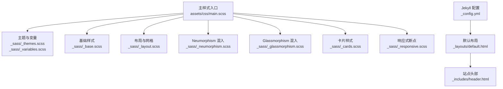
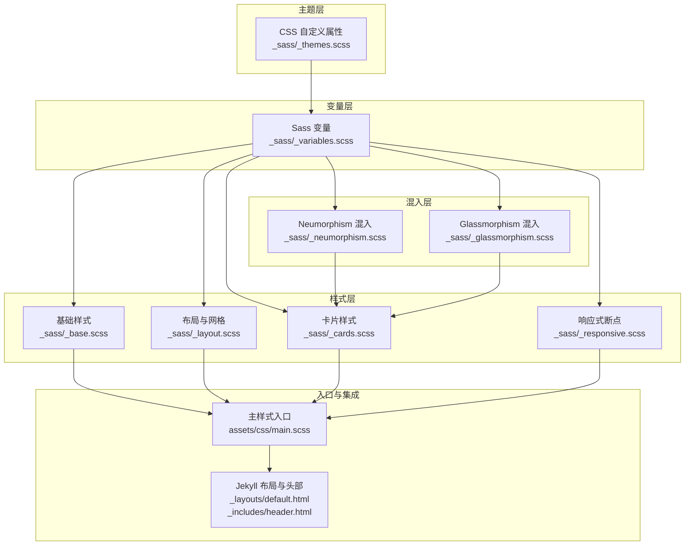
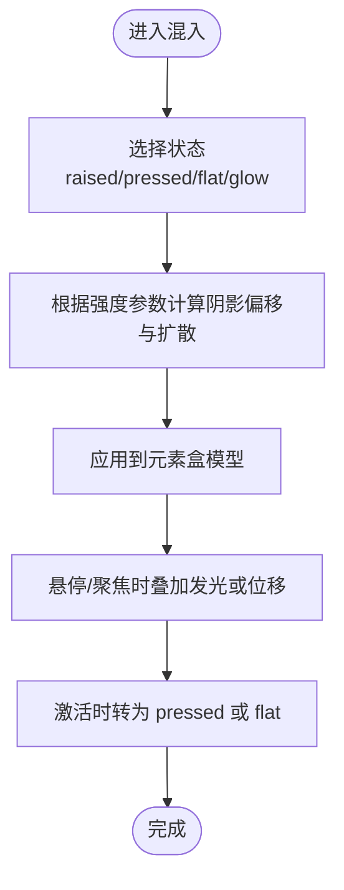
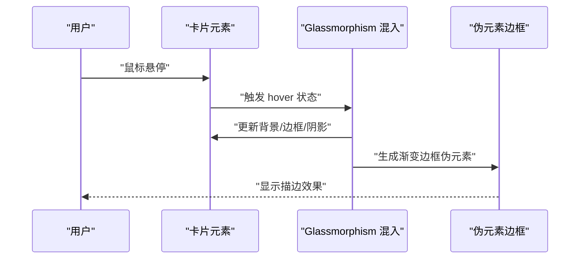
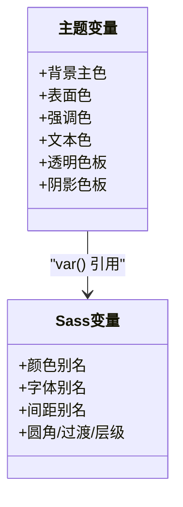
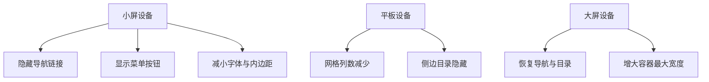
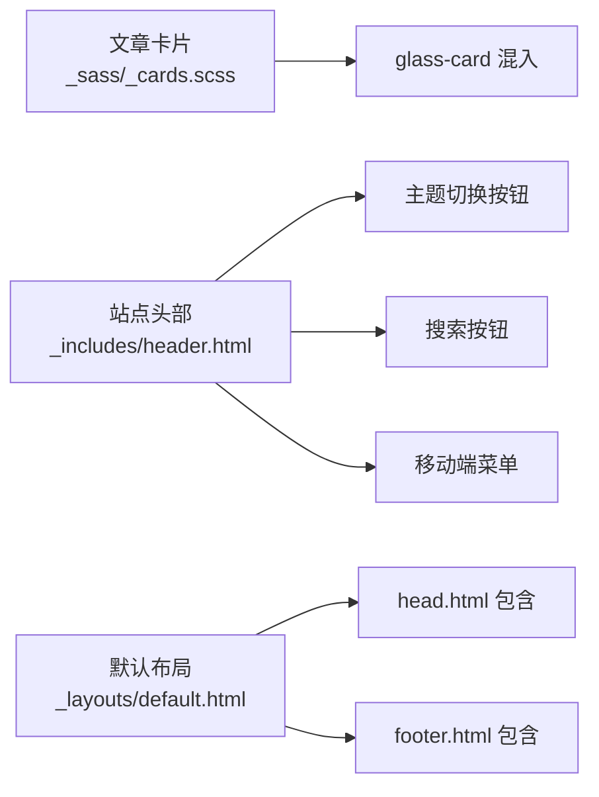
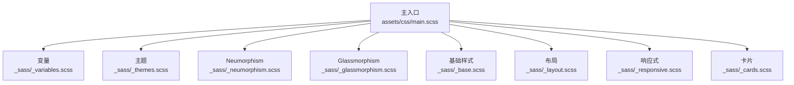

# 设计系统

<cite>
**本文引用的文件**
- [主样式入口](file://assets/css/main.scss)
- [变量定义](file://_sass/_variables.scss)
- [主题与 CSS 自定义属性](file://_sass/_themes.scss)
- [基础样式与排版](file://_sass/_base.scss)
- [网格与布局工具](file://_sass/_layout.scss)
- [响应式断点](file://_sass/_responsive.scss)
- [圆角与阴影混入（Neumorphism）](file://_sass/_neumorphism.scss)
- [玻璃拟态混入与渐变边框](file://_sass/_glassmorphism.scss)
- [文章卡片样式](file://_sass/_cards.scss)
- [Jekyll 配置](file://_config.yml)
- [默认布局模板](file://_layouts/default.html)
- [站点头部模板](file://_includes/header.html)
- [设计系统实践文章](file://_posts/2026-05-13-css-design-system.md)
- [博客首页文章](file://_posts/2026-05-17-welcome-to-labtab.md)
- [项目自述文件](file://README.md)
</cite>

## 目录
1. [简介](#简介)
2. [项目结构](#项目结构)
3. [核心组件](#核心组件)
4. [架构总览](#架构总览)
5. [详细组件分析](#详细组件分析)
6. [依赖关系分析](#依赖关系分析)
7. [性能考量](#性能考量)
8. [故障排查指南](#故障排查指南)
9. [结论](#结论)
10. [附录](#附录)

## 简介
本设计系统以 CSS 自定义属性为核心，结合 Sass 变量与混入（mixins），在 Jekyll 静态站点中实现统一的视觉与交互语言。系统重点涵盖以下方面：
- Neumorphism（软拟态）与 Glassmorphism（玻璃拟态）两种风格的阴影与背景实现
- 设计令牌（Design Tokens）体系：颜色、字体、间距、圆角、过渡与层级
- 响应式设计策略：断点、移动端优先、触摸交互优化
- 组件库使用指南：按钮、卡片、导航等的样式定制与扩展
- 设计系统的扩展方法：新增设计元素与组件的最佳实践

## 项目结构
设计系统由“主题变量 → 样式混入 → 基础样式 → 组件样式 → 布局与响应式”构成，通过主入口样式文件统一编译输出。

图表来源
- [主样式入口:1-17](file://assets/css/main.scss#L1-L17)
- [主题与变量:1-150](file://_sass/_themes.scss#L1-L150)
- [变量定义:1-91](file://_sass/_variables.scss#L1-L91)
- [基础样式与排版:1-172](file://_sass/_base.scss#L1-L172)
- [网格与布局工具:1-107](file://_sass/_layout.scss#L1-L107)
- [圆角与阴影混入（Neumorphism）:1-92](file://_sass/_neumorphism.scss#L1-L92)
- [玻璃拟态混入与渐变边框:1-89](file://_sass/_glassmorphism.scss#L1-L89)
- [文章卡片样式:1-126](file://_sass/_cards.scss#L1-L126)
- [响应式断点:1-119](file://_sass/_responsive.scss#L1-L119)
- [Jekyll 配置:1-91](file://_config.yml#L1-L91)
- [默认布局模板:1-32](file://_layouts/default.html#L1-L32)
- [站点头部模板:1-44](file://_includes/header.html#L1-L44)

章节来源
- [主样式入口:1-17](file://assets/css/main.scss#L1-L17)
- [Jekyll 配置:1-91](file://_config.yml#L1-L91)

## 核心组件
- 主题与 CSS 自定义属性：通过根级与主题选择器定义颜色、透明度、模糊半径、阴影等，供 Sass 变量与混入间接引用，实现深浅主题无缝切换。
- 设计令牌（Design Tokens）：颜色、字体、间距、圆角、过渡时间、层级等变量集中管理，确保全局一致性。
- Neumorphism 混入：提供 raised/pressed/flat/glow 等状态的阴影组合，以及按钮、卡片、输入框的样式封装。
- Glassmorphism 混入：提供标准、重型、轻量、渐变边框等玻璃容器样式，配合 backdrop-filter 与伪元素实现边框描边。
- 基础样式与排版：重置、字体、标题、段落、列表、引用、表格、滚动条等基础元素的统一风格。
- 布局系统：容器、网格、弹性布局工具类与阅读进度条等。
- 响应式断点：针对不同设备宽度的布局与交互调整。

章节来源
- [主题与 CSS 自定义属性:1-150](file://_sass/_themes.scss#L1-L150)
- [变量定义:1-91](file://_sass/_variables.scss#L1-L91)
- [圆角与阴影混入（Neumorphism）:1-92](file://_sass/_neumorphism.scss#L1-L92)
- [玻璃拟态混入与渐变边框:1-89](file://_sass/_glassmorphism.scss#L1-L89)
- [基础样式与排版:1-172](file://_sass/_base.scss#L1-L172)
- [网格与布局工具:1-107](file://_sass/_layout.scss#L1-L107)
- [响应式断点:1-119](file://_sass/_responsive.scss#L1-L119)

## 架构总览
设计系统采用“主题变量驱动 + Sass 混入封装”的分层架构。主题变量位于根级与主题选择器，Sass 变量与混入在 _sass 目录下按功能拆分，最终由主入口样式统一导入并编译。

图表来源
- [主题与 CSS 自定义属性:1-150](file://_sass/_themes.scss#L1-L150)
- [变量定义:1-91](file://_sass/_variables.scss#L1-L91)
- [圆角与阴影混入（Neumorphism）:1-92](file://_sass/_neumorphism.scss#L1-L92)
- [玻璃拟态混入与渐变边框:1-89](file://_sass/_glassmorphism.scss#L1-L89)
- [基础样式与排版:1-172](file://_sass/_base.scss#L1-L172)
- [网格与布局工具:1-107](file://_sass/_layout.scss#L1-L107)
- [文章卡片样式:1-126](file://_sass/_cards.scss#L1-L126)
- [响应式断点:1-119](file://_sass/_responsive.scss#L1-L119)
- [主样式入口:1-17](file://assets/css/main.scss#L1-L17)
- [默认布局模板:1-32](file://_layouts/default.html#L1-L32)
- [站点头部模板:1-44](file://_includes/header.html#L1-L44)

## 详细组件分析

### Neumorphism（软拟态）实现
- 阴影计算与强度控制：通过混入参数控制阴影偏移、扩散半径与颜色透明度，形成“凸起”和“凹陷”的立体感；同时提供发光叠加效果用于强调状态。
- 组件封装：按钮、卡片、输入框分别封装为独立混入，统一过渡动画与悬停/激活状态的位移与边框变化。
- 与主题联动：阴影颜色来自主题变量，深浅主题下阴影明暗程度自动适配。

图表来源
- [圆角与阴影混入（Neumorphism）:1-92](file://_sass/_neumorphism.scss#L1-L92)

章节来源
- [圆角与阴影混入（Neumorphism）:1-92](file://_sass/_neumorphism.scss#L1-L92)

### Glassmorphism（玻璃拟态）实现
- 背景与模糊：通过 RGBA 背景色与 backdrop-filter 实现半透明与虚化效果；重型容器在模态场景使用更强的模糊与不透明度。
- 渐变边框：利用伪元素与 -webkit-mask 掩膜技术，实现带角度渐变的超薄边框描边，无需额外图片资源。
- 兼容性回退：对不支持 backdrop-filter 的浏览器提供降级背景色，保证可用性。
- 组件封装：卡片、标签等组件以混入形式提供统一的过渡与悬停效果。

图表来源
- [玻璃拟态混入与渐变边框:1-89](file://_sass/_glassmorphism.scss#L1-L89)

章节来源
- [玻璃拟态混入与渐变边框:1-89](file://_sass/_glassmorphism.scss#L1-L89)

### 设计令牌系统（Design Tokens）
- 颜色变量：基于 CSS 自定义属性定义核心色板与语义色，Sass 变量通过 var() 引用，实现主题切换时的动态更新。
- 字体变量：定义无衬线与等宽字体族、基础字号与行高、标题层级字号映射。
- 间距变量：以 4px 基础单位的倍数体系，覆盖常用间距场景。
- 圆角、过渡、层级：统一圆角半径、过渡时长与 z-index 分层，避免视觉与交互不一致。

图表来源
- [主题与 CSS 自定义属性:1-150](file://_sass/_themes.scss#L1-L150)
- [变量定义:1-91](file://_sass/_variables.scss#L1-L91)

章节来源
- [主题与 CSS 自定义属性:1-150](file://_sass/_themes.scss#L1-L150)
- [变量定义:1-91](file://_sass/_variables.scss#L1-L91)

### 响应式设计策略
- 断点设置：针对桌面、平板、手机与小屏手机进行布局与排版微调，如导航隐藏/显示、卡片方向切换、字体大小与内边距调整。
- 移动端优先：默认样式面向移动设备，再在大屏上增强布局密度与信息密度。
- 触摸交互优化：按钮与导航在小屏上增大触控目标尺寸，减少点击误差。

图表来源
- [响应式断点:1-119](file://_sass/_responsive.scss#L1-L119)

章节来源
- [响应式断点:1-119](file://_sass/_responsive.scss#L1-L119)

### 组件库使用指南
- 文章卡片：使用玻璃卡片混入，配合标题、摘要、分类标签与渐变遮罩，实现悬停时的视觉引导。
- 导航栏：头部导航包含语言切换、主题切换、搜索按钮与移动端菜单，支持键盘可达性与本地主题偏好读取。
- 基础排版：标题、段落、列表、引用、表格等均遵循设计令牌，确保一致性与可读性。

图表来源
- [文章卡片样式:1-126](file://_sass/_cards.scss#L1-L126)
- [站点头部模板:1-44](file://_includes/header.html#L1-L44)
- [默认布局模板:1-32](file://_layouts/default.html#L1-L32)

章节来源
- [文章卡片样式:1-126](file://_sass/_cards.scss#L1-L126)
- [站点头部模板:1-44](file://_includes/header.html#L1-L44)
- [默认布局模板:1-32](file://_layouts/default.html#L1-L32)

### 设计系统的扩展方法
- 新增设计元素：在主题变量中补充 CSS 自定义属性，在变量文件中添加 Sass 别名，最后在混入或组件样式中使用。
- 新增组件：先在混入中定义通用样式，再在组件样式文件中组合使用，确保与现有布局与响应式规则兼容。
- 主题扩展：在主题选择器中新增数据主题值，或通过 JS 动态切换 data-theme 属性，验证过渡与对比度。

章节来源
- [主题与 CSS 自定义属性:1-150](file://_sass/_themes.scss#L1-L150)
- [变量定义:1-91](file://_sass/_variables.scss#L1-L91)
- [默认布局模板:1-32](file://_layouts/default.html#L1-L32)

## 依赖关系分析
- 主入口样式文件负责组织各模块的导入顺序，确保变量与混入在组件样式之前被解析。
- 组件样式依赖于变量与混入，混入又依赖于主题变量，形成“主题 → 变量 → 混入 → 组件”的单向依赖链。
- 响应式断点与布局工具相互独立，但共同作用于组件的可视表现。

图表来源
- [主样式入口:1-17](file://assets/css/main.scss#L1-L17)
- [变量定义:1-91](file://_sass/_variables.scss#L1-L91)
- [主题与 CSS 自定义属性:1-150](file://_sass/_themes.scss#L1-L150)
- [圆角与阴影混入（Neumorphism）:1-92](file://_sass/_neumorphism.scss#L1-L92)
- [玻璃拟态混入与渐变边框:1-89](file://_sass/_glassmorphism.scss#L1-L89)
- [基础样式与排版:1-172](file://_sass/_base.scss#L1-L172)
- [网格与布局工具:1-107](file://_sass/_layout.scss#L1-L107)
- [响应式断点:1-119](file://_sass/_responsive.scss#L1-L119)
- [文章卡片样式:1-126](file://_sass/_cards.scss#L1-L126)

章节来源
- [主样式入口:1-17](file://assets/css/main.scss#L1-L17)

## 性能考量
- 样式体积：通过压缩输出与按需引入混入，避免重复定义与冗余规则。
- 渲染性能：合理使用 backdrop-filter 与阴影，避免在低端设备上造成过度合成开销；在重型容器中适度降低模糊强度。
- 主题切换：CSS 自定义属性切换即时且低开销，建议优先使用；对不支持的旧浏览器提供降级方案。

## 故障排查指南
- 模糊与边框失效：检查浏览器是否支持 backdrop-filter；若不支持，确认混入中的回退类是否生效。
- 主题切换异常：确认根元素 data-theme 属性是否正确写入，以及主题选择器范围是否覆盖所需元素。
- 响应式布局错乱：核对断点范围与媒体查询顺序，避免样式被意外覆盖。
- 字体与排版不一致：检查基础样式中的字体族与字号映射，确保与设计令牌一致。

章节来源
- [玻璃拟态混入与渐变边框:84-89](file://_sass/_glassmorphism.scss#L84-L89)
- [默认布局模板:6-11](file://_layouts/default.html#L6-L11)
- [响应式断点:1-119](file://_sass/_responsive.scss#L1-L119)
- [基础样式与排版:1-172](file://_sass/_base.scss#L1-L172)

## 结论
本设计系统以 CSS 自定义属性为核心，结合 Sass 变量与混入，实现了主题化、模块化与可扩展的前端样式体系。通过 Neumorphism 与 Glassmorphism 的混入封装，统一了阴影与背景的视觉语言；通过设计令牌体系，确保颜色、字体、间距等基础元素的一致性；通过响应式断点与移动端优先策略，保障多端体验。开发者可在现有混入与组件基础上快速扩展新元素与组件，保持整体风格的连贯性。

## 附录
- 实战文章：设计系统从零搭建、组件设计与文档化实践
- 博客首页文章：站点特性与功能概览
- 项目自述：本地开发与部署流程

章节来源
- [设计系统实践文章:1-205](file://_posts/2026-05-13-css-design-system.md#L1-L205)
- [博客首页文章:1-92](file://_posts/2026-05-17-welcome-to-labtab.md#L1-L92)
- [项目自述文件:1-50](file://README.md#L1-L50)