# CI/CD 工作流

<cite>
**本文档引用的文件**
- [.github/workflows/deploy.yml](file://.github/workflows/deploy.yml)
- [.github/workflows/jekyll-docker.yml](file://.github/workflows/jekyll-docker.yml)
- [_config.yml](file://_config.yml)
- [Gemfile](file://Gemfile)
- [README.md](file://README.md)
</cite>

## 目录
1. [简介](#简介)
2. [项目结构](#项目结构)
3. [核心组件](#核心组件)
4. [架构概览](#架构概览)
5. [详细组件分析](#详细组件分析)
6. [依赖关系分析](#依赖关系分析)
7. [性能考虑](#性能考虑)
8. [故障排除指南](#故障排除指南)
9. [结论](#结论)

## 简介

labtab 是一个基于 Jekyll 构建的个人技术博客，采用 GitHub Actions 实现自动化 CI/CD 流水线。该项目提供了两种不同的部署策略：传统 Ruby 环境部署和 Docker 容器化部署，以满足不同场景下的需求。

该工作流系统支持自动触发和手动触发两种部署方式，具备完善的权限管理、并发控制和环境变量配置，确保部署过程的安全性和可靠性。

## 项目结构

labtab 项目采用标准的 Jekyll 博客结构，关键目录和文件组织如下：

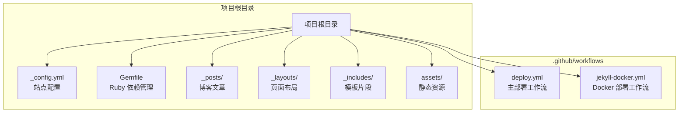

**图表来源**
- [deploy.yml:1-52](file://.github/workflows/deploy.yml#L1-L52)
- [jekyll-docker.yml:1-21](file://.github/workflows/jekyll-docker.yml#L1-L21)

**章节来源**
- [README.md:1-50](file://README.md#L1-L50)
- [_config.yml:1-91](file://_config.yml#L1-L91)

## 核心组件

### 主要工作流文件

项目包含两个主要的 GitHub Actions 工作流文件：

1. **deploy.yml** - 传统 Ruby 环境部署工作流
2. **jekyll-docker.yml** - Docker 容器化部署工作流

### 站点配置系统

- **_config.yml**: 包含站点基本信息、构建设置、插件配置、分页设置等
- **Gemfile**: 定义 Ruby 依赖包和 Jekyll 插件版本

### 内容管理系统

- **_posts/**: 存放博客文章，采用 Jekyll 标准格式
- **_layouts/**: 定义页面布局结构
- **_includes/**: 提供可复用的 HTML 模板片段

**章节来源**
- [deploy.yml:1-52](file://.github/workflows/deploy.yml#L1-L52)
- [jekyll-docker.yml:1-21](file://.github/workflows/jekyll-docker.yml#L1-L21)
- [_config.yml:1-91](file://_config.yml#L1-L91)
- [Gemfile:1-14](file://Gemfile#L1-L14)

## 架构概览

labtab 的 CI/CD 架构采用双工作流设计，提供灵活的部署选项：

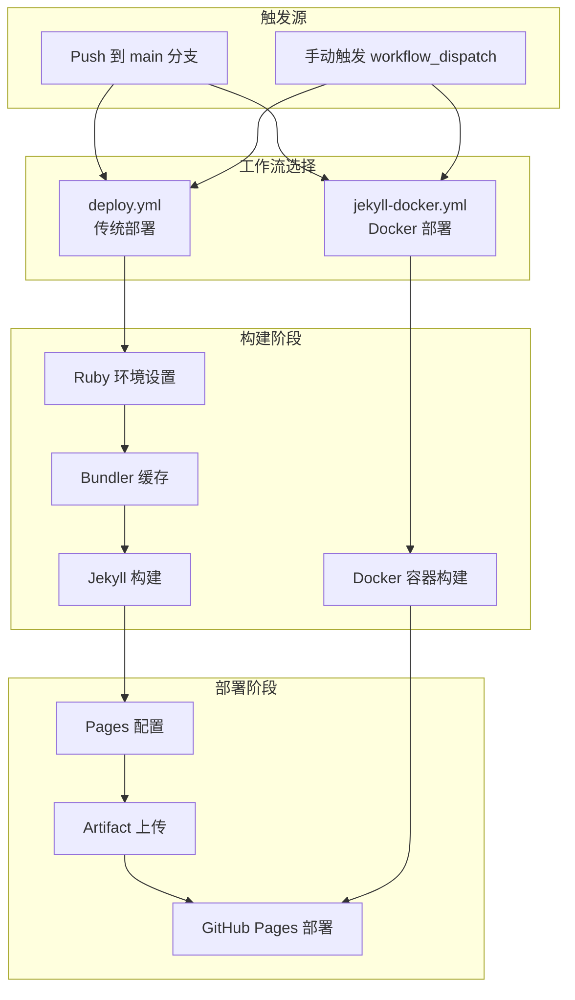

**图表来源**
- [deploy.yml:3-52](file://.github/workflows/deploy.yml#L3-L52)
- [jekyll-docker.yml:3-21](file://.github/workflows/jekyll-docker.yml#L3-L21)

## 详细组件分析

### 主部署工作流 (deploy.yml)

#### 触发条件配置

工作流支持两种触发方式：

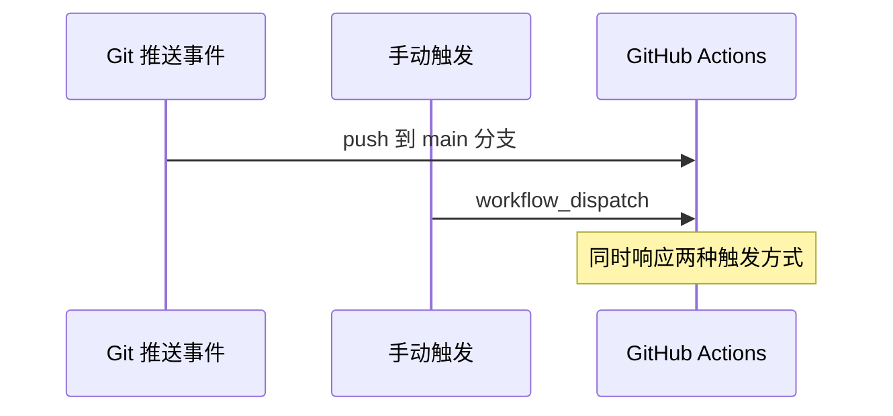

**图表来源**
- [deploy.yml:3-6](file://.github/workflows/deploy.yml#L3-L6)

#### 权限配置系统

工作流采用最小权限原则配置：

| 权限类型 | 权限值 | 用途 |
|---------|--------|------|
| contents | read | 读取仓库内容进行构建 |
| pages | write | 部署到 GitHub Pages |
| id-token | write | 获取身份令牌用于认证 |

#### 并发控制机制

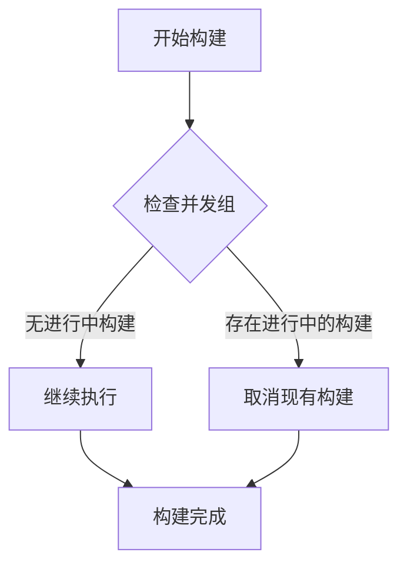

**图表来源**
- [deploy.yml:13-15](file://.github/workflows/deploy.yml#L13-L15)

#### 构建步骤详解

1. **代码检出**: 使用 actions/checkout@v4 获取最新代码
2. **Ruby 环境设置**: 
   - Ruby 版本: 3.2
   - 启用 Bundler 缓存优化
3. **Pages 配置**: 自动配置 GitHub Pages 环境
4. **Jekyll 构建**: 在生产环境下构建站点
5. **Artifact 上传**: 上传构建产物

#### 部署流程

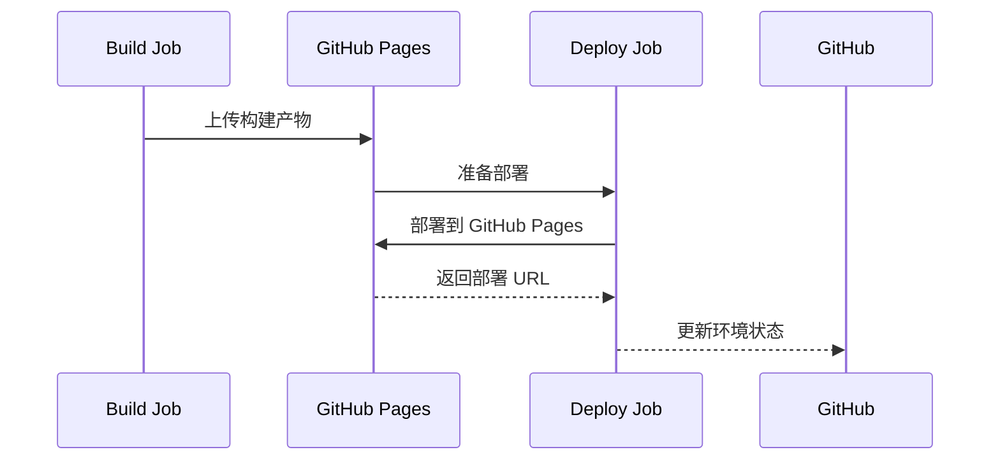

**图表来源**
- [deploy.yml:34-52](file://.github/workflows/deploy.yml#L34-L52)

**章节来源**
- [deploy.yml:1-52](file://.github/workflows/deploy.yml#L1-L52)

### Docker 部署工作流 (jekyll-docker.yml)

#### 容器化构建优势

Docker 工作流提供以下优势：

1. **环境一致性**: 使用官方 jekyll/builder:latest 镜像确保构建环境一致
2. **依赖隔离**: 避免本地 Ruby 环境冲突
3. **简化配置**: 无需手动设置 Ruby 和 Bundler
4. **跨平台兼容**: 在任何支持 Docker 的环境中运行

#### 构建流程

**图表来源**
- [jekyll-docker.yml:14-21](file://.github/workflows/jekyll-docker.yml#L14-L21)

**章节来源**
- [jekyll-docker.yml:1-21](file://.github/workflows/jekyll-docker.yml#L1-L21)

### 站点配置系统

#### Jekyll 配置参数

| 配置项 | 值 | 说明 |
|-------|-----|------|
| title | labtab | 站点标题 |
| description | 个人技术博客 | 站点描述 |
| url | https://halfism.github.io | 基础 URL |
| baseurl | /labtab | 基础路径 |
| lang | zh-CN | 语言设置 |
| markdown | kramdown | Markdown 解析器 |
| highlighter | rouge | 代码高亮器 |

#### 插件生态系统

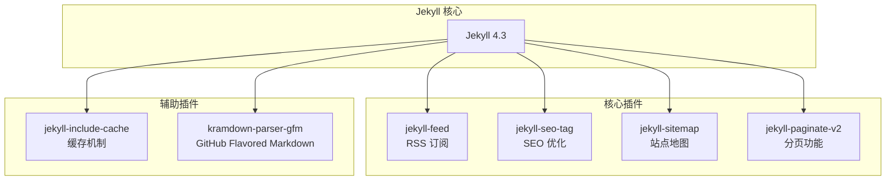

**图表来源**
- [_config.yml:34-40](file://_config.yml#L34-L40)
- [Gemfile:5-11](file://Gemfile#L5-L11)

**章节来源**
- [_config.yml:1-91](file://_config.yml#L1-L91)
- [Gemfile:1-14](file://Gemfile#L1-L14)

## 依赖关系分析

### 工作流间依赖关系

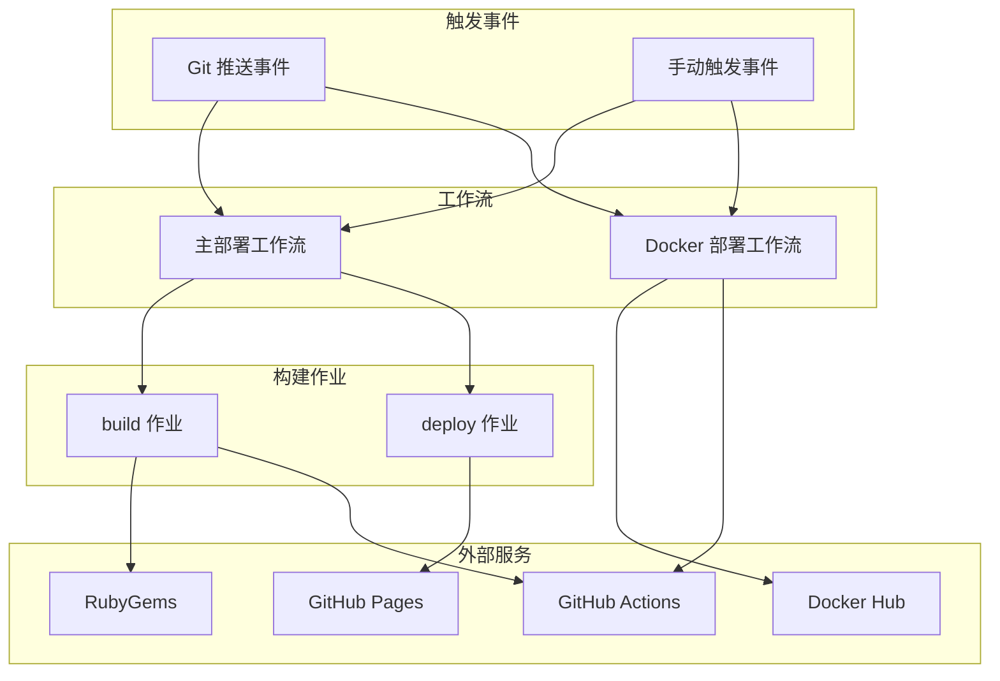

**图表来源**
- [deploy.yml:17-52](file://.github/workflows/deploy.yml#L17-L52)
- [jekyll-docker.yml:9-21](file://.github/workflows/jekyll-docker.yml#L9-L21)

### 依赖链分析

#### Ruby 环境依赖链

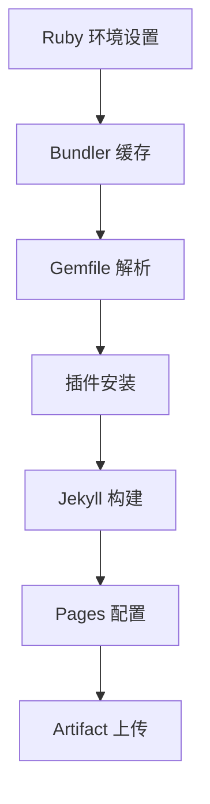

**图表来源**
- [deploy.yml:24-41](file://.github/workflows/deploy.yml#L24-L41)
- [Gemfile:1-14](file://Gemfile#L1-L14)

#### Docker 环境依赖链

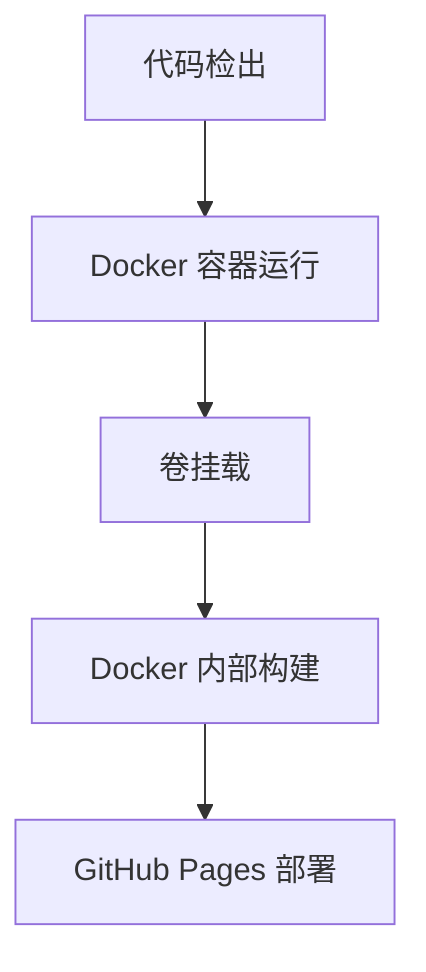

**图表来源**
- [jekyll-docker.yml:15-21](file://.github/workflows/jekyll-docker.yml#L15-L21)

**章节来源**
- [deploy.yml:1-52](file://.github/workflows/deploy.yml#L1-L52)
- [jekyll-docker.yml:1-21](file://.github/workflows/jekyll-docker.yml#L1-L21)

## 性能考虑

### 缓存优化策略

1. **Bundler 缓存**: 通过 `bundler-cache: true` 参数启用
2. **依赖版本锁定**: 使用 Gemfile.lock 确保依赖一致性
3. **增量构建**: 只重新构建变更的内容

### 并发控制优化

- **并发组隔离**: 使用 "pages" 组避免多个部署同时进行
- **取消策略**: 进行中的构建会被新触发的构建取消
- **资源分配**: Ubuntu 最新运行器提供充足的计算资源

### 构建时间优化

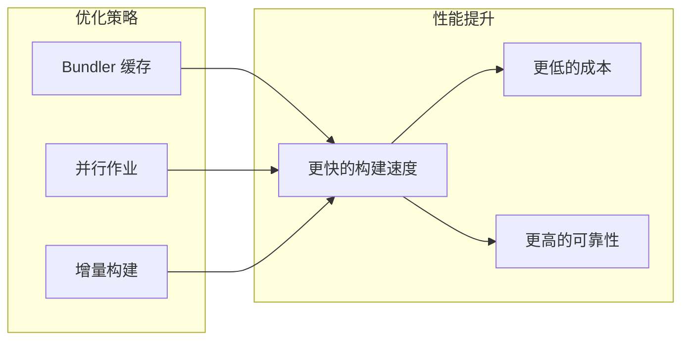

## 故障排除指南

### 常见问题及解决方案

#### 构建失败问题

| 问题类型 | 可能原因 | 解决方案 |
|---------|---------|---------|
| Ruby 版本不兼容 | Ruby 版本过旧 | 更新 Ruby 版本到 3.2 |
| Bundler 缓存损坏 | 缓存文件损坏 | 清理缓存后重试 |
| 插件依赖冲突 | 版本不匹配 | 检查 Gemfile 版本约束 |
| 权限不足 | GitHub Pages 权限缺失 | 检查工作流权限配置 |

#### Docker 构建问题

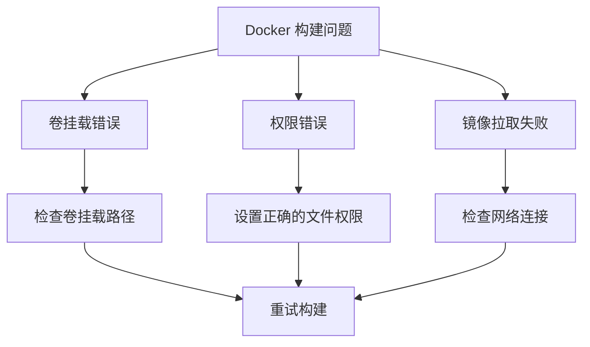

#### 调试技巧

1. **查看工作流日志**: 检查每个步骤的详细输出
2. **使用调试模式**: 在本地模拟构建过程
3. **逐步验证**: 逐个步骤测试配置正确性
4. **版本对比**: 对比成功和失败的构建记录

### 日志分析方法

#### 关键日志指标

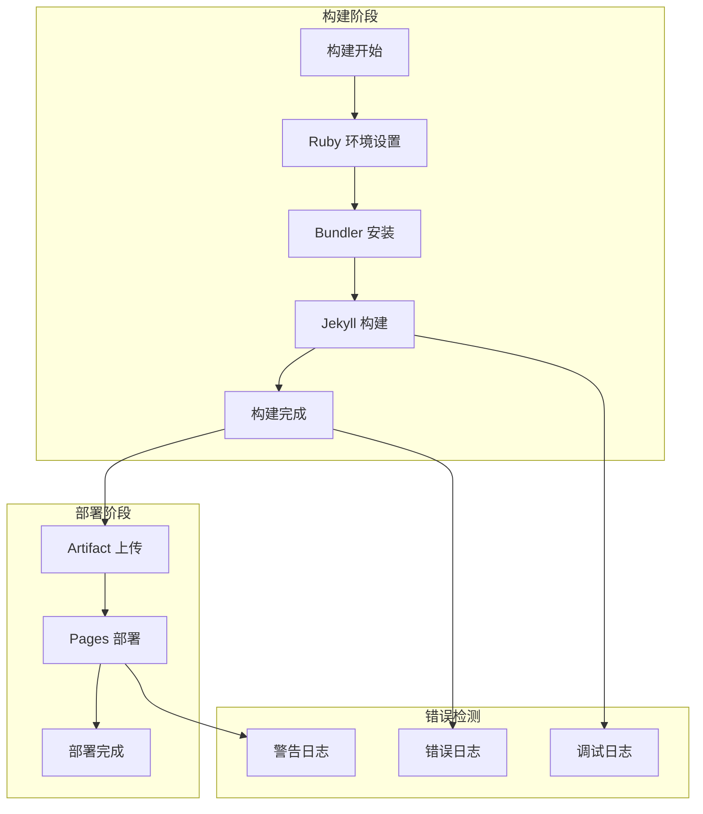

**章节来源**
- [deploy.yml:1-52](file://.github/workflows/deploy.yml#L1-L52)
- [jekyll-docker.yml:1-21](file://.github/workflows/jekyll-docker.yml#L1-L21)

## 结论

labtab 的 GitHub Actions CI/CD 工作流系统提供了完整、可靠且灵活的自动化部署解决方案。通过双工作流设计，用户可以根据具体需求选择最适合的部署方式。

### 主要优势

1. **双重部署策略**: 传统 Ruby 环境和 Docker 容器化两种部署方式
2. **完善的权限管理**: 最小权限原则确保安全性
3. **智能并发控制**: 避免资源冲突和重复部署
4. **全面的监控**: 详细的日志记录和错误报告
5. **易于维护**: 清晰的配置结构和文档

### 最佳实践建议

1. **定期更新依赖**: 保持 Ruby 和插件版本的最新状态
2. **监控构建性能**: 关注构建时间和资源使用情况
3. **备份配置**: 定期备份工作流配置文件
4. **测试变更**: 在 PR 中测试新的工作流变更
5. **文档维护**: 保持文档与实际配置同步

该工作流系统为个人技术博客提供了专业级的自动化部署能力，既保证了部署的可靠性，又提供了足够的灵活性来适应不同的部署需求。