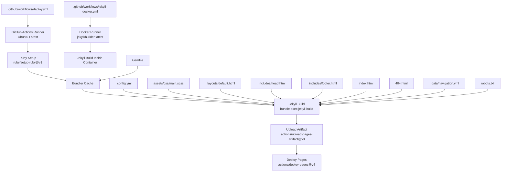
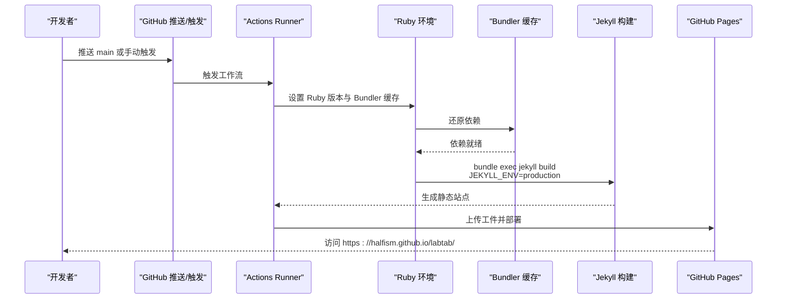
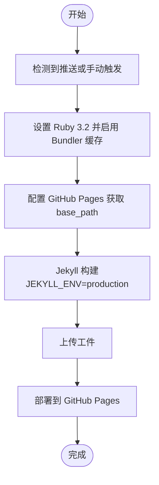
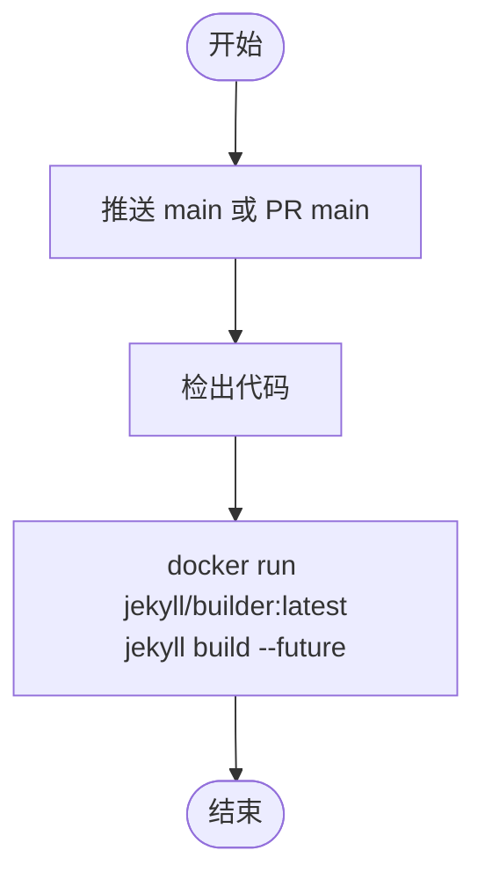
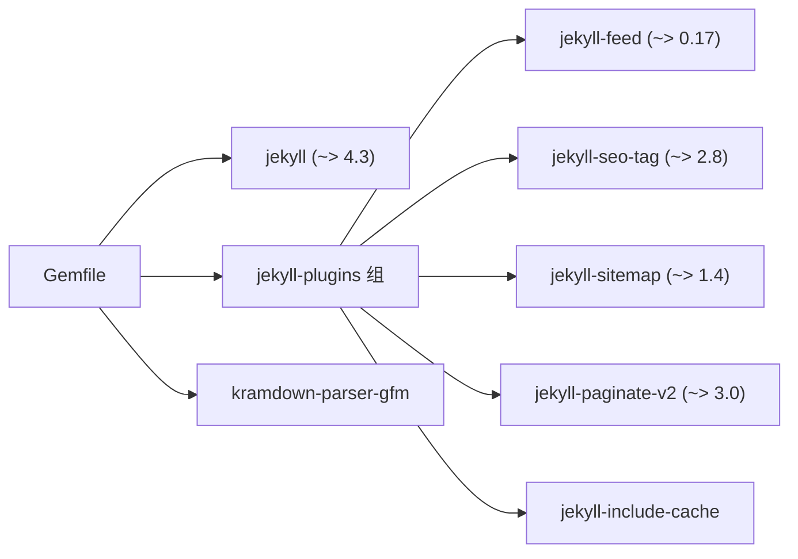
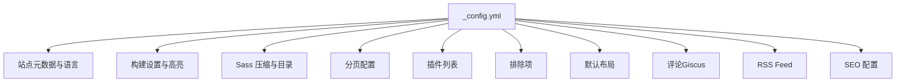
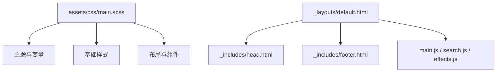
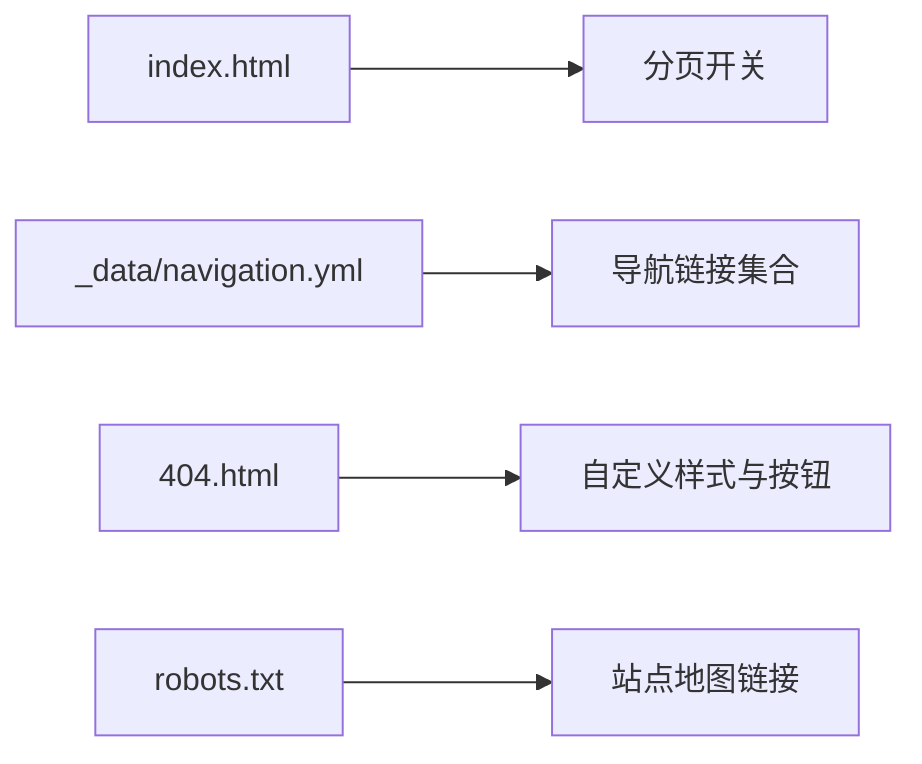
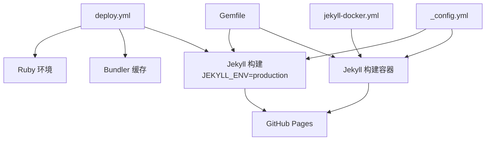

# 部署运维

<cite>
**本文引用的文件**
- [.github/workflows/deploy.yml](file://.github/workflows/deploy.yml)
- [.github/workflows/jekyll-docker.yml](file://.github/workflows/jekyll-docker.yml)
- [Gemfile](file://Gemfile)
- [_config.yml](file://_config.yml)
- [README.md](file://README.md)
- [assets/css/main.scss](file://assets/css/main.scss)
- [_data/navigation.yml](file://_data/navigation.yml)
- [index.html](file://index.html)
- [404.html](file://404.html)
- [robots.txt](file://robots.txt)
- [_layouts/default.html](file://_layouts/default.html)
- [_includes/head.html](file://_includes/head.html)
- [_includes/footer.html](file://_includes/footer.html)
</cite>

## 目录
1. [简介](#简介)
2. [项目结构](#项目结构)
3. [核心组件](#核心组件)
4. [架构总览](#架构总览)
5. [详细组件分析](#详细组件分析)
6. [依赖分析](#依赖分析)
7. [性能考虑](#性能考虑)
8. [故障排查指南](#故障排查指南)
9. [结论](#结论)
10. [附录](#附录)

## 简介
本文件面向 labtab 的部署与运维，围绕以下主题展开：  
- GitHub Actions CI/CD 工作流配置与执行流程（构建、部署、环境变量）  
- Ruby 环境与依赖管理（Gemfile、Bundler 缓存、版本锁定与更新）  
- GitHub Pages 集成（基础路径、分页、站点地图、Sass 压缩）  
- 性能优化策略（资源压缩、缓存、CDN）  
- 监控与维护（日志查看、错误排查、备份建议）  
- 生产部署最佳实践与故障恢复方案  

## 项目结构
labtab 是一个基于 Jekyll 的静态博客，采用 GitHub Actions 自动化构建与发布至 GitHub Pages。关键目录与文件如下：  
- 工作流：.github/workflows/deploy.yml（主发布）、.github/workflows/jekyll-docker.yml（CI 容器构建）  
- 构建配置：_config.yml（站点信息、分页、插件、Sass 压缩等）  
- 依赖管理：Gemfile（Jekyll 及插件版本）  
- 资源与样式：assets/css/main.scss（Sass 导入清单）  
- 页面与布局：_layouts/default.html、_includes/head.html、_includes/footer.html、index.html、404.html  
- 导航与索引：_data/navigation.yml、robots.txt  
- 文档：README.md（本地开发与评论系统配置）

**图表来源**
- [.github/workflows/deploy.yml:1-52](file://.github/workflows/deploy.yml#L1-L52)
- [.github/workflows/jekyll-docker.yml:1-21](file://.github/workflows/jekyll-docker.yml#L1-L21)
- [_config.yml:1-91](file://_config.yml#L1-L91)
- [Gemfile:1-14](file://Gemfile#L1-L14)
- [assets/css/main.scss:1-17](file://assets/css/main.scss#L1-L17)
- [_layouts/default.html:1-32](file://_layouts/default.html#L1-L32)
- [_includes/head.html:1-30](file://_includes/head.html#L1-L30)
- [_includes/footer.html:1-16](file://_includes/footer.html#L1-L16)
- [index.html:1-6](file://index.html#L1-L6)
- [404.html:1-13](file://404.html#L1-L13)
- [_data/navigation.yml:1-16](file://_data/navigation.yml#L1-L16)
- [robots.txt:1-5](file://robots.txt#L1-L5)

**章节来源**
- [.github/workflows/deploy.yml:1-52](file://.github/workflows/deploy.yml#L1-L52)
- [.github/workflows/jekyll-docker.yml:1-21](file://.github/workflows/jekyll-docker.yml#L1-L21)
- [_config.yml:1-91](file://_config.yml#L1-L91)
- [Gemfile:1-14](file://Gemfile#L1-L14)
- [assets/css/main.scss:1-17](file://assets/css/main.scss#L1-L17)
- [_layouts/default.html:1-32](file://_layouts/default.html#L1-L32)
- [_includes/head.html:1-30](file://_includes/head.html#L1-L30)
- [_includes/footer.html:1-16](file://_includes/footer.html#L1-L16)
- [index.html:1-6](file://index.html#L1-L6)
- [404.html:1-13](file://404.html#L1-L13)
- [_data/navigation.yml:1-16](file://_data/navigation.yml#L1-L16)
- [robots.txt:1-5](file://robots.txt#L1-L5)

## 核心组件
- GitHub Actions 发布工作流：在推送到 main 分支或手动触发时，自动拉取代码、设置 Ruby 环境、配置 Pages、构建 Jekyll 并上传工件，最后部署到 GitHub Pages。  
- Docker CI 工作流：在 Ubuntu Runner 上使用 jekyll/builder 容器进行构建，便于隔离与一致性。  
- Ruby 与 Bundler：通过 Gemfile 指定 Jekyll 与插件版本，启用 Bundler 缓存以加速安装；Jekyll 构建时通过 JEKYLL_ENV=production 启用压缩与优化。  
- Jekyll 配置：_config.yml 控制站点元数据、分页、插件、Sass 输出风格、排除项、默认布局等；配合相对路径与 baseurl 实现子路径部署。  
- 资源与样式：Sass 导入清单集中管理模块；head.html 引入字体、图标与主样式；footer.html 提供版权与链接。

**章节来源**
- [.github/workflows/deploy.yml:17-52](file://.github/workflows/deploy.yml#L17-L52)
- [.github/workflows/jekyll-docker.yml:9-21](file://.github/workflows/jekyll-docker.yml#L9-L21)
- [Gemfile:1-14](file://Gemfile#L1-L14)
- [_config.yml:9-49](file://_config.yml#L9-L49)
- [assets/css/main.scss:1-17](file://assets/css/main.scss#L1-L17)
- [_includes/head.html:13-20](file://_includes/head.html#L13-L20)
- [_includes/footer.html:1-16](file://_includes/footer.html#L1-L16)

## 架构总览
下图展示从代码提交到页面上线的端到端流程，包括两种构建路径（Actions 与 Docker）以及关键的环境变量与输出。

**图表来源**
- [.github/workflows/deploy.yml:17-52](file://.github/workflows/deploy.yml#L17-L52)
- [_config.yml:5-6](file://_config.yml#L5-L6)
- [_config.yml:22-24](file://_config.yml#L22-L24)

**章节来源**
- [.github/workflows/deploy.yml:1-52](file://.github/workflows/deploy.yml#L1-L52)
- [_config.yml:5-6](file://_config.yml#L5-L6)
- [_config.yml:22-24](file://_config.yml#L22-L24)

## 详细组件分析

### GitHub Actions 发布工作流（deploy.yml）
- 触发条件：推送至 main 分支或手动 workflow_dispatch。  
- 权限：读取内容、写 Pages、签发 ID 令牌。  
- 并发控制：同组“pages”互斥，避免并发冲突。  
- 步骤分解：  
  - 检出代码  
  - 设置 Ruby 3.2 并启用 Bundler 缓存  
  - 配置 Pages（获取 base_path）  
  - 使用 JEKYLL_ENV=production 构建 Jekyll（baseurl 由 Pages 输出注入）  
  - 上传工件  
  - 部署到 GitHub Pages（输出页面 URL）

**图表来源**
- [.github/workflows/deploy.yml:17-52](file://.github/workflows/deploy.yml#L17-L52)

**章节来源**
- [.github/workflows/deploy.yml:1-52](file://.github/workflows/deploy.yml#L1-L52)

### GitHub Actions Docker CI 工作流（jekyll-docker.yml）
- 触发条件：推送 main 或 PR 至 main。  
- 执行步骤：检出代码后，在 jekyll/builder 容器中运行 Jekyll 构建，同时对工作区与输出目录赋予权限以便容器内写入。  
- 用途：确保构建环境一致，便于在不同本地环境下复现问题。

**图表来源**
- [.github/workflows/jekyll-docker.yml:1-21](file://.github/workflows/jekyll-docker.yml#L1-L21)

**章节来源**
- [.github/workflows/jekyll-docker.yml:1-21](file://.github/workflows/jekyll-docker.yml#L1-L21)

### Ruby 环境与依赖管理（Gemfile）
- Ruby 版本：通过 Actions 显式设置为 3.2。  
- Jekyll 主版本：固定在 4.3 附近，保证稳定性。  
- 插件组：jekyll_plugins 包含 feed、seo-tag、sitemap、paginate-v2、include-cache 等。  
- 依赖更新：建议使用 Bundler 更新命令升级版本，结合 Gemfile.lock 提交以锁定版本。

**图表来源**
- [Gemfile:1-14](file://Gemfile#L1-L14)

**章节来源**
- [Gemfile:1-14](file://Gemfile#L1-L14)

### Jekyll 配置与站点设置（_config.yml）
- 站点元数据：title、description、author、url、baseurl、语言等。  
- 构建设置：markdown、highlighter、permalink。  
- Sass：style 压缩、sass_dir 指向 _sass。  
- 分页：enabled、per_page、permalink、sort_field、sort_reverse。  
- 插件：plugins 列表与 _config.yml 中声明保持一致。  
- 排除：Gemfile、Gemfile.lock、README.md、LICENSE、node_modules、vendor。  
- 默认布局：posts 默认 post，pages 默认 page。  
- 评论（Giscus）：provider 与 repo、repo_id、category、category_id、映射、主题等。  
- Feed：feed.path。  
- SEO：twitter 卡片类型、social 链接。

**图表来源**
- [_config.yml:1-91](file://_config.yml#L1-L91)

**章节来源**
- [_config.yml:1-91](file://_config.yml#L1-L91)

### 资源与样式（assets/css/main.scss 与布局/包含）
- Sass 导入：统一导入主题、变量、基础样式、组件与响应式规则。  
- 布局：default.html 注入 head.html、seo.html、脚本与搜索模态，设置主题数据属性。  
- 头部：head.html 引入预连接、字体、图标、主样式、Feed 与 SEO。  
- 底部：footer.html 展示版权与 GitHub Pages/Jekyll 标识。

**图表来源**
- [assets/css/main.scss:1-17](file://assets/css/main.scss#L1-L17)
- [_layouts/default.html:1-32](file://_layouts/default.html#L1-L32)
- [_includes/head.html:1-30](file://_includes/head.html#L1-L30)
- [_includes/footer.html:1-16](file://_includes/footer.html#L1-L16)

**章节来源**
- [assets/css/main.scss:1-17](file://assets/css/main.scss#L1-L17)
- [_layouts/default.html:1-32](file://_layouts/default.html#L1-L32)
- [_includes/head.html:1-30](file://_includes/head.html#L1-L30)
- [_includes/footer.html:1-16](file://_includes/footer.html#L1-L16)

### 页面与导航（index.html、404.html、navigation.yml、robots.txt）
- 首页：启用分页。  
- 404：自定义样式与返回首页按钮。  
- 导航：标题、URL、国际化键。  
- robots：允许所有爬虫，指向 sitemap。

**图表来源**
- [index.html:1-6](file://index.html#L1-L6)
- [_data/navigation.yml:1-16](file://_data/navigation.yml#L1-L16)
- [404.html:1-13](file://404.html#L1-L13)
- [robots.txt:1-5](file://robots.txt#L1-L5)

**章节来源**
- [index.html:1-6](file://index.html#L1-L6)
- [_data/navigation.yml:1-16](file://_data/navigation.yml#L1-L16)
- [404.html:1-13](file://404.html#L1-L13)
- [robots.txt:1-5](file://robots.txt#L1-L5)

## 依赖分析
- Actions 与 Docker 两条构建链路：Actions 使用 ruby/setup-ruby 与 Bundler 缓存；Docker 使用官方 jekyll/builder 容器。  
- Jekyll 与插件版本：通过 Gemfile 固定，确保可重复构建。  
- Pages 基础路径：通过 actions/configure-pages 输出 base_path 注入 Jekyll 构建参数，配合 _config.yml 的 baseurl 实现子路径部署。  
- Sass 压缩：_config.yml 中 sass.style=compressed，减少体积。  
- 插件一致性：_config.yml 的 plugins 与 Gemfile 的 jekyll_plugins 组保持一致，避免缺失或冗余。

**图表来源**
- [.github/workflows/deploy.yml:17-52](file://.github/workflows/deploy.yml#L17-L52)
- [.github/workflows/jekyll-docker.yml:9-21](file://.github/workflows/jekyll-docker.yml#L9-L21)
- [Gemfile:1-14](file://Gemfile#L1-L14)
- [_config.yml:22-24](file://_config.yml#L22-L24)

**章节来源**
- [.github/workflows/deploy.yml:17-52](file://.github/workflows/deploy.yml#L17-L52)
- [.github/workflows/jekyll-docker.yml:9-21](file://.github/workflows/jekyll-docker.yml#L9-L21)
- [Gemfile:1-14](file://Gemfile#L1-L14)
- [_config.yml:22-24](file://_config.yml#L22-L24)

## 性能考虑
- 资源压缩：  
  - Sass 压缩：_config.yml 中 sass.style=compressed，降低 CSS 体积。  
  - Jekyll 环境：JEKYLL_ENV=production 启用 Jekyll 内置优化。  
- 缓存配置：  
  - Bundler 缓存：Actions 中启用 bundler-cache，显著缩短依赖安装时间。  
  - 浏览器缓存：通过 CDN 与 GitHub Pages 默认缓存策略提升访问速度（需配合 CDN）。  
- CDN 集成：  
  - 字体与图标：head.html 中引入 Google Fonts 与 lucide 图标，建议通过 CDN 加速与缓存策略优化加载性能。  
- 其他建议：  
  - 将图片与静态资源迁移至 CDN，结合缓存头与压缩（gzip/br）进一步优化。  
  - 使用相对路径与 baseurl，确保子路径部署下的资源正确解析。

**章节来源**
- [_config.yml:22-24](file://_config.yml#L22-L24)
- [.github/workflows/deploy.yml:24-38](file://.github/workflows/deploy.yml#L24-L38)
- [_includes/head.html:9-20](file://_includes/head.html#L9-L20)

## 故障排查指南
- 构建失败（依赖/权限）：  
  - 确认 Gemfile 与 Gemfile.lock 一致，必要时重新生成锁文件并提交。  
  - Docker 工作流中注意容器内权限问题，确保工作区与输出目录可写。  
- Pages 部署失败：  
  - 检查 Actions 权限（contents/pages/id-token）是否具备写入权限。  
  - 确认 baseurl 与 Pages 输出的 base_path 一致，避免资源 404。  
- 评论系统（Giscus）异常：  
  - 核对 _config.yml 中 repo、repo_id、category、category_id、mapping 等字段是否正确。  
  - 在 giscus.app 重新同步仓库与分类 ID。  
- 本地开发与验证：  
  - 使用 README.md 中的 bundle install 与 bundle exec jekyll serve 进行本地预览。  
- 日志与回滚：  
  - 在 Actions 工作流页面查看构建日志，定位具体失败步骤。  
  - 如需回滚，可切换到上一个稳定提交并重新触发工作流。

**章节来源**
- [.github/workflows/deploy.yml:8-15](file://.github/workflows/deploy.yml#L8-L15)
- [_config.yml:65-79](file://_config.yml#L65-L79)
- [README.md:34-39](file://README.md#L34-L39)

## 结论
labtab 的部署运维以 GitHub Actions 为核心，结合 Ruby 与 Jekyll 的稳定生态，实现了自动化、可重复且易于维护的发布流程。通过 Bundler 缓存、Sass 压缩与 Pages 子路径部署，兼顾了性能与可扩展性。建议在生产环境中配合 CDN 与更严格的版本锁定策略，持续优化构建与发布效率。

## 附录
- 本地开发命令参考：  
  - 安装依赖与启动服务：见 README.md 的本地开发部分。  
- 评论系统配置参考：  
  - 在 README.md 的“Setup Comments”部分按步骤完成仓库 Discussions 与 giscus.app 的配置。  
- 站点地图与 SEO：  
  - robots.txt 指向 sitemap.xml；_config.yml 中已配置 feed 与 SEO 参数。

**章节来源**
- [README.md:34-46](file://README.md#L34-L46)
- [robots.txt:1-5](file://robots.txt#L1-L5)
- [_config.yml:80-91](file://_config.yml#L80-L91)