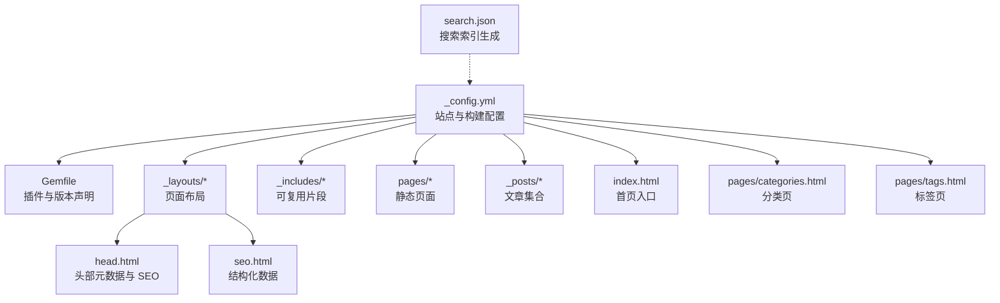
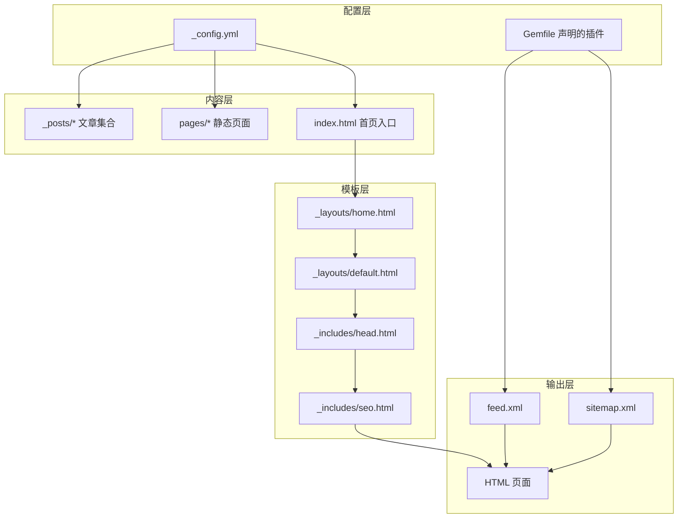
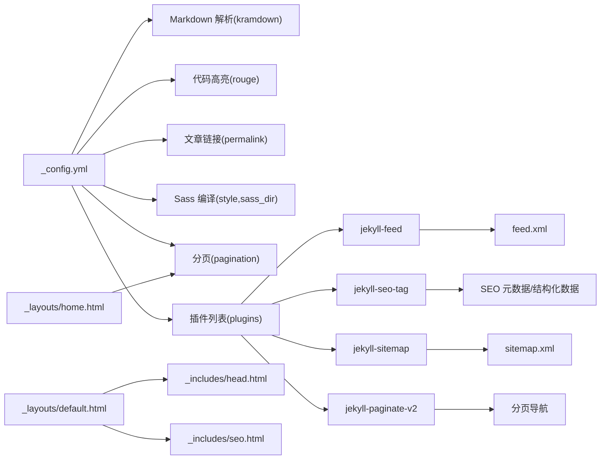

# Jekyll 配置

<cite>
**本文引用的文件**
- [_config.yml](file://_config.yml)
- [Gemfile](file://Gemfile)
- [README.md](file://README.md)
- [index.html](file://index.html)
- [pages/categories.html](file://pages/categories.html)
- [pages/tags.html](file://pages/tags.html)
- [_layouts/default.html](file://_layouts/default.html)
- [_layouts/home.html](file://_layouts/home.html)
- [_includes/head.html](file://_includes/head.html)
- [_includes/seo.html](file://_includes/seo.html)
- [_posts/2026-05-17-welcome-to-labtab.md](file://_posts/2026-05-17-welcome-to-labtab.md)
- [pages/about.md](file://pages/about.md)
- [search.json](file://search.json)
</cite>

## 目录
1. [简介](#简介)
2. [项目结构](#项目结构)
3. [核心组件](#核心组件)
4. [架构总览](#架构总览)
5. [详细组件分析](#详细组件分析)
6. [依赖关系分析](#依赖关系分析)
7. [性能考量](#性能考量)
8. [故障排查指南](#故障排查指南)
9. [结论](#结论)

## 简介
本文件系统性梳理 Jekyll 配置系统在本项目中的实现与用法，重点覆盖以下方面：
- 站点基础信息：title、description、author、url、baseurl、lang
- 构建设置：markdown、highlighter、permalink 及其相关 kramdown 选项
- Sass 编译：style、sass_dir
- 分页配置：enabled、per_page、permalink、sort_field、sort_reverse
- 插件配置：jekyll-feed、jekyll-seo-tag、jekyll-sitemap、jekyll-paginate-v2
- 排除规则：exclude 的使用场景与最佳实践
- 集合默认值：collections defaults 如何影响页面布局与功能
- 配置验证方法与常见错误的解决方案

## 项目结构
本项目采用标准 Jekyll 目录组织，关键配置集中在根目录的配置文件中，并通过布局、包含模板与页面文件共同完成渲染与输出。

图表来源
- [_config.yml:1-91](file://_config.yml#L1-L91)
- [Gemfile:1-14](file://Gemfile#L1-L14)
- [_layouts/default.html:1-32](file://_layouts/default.html#L1-L32)
- [_includes/head.html:1-30](file://_includes/head.html#L1-L30)
- [_includes/seo.html:1-27](file://_includes/seo.html#L1-L27)
- [index.html:1-6](file://index.html#L1-L6)
- [pages/categories.html:1-6](file://pages/categories.html#L1-L6)
- [pages/tags.html:1-6](file://pages/tags.html#L1-L6)
- [search.json:1-14](file://search.json#L1-L14)

章节来源
- [_config.yml:1-91](file://_config.yml#L1-L91)
- [Gemfile:1-14](file://Gemfile#L1-L14)

## 核心组件
本节从配置层面拆解各配置段落及其作用范围与默认行为。

- 站点基本信息
  - title、description、author、url、baseurl、lang：用于全局站点标识、语言与链接前缀。这些键值在布局与包含模板中被广泛使用，确保全站一致的显示与链接行为。
  - 参考路径：[_config.yml:2-7](file://_config.yml#L2-L7)

- 构建设置
  - markdown：指定 Markdown 解析器为 kramdown；highlighter 指定代码高亮为 rouge。
  - permalink：文章永久链接格式为“年/月/日/标题”。
  - kramdown 子配置：input 使用 GFM，syntax_highlighter 指向 rouge，block 行号关闭。
  - 参考路径：[_config.yml:10-20](file://_config.yml#L10-L20)

- Sass 编译
  - style：压缩样式输出以优化体积。
  - sass_dir：Sass 源文件目录为 _sass。
  - 参考路径：[_config.yml:22-24](file://_config.yml#L22-L24)

- 分页配置
  - enabled：启用分页。
  - per_page：每页文章数为 6。
  - permalink：分页链接格式为“/page/:num/”。
  - sort_field/sort_reverse：按日期降序排列。
  - 参考路径：[_config.yml:27-32](file://_config.yml#L27-L32)

- 插件配置
  - plugins 列表包含 jekyll-feed、jekyll-seo-tag、jekyll-sitemap、jekyll-paginate-v2。
  - 参考路径：[_config.yml:35-39](file://_config.yml#L35-L39)，[Gemfile:5-11](file://Gemfile#L5-L11)

- 排除规则
  - exclude：忽略 Gemfile、Gemfile.lock、README.md、LICENSE、node_modules、vendor 等文件或目录，避免不必要的构建与部署。
  - 参考路径：[_config.yml:42-48](file://_config.yml#L42-L48)

- 集合默认值
  - posts 默认 layout 为 post，开启 comments 与 toc。
  - pages 默认 layout 为 page。
  - 参考路径：[_config.yml:51-64](file://_config.yml#L51-L64)

- 其他扩展配置
  - comments：Giscus 评论系统参数，如仓库、分类等 ID 与主题。
  - feed：RSS 输出路径。
  - twitter/card、social/links：SEO 卡片与社交链接。
  - 参考路径：[_config.yml:66-91](file://_config.yml#L66-L91)

章节来源
- [_config.yml:1-91](file://_config.yml#L1-L91)
- [Gemfile:1-14](file://Gemfile#L1-L14)

## 架构总览
下图展示配置如何贯穿站点渲染流程：配置驱动构建、布局与包含模板协作生成最终页面，并由插件提供 SEO、RSS、站点地图与分页能力。

图表来源
- [_config.yml:1-91](file://_config.yml#L1-L91)
- [Gemfile:1-14](file://Gemfile#L1-L14)
- [_layouts/default.html:1-32](file://_layouts/default.html#L1-L32)
- [_layouts/home.html:1-126](file://_layouts/home.html#L1-L126)
- [_includes/head.html:1-30](file://_includes/head.html#L1-L30)
- [_includes/seo.html:1-27](file://_includes/seo.html#L1-L27)

## 详细组件分析

### 站点基本信息与语言设置
- 作用：定义站点标题、描述、作者、域名、子路径与语言，供布局与包含模板读取，保证统一的显示与链接行为。
- 关键点：
  - lang 在默认布局中作为 HTML 的 lang 属性使用，确保无障碍与搜索引擎识别。
  - url 与 baseurl 组合形成完整绝对链接前缀，配合 relative_url/absolute_url 进行链接生成。
- 参考路径：
  - [_config.yml:2-7](file://_config.yml#L2-L7)
  - [_layouts/default.html](file://_layouts/default.html#L2)

章节来源
- [_config.yml:2-7](file://_config.yml#L2-L7)
- [_layouts/default.html](file://_layouts/default.html#L2)

### 构建设置与 Markdown/Syntax Highlighter
- 作用：选择解析器与高亮方案，并设定文章链接格式。
- 关键点：
  - markdown 为 kramdown，highlighter 为 rouge，确保与语法高亮插件一致。
  - kramdown.input 为 GFM，支持 GitHub 风格的表格、任务列表等。
  - block 行号关闭，减少冗余标记，提升可读性。
  - permalink 为“年/月/日/标题”，便于语义化与 SEO。
- 参考路径：
  - [_config.yml:10-20](file://_config.yml#L10-L20)

章节来源
- [_config.yml:10-20](file://_config.yml#L10-L20)

### Sass 编译选项
- 作用：控制样式编译输出风格与源目录位置。
- 关键点：
  - style: compressed 降低 CSS 体积，适合生产环境。
  - sass_dir: _sass 与主题/变量/布局等 SCSS 文件协同工作。
- 参考路径：
  - [_config.yml:22-24](file://_config.yml#L22-L24)

章节来源
- [_config.yml:22-24](file://_config.yml#L22-L24)

### 分页配置与首页渲染
- 作用：控制首页与列表页的文章分页行为。
- 关键点：
  - pagination.enabled 启用分页；per_page 控制每页数量；permalink 定义分页链接格式。
  - sort_field 与 sort_reverse 决定排序策略（按日期倒序）。
  - 首页 index.html 显式启用分页，结合布局 home.html 渲染分页导航。
- 参考路径：
  - [_config.yml:27-32](file://_config.yml#L27-L32)
  - [index.html:3-5](file://index.html#L3-L5)
  - [_layouts/home.html:19-51](file://_layouts/home.html#L19-L51)

章节来源
- [_config.yml:27-32](file://_config.yml#L27-L32)
- [index.html:3-5](file://index.html#L3-L5)
- [_layouts/home.html:19-51](file://_layouts/home.html#L19-L51)

### 插件配置与功能集成
- 作用：通过插件增强 SEO、RSS、站点地图与分页能力。
- 关键点：
  - jekyll-feed：生成 feed.xml。
  - jekyll-seo-tag：注入 SEO 元数据与结构化数据。
  - jekyll-sitemap：生成 sitemap.xml。
  - jekyll-paginate-v2：提供分页逻辑与导航。
  - 版本约束在 Gemfile 中声明，确保兼容性。
- 参考路径：
  - [_config.yml:35-39](file://_config.yml#L35-L39)
  - [Gemfile:5-11](file://Gemfile#L5-L11)

章节来源
- [_config.yml:35-39](file://_config.yml#L35-L39)
- [Gemfile:5-11](file://Gemfile#L5-L11)

### 排除规则与最佳实践
- 作用：避免构建与部署无关或敏感文件，减少体积与风险。
- 最佳实践：
  - 忽略包管理器生成的目录（如 vendor、node_modules）。
  - 忽略开发文档与许可证文件（如 README.md、LICENSE）。
  - 忽略临时缓存与中间产物（如 .sass-cache、.jekyll-cache）。
- 参考路径：
  - [_config.yml:42-48](file://_config.yml#L42-L48)

章节来源
- [_config.yml:42-48](file://_config.yml#L42-L48)

### 集合默认值与页面布局
- 作用：为 posts 与 pages 集合设置默认布局与功能开关，简化页面前端元数据。
- 关键点：
  - posts 默认 layout: post，启用 comments 与 toc，使文章具备目录与评论能力。
  - pages 默认 layout: page，适配静态页面。
  - 该机制与布局模板协作，决定页面渲染结构与交互元素。
- 参考路径：
  - [_config.yml:51-64](file://_config.yml#L51-L64)
  - [_layouts/post.html:38-68](file://_layouts/post.html#L38-L68)

章节来源
- [_config.yml:51-64](file://_config.yml#L51-L64)

### SEO 与 RSS 配置
- 作用：通过 jekyll-seo-tag 与 jekyll-feed 提升 SEO 与订阅体验。
- 关键点：
  - feed.path 指定 RSS 输出路径。
  - twitter.card 与 social.links 影响社交卡片与分享信息。
  - 结构化数据在 _includes/seo.html 中注入，面向搜索引擎。
- 参考路径：
  - [_config.yml:80-91](file://_config.yml#L80-L91)
  - [_includes/seo.html:1-27](file://_includes/seo.html#L1-L27)
  - [_includes/head.html:22-23](file://_includes/head.html#L22-L23)

章节来源
- [_config.yml:80-91](file://_config.yml#L80-L91)
- [_includes/seo.html:1-27](file://_includes/seo.html#L1-L27)
- [_includes/head.html:22-23](file://_includes/head.html#L22-L23)

## 依赖关系分析
下图展示配置与插件、布局、包含模板之间的依赖关系。

图表来源
- [_config.yml:10-39](file://_config.yml#L10-L39)
- [Gemfile:5-11](file://Gemfile#L5-L11)
- [_layouts/default.html:1-32](file://_layouts/default.html#L1-L32)
- [_includes/head.html:1-30](file://_includes/head.html#L1-L30)
- [_includes/seo.html:1-27](file://_includes/seo.html#L1-L27)
- [_layouts/home.html:1-126](file://_layouts/home.html#L1-L126)

章节来源
- [_config.yml:10-39](file://_config.yml#L10-L39)
- [Gemfile:5-11](file://Gemfile#L5-L11)

## 性能考量
- 压缩输出：Sass style 设置为压缩模式，有助于减小 CSS 体积，提升加载速度。
- 分页限制：每页仅渲染固定数量的文章，避免首页渲染压力过大。
- 排除无关文件：通过 exclude 忽略缓存与开发产物，减少构建时间与部署体积。
- 代码高亮：使用轻量级高亮器，避免引入重型依赖。

## 故障排查指南
- 分页不生效
  - 检查首页是否显式启用分页（index.html）。
  - 确认分页配置项齐全且未被覆盖。
  - 参考路径：[index.html:3-5](file://index.html#L3-L5)，[_config.yml:27-32](file://_config.yml#L27-L32)
- RSS 不生成
  - 确认 jekyll-feed 已在 plugins 列表中启用。
  - 检查 feed.path 是否正确。
  - 参考路径：[_config.yml:80-82](file://_config.yml#L80-L82)，[Gemfile](file://Gemfile#L6)
- SEO 元数据缺失
  - 确认 jekyll-seo-tag 已启用，且 _includes/head.html 调用了 。
  - 检查结构化数据是否在 _includes/seo.html 中注入。
  - 参考路径：[_config.yml:85-91](file://_config.yml#L85-L91)，[_includes/head.html](file://_includes/head.html#L29)，[_includes/seo.html:1-27](file://_includes/seo.html#L1-L27)
- 评论系统无法加载
  - 确认 Giscus 所需的仓库 ID、分类 ID、映射方式等参数已正确填写。
  - 参考路径：[_config.yml:66-78](file://_config.yml#L66-L78)
- 链接错误或相对路径问题
  - 检查 url 与 baseurl 组合是否正确，以及 relative_url/absolute_url 的使用是否恰当。
  - 参考路径：[_config.yml:5-6](file://_config.yml#L5-L6)，[_includes/head.html:22-23](file://_includes/head.html#L22-L23)
- 本地开发与部署差异
  - 使用 README 中提供的命令进行本地预览与构建，确保 Gemfile.lock 与 Gemfile 一致。
  - 参考路径：[README.md:34-39](file://README.md#L34-L39)，[Gemfile:1-14](file://Gemfile#L1-L14)

章节来源
- [index.html:3-5](file://index.html#L3-L5)
- [_config.yml:27-32](file://_config.yml#L27-L32)
- [Gemfile](file://Gemfile#L6)
- [_includes/head.html:22-23](file://_includes/head.html#L22-L23)
- [_includes/seo.html:1-27](file://_includes/seo.html#L1-L27)
- [README.md:34-39](file://README.md#L34-L39)

## 结论
本项目的 Jekyll 配置围绕“清晰、可维护、可扩展”的目标设计：通过集中化的配置文件统一站点标识、构建与样式策略；借助插件体系完善 SEO、RSS 与分页；利用集合默认值减少重复配置；并通过排除规则保障构建效率与部署安全。遵循本文档的配置要点与排错建议，可在本地与线上环境中稳定运行。