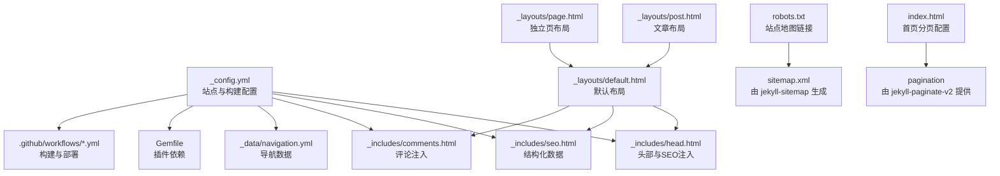
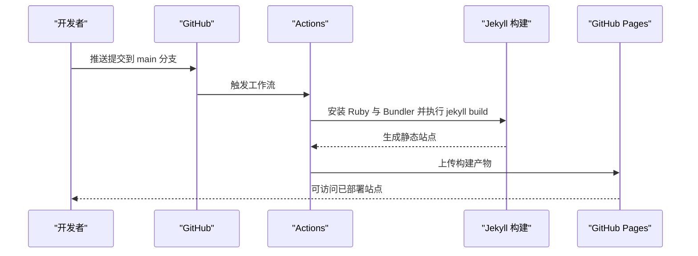
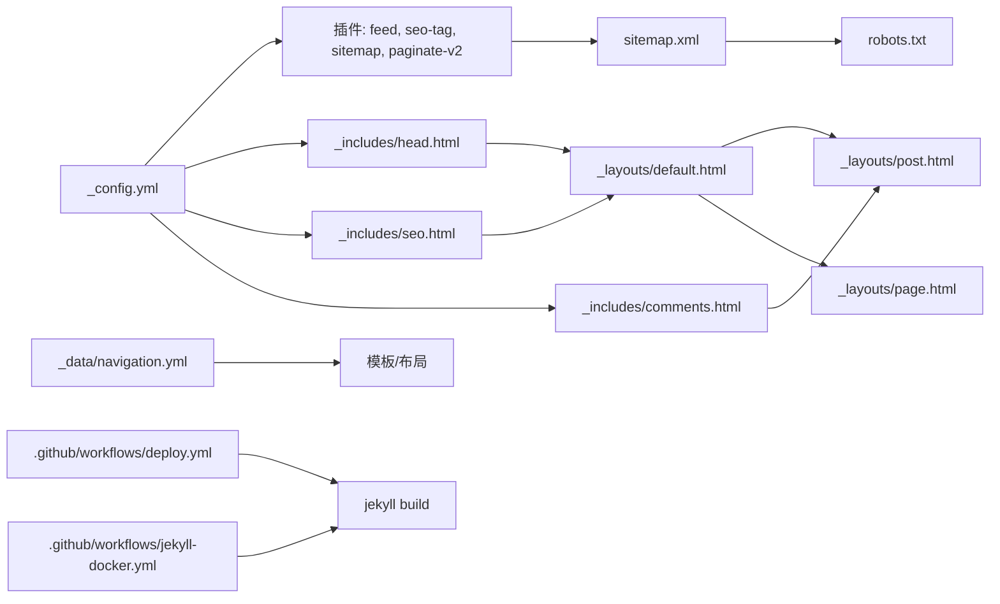

# 配置参考

<cite>
**本文引用的文件**
- [_config.yml](file://_config.yml)
- [Gemfile](file://Gemfile)
- [_data/navigation.yml](file://_data/navigation.yml)
- [_includes/head.html](file://_includes/head.html)
- [_includes/seo.html](file://_includes/seo.html)
- [_includes/comments.html](file://_includes/comments.html)
- [_layouts/default.html](file://_layouts/default.html)
- [_layouts/post.html](file://_layouts/post.html)
- [_layouts/page.html](file://_layouts/page.html)
- [README.md](file://README.md)
- [.github/workflows/deploy.yml](file://.github/workflows/deploy.yml)
- [.github/workflows/jekyll-docker.yml](file://.github/workflows/jekyll-docker.yml)
- [robots.txt](file://robots.txt)
- [index.html](file://index.html)
- [_sass/_variables.scss](file://_sass/_variables.scss)
- [_sass/_themes.scss](file://_sass/_themes.scss)
</cite>

## 目录
1. [简介](#简介)
2. [项目结构](#项目结构)
3. [核心组件](#核心组件)
4. [架构总览](#架构总览)
5. [详细组件分析](#详细组件分析)
6. [依赖关系分析](#依赖关系分析)
7. [性能考量](#性能考量)
8. [故障排查指南](#故障排查指南)
9. [结论](#结论)
10. [附录](#附录)

## 简介
本文件为 labtab 配置系统的完整参考，覆盖 Jekyll 站点配置、数据文件、SEO 结构化数据、评论系统（Giscus）集成、构建与部署流程、以及版本管理与最佳实践。内容以仓库实际文件为依据，帮助读者快速理解并正确配置站点。

## 项目结构
labtab 使用标准 Jekyll 目录组织，关键配置集中在根目录的配置文件与数据目录中；页面与布局通过 Liquid 模板组合；评论、SEO、头部信息等通过 includes 注入；构建与部署由 GitHub Actions 自动化完成。

图表来源
- [_config.yml:1-91](file://_config.yml#L1-L91)
- [_includes/head.html:1-30](file://_includes/head.html#L1-L30)
- [_includes/seo.html:1-27](file://_includes/seo.html#L1-L27)
- [_includes/comments.html:1-21](file://_includes/comments.html#L1-L21)
- [_data/navigation.yml:1-16](file://_data/navigation.yml#L1-L16)
- [Gemfile:1-14](file://Gemfile#L1-L14)
- [.github/workflows/deploy.yml:1-52](file://.github/workflows/deploy.yml#L1-L52)
- [_layouts/default.html:1-32](file://_layouts/default.html#L1-L32)
- [_layouts/post.html:1-83](file://_layouts/post.html#L1-L83)
- [_layouts/page.html:1-36](file://_layouts/page.html#L1-L36)
- [robots.txt:1-5](file://robots.txt#L1-L5)
- [index.html:1-6](file://index.html#L1-L6)

章节来源
- [_config.yml:1-91](file://_config.yml#L1-L91)
- [_data/navigation.yml:1-16](file://_data/navigation.yml#L1-L16)
- [_includes/head.html:1-30](file://_includes/head.html#L1-L30)
- [_includes/seo.html:1-27](file://_includes/seo.html#L1-L27)
- [_includes/comments.html:1-21](file://_includes/comments.html#L1-L21)
- [Gemfile:1-14](file://Gemfile#L1-L14)
- [_layouts/default.html:1-32](file://_layouts/default.html#L1-L32)
- [_layouts/post.html:1-83](file://_layouts/post.html#L1-L83)
- [_layouts/page.html:1-36](file://_layouts/page.html#L1-L36)
- [.github/workflows/deploy.yml:1-52](file://.github/workflows/deploy.yml#L1-L52)
- [.github/workflows/jekyll-docker.yml:1-21](file://.github/workflows/jekyll-docker.yml#L1-L21)
- [robots.txt:1-5](file://robots.txt#L1-L5)
- [index.html:1-6](file://index.html#L1-L6)

## 核心组件
- 站点基础信息：站点标题、描述、作者、URL、基础路径、语言
- 构建选项：Markdown 解析器、高亮器、永久链接格式
- Sass 编译：样式压缩、源目录
- 分页：启用分页、每页数量、分页链接、排序字段与顺序
- 插件：feed、seo-tag、sitemap、paginate-v2、include-cache
- 排除规则：Gemfile、锁文件、README、LICENSE、node_modules、vendor
- 默认值：集合默认布局与开关（文章默认开启评论与目录）
- 评论系统（Giscus）：仓库与分类 ID、映射方式、主题、加载策略等
- Feed：输出路径
- SEO：Twitter 卡片类型、社交账号信息
- 数据：导航菜单

章节来源
- [_config.yml:1-91](file://_config.yml#L1-L91)
- [_data/navigation.yml:1-16](file://_data/navigation.yml#L1-L16)

## 架构总览
Jekyll 在本地或容器内构建，GitHub Actions 负责生产环境构建与部署。构建产物上传为 Pages 资源，最终在 GitHub Pages 上发布。评论与 SEO 通过 includes 注入到布局中，导航数据来自 _data。

图表来源
- [.github/workflows/deploy.yml:1-52](file://.github/workflows/deploy.yml#L1-L52)

章节来源
- [.github/workflows/deploy.yml:1-52](file://.github/workflows/deploy.yml#L1-L52)
- [.github/workflows/jekyll-docker.yml:1-21](file://.github/workflows/jekyll-docker.yml#L1-L21)

## 详细组件分析

### 站点配置（_config.yml）
- 基础信息
  - 站点标题、描述、作者、URL、基础路径、语言
- 构建设置
  - Markdown 解析器、高亮器、永久链接格式
  - kramdown 子项：输入模式、语法高亮器、高亮选项（如关闭行号）
- Sass
  - 输出风格压缩、源目录
- 分页
  - 启用分页、每页条数、分页链接、排序字段与方向
- 插件
  - feed、seo-tag、sitemap、paginate-v2、include-cache
- 排除
  - Gemfile、锁文件、README、LICENSE、node_modules、vendor
- 默认值
  - posts 集合默认布局为 post，开启评论与目录；pages 集合默认布局为 page
- 评论（Giscus）
  - 仓库与分类 ID、映射方式、反应开关、元数据开关、输入位置、主题、懒加载
- Feed
  - 输出路径
- SEO
  - Twitter 卡片类型、社交账号名称、社交链接列表

章节来源
- [_config.yml:1-91](file://_config.yml#L1-L91)

### 数据文件（_data/navigation.yml）
- 导航菜单项：标题、URL、国际化键
- 用于模板中渲染主导航

章节来源
- [_data/navigation.yml:1-16](file://_data/navigation.yml#L1-L16)

### 头部与 SEO 注入（_includes/head.html）
- 元标签：字符集、视口、兼容性、标题、描述、作者
- 资源：字体、图标、主样式、RSS 订阅、Favicon
- SEO：调用 jekyll-seo-tag 的 

章节来源
- [_includes/head.html:1-30](file://_includes/head.html#L1-L30)

### 结构化数据（_includes/seo.html）
- 仅在文章布局下注入 JSON-LD
- 类型为 BlogPosting，包含标题、发布时间、修改时间、作者、出版者、描述、页面地址等

章节来源
- [_includes/seo.html:1-27](file://_includes/seo.html#L1-L27)

### 评论系统（Giscus）集成（_includes/comments.html）
- 条件注入：当 provider 为 giscus 时
- 动态属性：仓库、仓库 ID、分类、分类 ID、映射、反应、元数据、输入位置、主题、加载策略
- 异步加载客户端脚本

章节来源
- [_includes/comments.html:1-21](file://_includes/comments.html#L1-L21)

### 布局与主题（_layouts/default.html、_sass/*）
- 默认布局：设置语言、引入 head 与 seo includes、主题初始化脚本
- 文章布局：特色图、标题、日期、阅读时长、分类、目录、正文、标签、评论、相关文章
- 页面布局：标题与副标题、内容区域
- 主题与变量：CSS 自定义属性定义深浅主题色板、透明色、阴影、玻璃拟态参数、排版与间距、过渡动画

章节来源
- [_layouts/default.html:1-32](file://_layouts/default.html#L1-L32)
- [_layouts/post.html:1-83](file://_layouts/post.html#L1-L83)
- [_layouts/page.html:1-36](file://_layouts/page.html#L1-L36)
- [_sass/_themes.scss:1-150](file://_sass/_themes.scss#L1-L150)
- [_sass/_variables.scss:1-91](file://_sass/_variables.scss#L1-L91)

### 插件与依赖（Gemfile）
- Jekyll 版本与插件组：feed、seo-tag、sitemap、paginate-v2、include-cache
- 额外解析器：kramdown-parser-gfm

章节来源
- [Gemfile:1-14](file://Gemfile#L1-L14)

### 构建与部署（GitHub Actions）
- 生产构建工作流：安装 Ruby 与 Bundler，执行 jekyll build，设置 JEKYLL_ENV=production，上传构建产物
- 容器构建工作流：使用 jekyll/builder 容器构建站点

章节来源
- [.github/workflows/deploy.yml:1-52](file://.github/workflows/deploy.yml#L1-L52)
- [.github/workflows/jekyll-docker.yml:1-21](file://.github/workflows/jekyll-docker.yml#L1-L21)

### 站点地图与索引（robots.txt）
- 允许所有爬虫访问根路径
- 指向 sitemap.xml（由 jekyll-sitemap 生成）

章节来源
- [robots.txt:1-5](file://robots.txt#L1-L5)

### 首页分页（index.html）
- 启用分页

章节来源
- [index.html:1-6](file://index.html#L1-L6)

## 依赖关系分析
- 配置对插件的依赖：feed、seo-tag、sitemap、paginate-v2
- includes 对配置的依赖：head 注入 SEO、评论注入读取评论配置
- 布局对 includes 的依赖：default 引入 head 与 seo
- 数据对模板的依赖：navigation.yml 渲染导航
- 工作流对配置的依赖：构建命令与环境变量

图表来源
- [_config.yml:1-91](file://_config.yml#L1-L91)
- [_data/navigation.yml:1-16](file://_data/navigation.yml#L1-L16)
- [_includes/head.html:1-30](file://_includes/head.html#L1-L30)
- [_includes/seo.html:1-27](file://_includes/seo.html#L1-L27)
- [_includes/comments.html:1-21](file://_includes/comments.html#L1-L21)
- [_layouts/default.html:1-32](file://_layouts/default.html#L1-L32)
- [_layouts/post.html:1-83](file://_layouts/post.html#L1-L83)
- [_layouts/page.html:1-36](file://_layouts/page.html#L1-L36)
- [.github/workflows/deploy.yml:1-52](file://.github/workflows/deploy.yml#L1-L52)
- [.github/workflows/jekyll-docker.yml:1-21](file://.github/workflows/jekyll-docker.yml#L1-L21)
- [robots.txt:1-5](file://robots.txt#L1-L5)

章节来源
- [_config.yml:1-91](file://_config.yml#L1-L91)
- [_data/navigation.yml:1-16](file://_data/navigation.yml#L1-L16)
- [_includes/head.html:1-30](file://_includes/head.html#L1-L30)
- [_includes/seo.html:1-27](file://_includes/seo.html#L1-L27)
- [_includes/comments.html:1-21](file://_includes/comments.html#L1-L21)
- [_layouts/default.html:1-32](file://_layouts/default.html#L1-L32)
- [_layouts/post.html:1-83](file://_layouts/post.html#L1-L83)
- [_layouts/page.html:1-36](file://_layouts/page.html#L1-L36)
- [.github/workflows/deploy.yml:1-52](file://.github/workflows/deploy.yml#L1-L52)
- [.github/workflows/jekyll-docker.yml:1-21](file://.github/workflows/jekyll-docker.yml#L1-L21)
- [robots.txt:1-5](file://robots.txt#L1-L5)

## 性能考量
- 样式压缩：Sass 输出风格为压缩，减少体积
- 代码高亮：Rouge 高亮器，可按需调整行号显示
- 分页：限制每页条数，降低单页负载
- 资源预连接：字体与图标资源预连接，改善首屏加载
- 主题切换：CSS 自定义属性与过渡动画，避免频繁重排
- 构建缓存：Actions 中启用 Bundler 缓存，缩短构建时间

章节来源
- [_config.yml:21-25](file://_config.yml#L21-L25)
- [_config.yml:17-20](file://_config.yml#L17-L20)
- [_config.yml:27-33](file://_config.yml#L27-L33)
- [_includes/head.html:9-17](file://_includes/head.html#L9-L17)
- [_sass/_themes.scss:146-150](file://_sass/_themes.scss#L146-L150)
- [.github/workflows/deploy.yml:27-28](file://.github/workflows/deploy.yml#L27-L28)

## 故障排查指南
- 评论未显示
  - 检查评论 provider 是否为 giscus
  - 确认仓库、分类 ID、映射方式、主题等参数是否正确
  - 确保已启用仓库 Discussions 并创建对应分类
- SEO 标签缺失
  - 确认已启用 jekyll-seo-tag 插件
  - 检查 head.html 是否包含 
  - 文章页应为 post 布局以注入结构化数据
- 分页不生效
  - 确认已启用 jekyll-paginate-v2 插件
  - 检查首页 index.html 是否声明 pagination.enabled
- 构建失败
  - 确认 Gemfile 中插件版本与 Jekyll 版本兼容
  - 在 Actions 中检查 JEKYLL_ENV 设置与 baseurl 参数
- 部署后样式异常
  - 检查 baseurl 与相对路径拼接
  - 确认主题初始化脚本正确读取 localStorage 中的主题状态

章节来源
- [_includes/comments.html:1-21](file://_includes/comments.html#L1-L21)
- [_config.yml:65-79](file://_config.yml#L65-L79)
- [_includes/head.html:28-30](file://_includes/head.html#L28-L30)
- [_layouts/post.html:65-68](file://_layouts/post.html#L65-L68)
- [_config.yml:34-40](file://_config.yml#L34-L40)
- [index.html:3-5](file://index.html#L3-L5)
- [Gemfile:1-14](file://Gemfile#L1-L14)
- [.github/workflows/deploy.yml:34-38](file://.github/workflows/deploy.yml#L34-L38)
- [_layouts/default.html:6-11](file://_layouts/default.html#L6-L11)

## 结论
labtab 的配置体系围绕 Jekyll 核心配置展开，结合 includes 实现 SEO 与评论注入，利用数据文件管理导航，配合 GitHub Actions 完成自动化构建与部署。通过合理的插件选择、分页与样式优化，可在保证性能的同时提升可维护性与扩展性。

## 附录

### 配置项速查表
- 站点基本信息：title、description、author、url、baseurl、lang
- 构建选项：markdown、highlighter、permalink、kramdown.input、kramdown.syntax_highlighter、kramdown.syntax_highlighter_opts.block.line_numbers
- Sass：sass.style、sass.sass_dir
- 分页：pagination.enabled、pagination.per_page、pagination.permalink、pagination.sort_field、pagination.sort_reverse
- 插件：plugins 列表（feed、seo-tag、sitemap、paginate-v2、include-cache）
- 排除：exclude 列表
- 默认值：collections.defaults
- 评论（Giscus）：comments.provider、comments.giscus.*（repo、repo_id、category、category_id、mapping、reactions_enabled、emit_metadata、input_position、theme、loading）
- Feed：feed.path
- SEO：twitter.card、social.name、social.links
- 数据：_data/navigation.yml

章节来源
- [_config.yml:1-91](file://_config.yml#L1-L91)
- [_data/navigation.yml:1-16](file://_data/navigation.yml#L1-L16)

### 版本管理与环境变量
- 版本锁定：Gemfile 固定 Jekyll 与插件版本
- 环境变量：JEKYLL_ENV=production
- 构建参数：baseurl 由 GitHub Pages 输出注入

章节来源
- [Gemfile:1-14](file://Gemfile#L1-L14)
- [.github/workflows/deploy.yml:34-38](file://.github/workflows/deploy.yml#L34-L38)
- [.github/workflows/deploy.yml:35-35](file://.github/workflows/deploy.yml#L35-L35)

### 配置验证方法
- 本地验证：使用 bundle 安装依赖并运行 jekyll serve
- 构建验证：在 Actions 中执行 jekyll build，确认无插件冲突
- SEO 验证：使用社交平台调试工具检查结构化数据
- 评论验证：在文章页查看评论区是否加载

章节来源
- [README.md:34-39](file://README.md#L34-L39)
- [.github/workflows/deploy.yml:1-52](file://.github/workflows/deploy.yml#L1-L52)
- [_includes/seo.html:1-27](file://_includes/seo.html#L1-L27)
- [_includes/comments.html:1-21](file://_includes/comments.html#L1-L21)