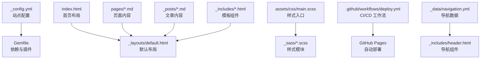
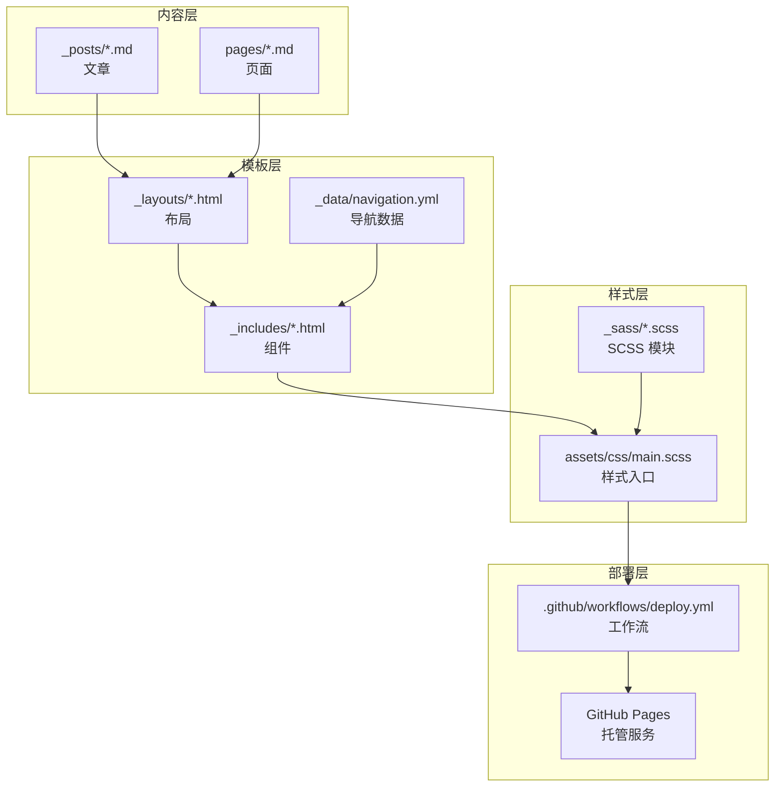
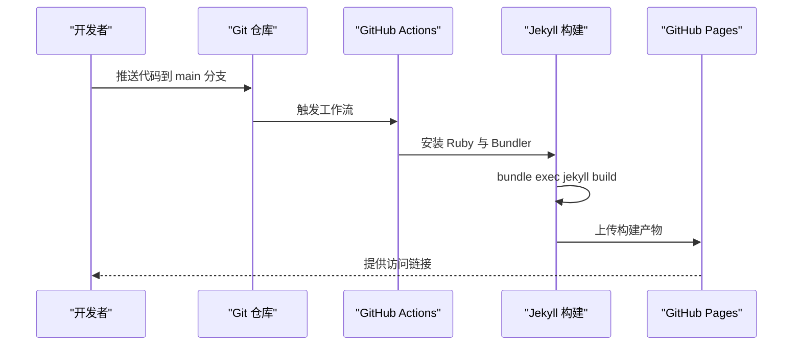
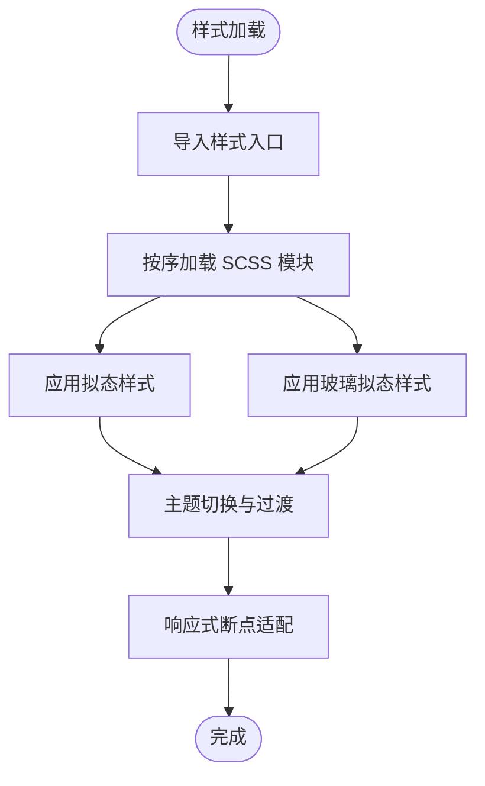
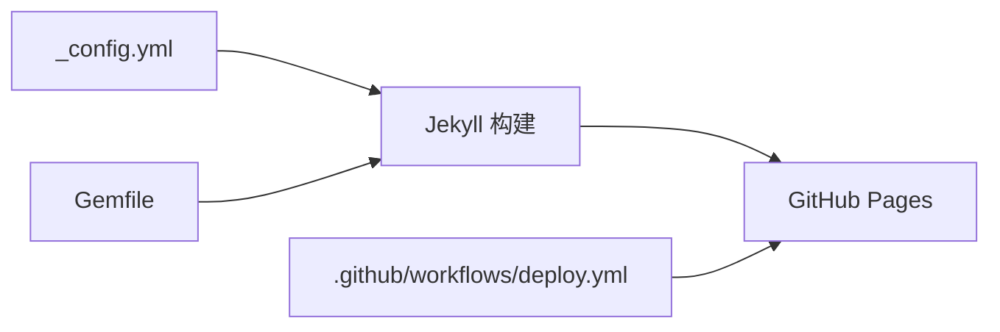

# 项目介绍

<cite>
**本文档引用的文件**
- [README.md](file://README.md)
- [_config.yml](file://_config.yml)
- [Gemfile](file://Gemfile)
- [index.html](file://index.html)
- [pages/about.md](file://pages/about.md)
- [_layouts/default.html](file://_layouts/default.html)
- [_sass/_neumorphism.scss](file://_sass/_neumorphism.scss)
- [_sass/_glassmorphism.scss](file://_sass/_glassmorphism.scss)
- [_includes/header.html](file://_includes/header.html)
- [_posts/2026-05-17-welcome-to-labtab.md](file://_posts/2026-05-17-welcome-to-labtab.md)
- [.github/workflows/deploy.yml](file://.github/workflows/deploy.yml)
- [_data/navigation.yml](file://_data/navigation.yml)
- [assets/css/main.scss](file://assets/css/main.scss)
</cite>

## 目录
1. [引言](#引言)
2. [项目结构](#项目结构)
3. [核心组件](#核心组件)
4. [架构总览](#架构总览)
5. [详细组件分析](#详细组件分析)
6. [依赖分析](#依赖分析)
7. [性能考虑](#性能考虑)
8. [故障排除指南](#故障排除指南)
9. [结论](#结论)
10. [附录](#附录)

## 引言
labtab 是一个基于 Jekyll 的个人技术博客平台，专注于展示技术文章、分享开发经验与记录学习历程。该项目通过 GitHub Pages 实现自动化部署，采用自定义暗色主题与前沿设计风格（拟态与玻璃拟态），为读者提供沉浸式阅读体验。项目同时集成了客户端搜索、分类标签、评论系统、RSS 订阅与 SEO 优化等实用功能，既适合初学者入门静态博客，也为有经验的开发者提供了可扩展的技术架构与设计实现参考。

## 项目结构
labtab 采用 Jekyll 标准目录组织方式，结合自定义布局、样式与数据配置，形成清晰的层次化结构：
- 站点配置与构建：通过配置文件与 Gemfile 定义站点元信息、插件与构建参数
- 内容管理：使用 Markdown 文件组织文章与页面，遵循 Jekyll 前言元数据规范
- 主题与样式：通过 SCSS 模块化组织样式，支持拟态与玻璃拟态设计
- 布局与模板：以 Liquid 模板引擎渲染页面，包含头部、页脚、搜索模态等组件
- 自动化部署：通过 GitHub Actions 在推送主分支时自动构建并发布到 GitHub Pages

图表来源
- [_config.yml:1-91](file://_config.yml#L1-L91)
- [Gemfile:1-14](file://Gemfile#L1-L14)
- [index.html:1-6](file://index.html#L1-L6)
- [_layouts/default.html:1-32](file://_layouts/default.html#L1-L32)
- [assets/css/main.scss:1-17](file://assets/css/main.scss#L1-L17)
- [_sass/_neumorphism.scss:1-92](file://_sass/_neumorphism.scss#L1-L92)
- [_sass/_glassmorphism.scss:1-89](file://_sass/_glassmorphism.scss#L1-L89)
- [_includes/header.html:1-44](file://_includes/header.html#L1-L44)
- [_data/navigation.yml:1-16](file://_data/navigation.yml#L1-L16)

章节来源
- [_config.yml:1-91](file://_config.yml#L1-L91)
- [Gemfile:1-14](file://Gemfile#L1-L14)
- [index.html:1-6](file://index.html#L1-L6)
- [_layouts/default.html:1-32](file://_layouts/default.html#L1-L32)
- [assets/css/main.scss:1-17](file://assets/css/main.scss#L1-L17)
- [_includes/header.html:1-44](file://_includes/header.html#L1-L44)
- [_data/navigation.yml:1-16](file://_data/navigation.yml#L1-L16)

## 核心组件
- 站点配置与构建
  - 使用配置文件统一管理站点标题、描述、作者、URL、分页、插件与排除项等
  - 通过 Gemfile 指定 Jekyll 版本与插件生态，确保构建一致性
- 内容管理
  - 文章采用标准 Jekyll 命名约定与前言元数据，支持分类、标签、目录与评论开关
  - 页面通过独立布局与链接组织，如关于页、归档页、分类页与标签页
- 主题与样式
  - 采用 SCSS 模块化组织，支持拟态与玻璃拟态混合设计风格
  - 提供主题切换、响应式布局与动画效果，增强交互体验
- 布局与模板
  - 默认布局统一注入 SEO、头部、页脚、搜索模态与脚本资源
  - 导航组件从数据文件读取菜单项，支持移动端折叠与激活状态
- 自动化部署
  - GitHub Actions 在推送主分支时自动安装依赖、构建站点并上传到 GitHub Pages

章节来源
- [_config.yml:1-91](file://_config.yml#L1-L91)
- [Gemfile:1-14](file://Gemfile#L1-L14)
- [_posts/2026-05-17-welcome-to-labtab.md:1-92](file://_posts/2026-05-17-welcome-to-labtab.md#L1-L92)
- [_layouts/default.html:1-32](file://_layouts/default.html#L1-L32)
- [_includes/header.html:1-44](file://_includes/header.html#L1-L44)
- [.github/workflows/deploy.yml:1-52](file://.github/workflows/deploy.yml#L1-L52)

## 架构总览
labtab 的整体架构围绕“内容—模板—样式—部署”的流水线展开。内容层由 Markdown 文件构成；模板层通过 Liquid 渲染布局与组件；样式层通过 SCSS 模块化实现设计系统；部署层通过 GitHub Actions 实现自动化构建与发布。

图表来源
- [_posts/2026-05-17-welcome-to-labtab.md:1-92](file://_posts/2026-05-17-welcome-to-labtab.md#L1-L92)
- [pages/about.md:1-30](file://pages/about.md#L1-L30)
- [_layouts/default.html:1-32](file://_layouts/default.html#L1-L32)
- [_includes/header.html:1-44](file://_includes/header.html#L1-L44)
- [_data/navigation.yml:1-16](file://_data/navigation.yml#L1-L16)
- [assets/css/main.scss:1-17](file://assets/css/main.scss#L1-L17)
- [_sass/_neumorphism.scss:1-92](file://_sass/_neumorphism.scss#L1-L92)
- [_sass/_glassmorphism.scss:1-89](file://_sass/_glassmorphism.scss#L1-L89)
- [.github/workflows/deploy.yml:1-52](file://.github/workflows/deploy.yml#L1-L52)

## 详细组件分析

### 设计理念与价值主张
- 选择 Jekyll 的原因
  - 静态生成：无需数据库与服务器端逻辑，提升安全性与性能
  - 易于部署：与 GitHub Pages 深度集成，自动化构建与发布
  - 可控性强：完全掌控内容与样式，便于长期维护与演进
- 选择拟态与玻璃拟态的原因
  - 拟态（Neumorphism）：通过阴影与内阴影营造立体感，增强界面层次
  - 玻璃拟态（Glassmorphism）：利用背景模糊与半透明边框，打造通透质感
  - 混合风格：在深色主题下平衡视觉重量与可读性，提升现代感与沉浸感

章节来源
- [_sass/_neumorphism.scss:1-92](file://_sass/_neumorphism.scss#L1-L92)
- [_sass/_glassmorphism.scss:1-89](file://_sass/_glassmorphism.scss#L1-L89)
- [_posts/2026-05-17-welcome-to-labtab.md:1-92](file://_posts/2026-05-17-welcome-to-labtab.md#L1-L92)

### 功能特性与用户体验
- 搜索与导航
  - 客户端搜索：支持快捷键触发，快速检索全站内容
  - 响应式导航：桌面端与移动端适配，支持主题切换与语言切换
- 内容组织
  - 分类与标签：便于内容分类与关联浏览
  - 目录与评论：支持文章目录生成与评论互动
- 主题与交互
  - 深色主题与主题切换：保护视力，适应不同环境
  - 动画与过渡：提升交互流畅度与视觉反馈

章节来源
- [_includes/header.html:1-44](file://_includes/header.html#L1-L44)
- [_layouts/default.html:1-32](file://_layouts/default.html#L1-L32)
- [_data/navigation.yml:1-16](file://_data/navigation.yml#L1-L16)
- [_config.yml:1-91](file://_config.yml#L1-L91)

### 静态博客入门与进阶
- 初学者视角
  - 什么是静态博客：将内容以纯文本形式编写，通过静态站点生成器转换为 HTML，再托管到静态网站服务
  - 优势：安全、快速、低成本、易备份、可离线编辑
  - 入门步骤：安装依赖、本地预览、撰写文章、推送到仓库自动部署
- 进阶开发者视角
  - 可扩展性：通过插件生态与自定义样式实现复杂功能
  - 维护成本：内容与样式分离，便于版本控制与协作
  - 性能优化：压缩资源、启用缓存、合理分页与懒加载

章节来源
- [README.md:1-50](file://README.md#L1-L50)
- [_posts/2026-05-17-welcome-to-labtab.md:1-92](file://_posts/2026-05-17-welcome-to-labtab.md#L1-L92)

### 自动化部署流程

图表来源
- [.github/workflows/deploy.yml:1-52](file://.github/workflows/deploy.yml#L1-L52)

章节来源
- [.github/workflows/deploy.yml:1-52](file://.github/workflows/deploy.yml#L1-L52)

### 样式系统与设计实现
- 拟态混入（Mixins）
  - 提供 Raised、Pressed、Flat、Glow 等基础样式组合，用于按钮、卡片与输入框
  - 支持悬停与激活状态的动态变换，增强交互反馈
- 玻璃拟态混入（Mixins）
  - 提供标准玻璃卡片、重型覆盖层、轻量玻璃与渐变边框等样式
  - 兼容无 backdrop-filter 浏览器，提供降级方案
- 样式入口与模块化
  - 通过样式入口文件按顺序引入主题、变量、基础样式与各功能模块
  - 支持主题切换与响应式断点，保证跨设备一致体验

图表来源
- [assets/css/main.scss:1-17](file://assets/css/main.scss#L1-L17)
- [_sass/_neumorphism.scss:1-92](file://_sass/_neumorphism.scss#L1-L92)
- [_sass/_glassmorphism.scss:1-89](file://_sass/_glassmorphism.scss#L1-L89)

章节来源
- [assets/css/main.scss:1-17](file://assets/css/main.scss#L1-L17)
- [_sass/_neumorphism.scss:1-92](file://_sass/_neumorphism.scss#L1-L92)
- [_sass/_glassmorphism.scss:1-89](file://_sass/_glassmorphism.scss#L1-L89)

## 依赖分析
- 站点配置依赖
  - 配置文件定义了站点元信息、构建参数、分页策略与插件集合
  - 插件涵盖 RSS、SEO、站点地图与分页，满足内容发现与可访问性需求
- 构建依赖
  - Gemfile 指定 Jekyll 版本与插件生态，确保本地与 CI 环境一致
- 部署依赖
  - GitHub Actions 工作流负责 Ruby 环境设置、依赖安装与构建发布

图表来源
- [_config.yml:1-91](file://_config.yml#L1-L91)
- [Gemfile:1-14](file://Gemfile#L1-L14)
- [.github/workflows/deploy.yml:1-52](file://.github/workflows/deploy.yml#L1-L52)

章节来源
- [_config.yml:1-91](file://_config.yml#L1-L91)
- [Gemfile:1-14](file://Gemfile#L1-L14)
- [.github/workflows/deploy.yml:1-52](file://.github/workflows/deploy.yml#L1-L52)

## 性能考虑
- 资源优化
  - 启用 SCSS 压缩与静态资源缓存，减少传输体积
  - 合理分页降低单页内容量，提升首屏加载速度
- 构建效率
  - 使用 Bundler 缓存与固定 Ruby 版本，缩短构建时间
- 用户体验
  - 主题切换与过渡动画采用硬件加速属性，保证流畅度
  - 玻璃拟态样式在不支持 backdrop-filter 的浏览器提供降级方案

## 故障排除指南
- 本地构建失败
  - 确认 Ruby 与 Bundler 版本符合 Gemfile 要求
  - 清理缓存后重新安装依赖并执行构建命令
- 部署未生效
  - 检查工作流日志中的构建错误与权限配置
  - 确认 baseurl 与站点根路径设置正确
- 样式异常
  - 检查 SCSS 模块导入顺序与变量定义
  - 验证主题切换逻辑与浏览器兼容性

章节来源
- [README.md:34-39](file://README.md#L34-L39)
- [.github/workflows/deploy.yml:1-52](file://.github/workflows/deploy.yml#L1-L52)

## 结论
labtab 以 Jekyll 为核心，结合拟态与玻璃拟态设计风格，构建了一个兼具美观与实用性的个人技术博客平台。通过模块化的样式系统、完善的自动化部署流程与丰富的功能特性，项目既能满足初学者快速上手的需求，也能为有经验的开发者提供可扩展的技术实现参考。未来可进一步完善多语言支持、增强搜索算法与内容推荐机制，持续提升用户体验与内容传播效果。

## 附录
- 项目受众与使用场景
  - 初学者：学习静态博客搭建、Markdown 写作与 GitHub Pages 部署
  - 开发者：参考 Jekyll 插件生态、SCSS 模块化与自动化工作流
  - 内容创作者：基于分类标签体系组织技术内容，建立个人知识库
- 发展历程与未来规划
  - 历史：从零开始搭建，逐步完善样式与功能
  - 规划：引入更多交互元素、增强内容发现能力与社区互动