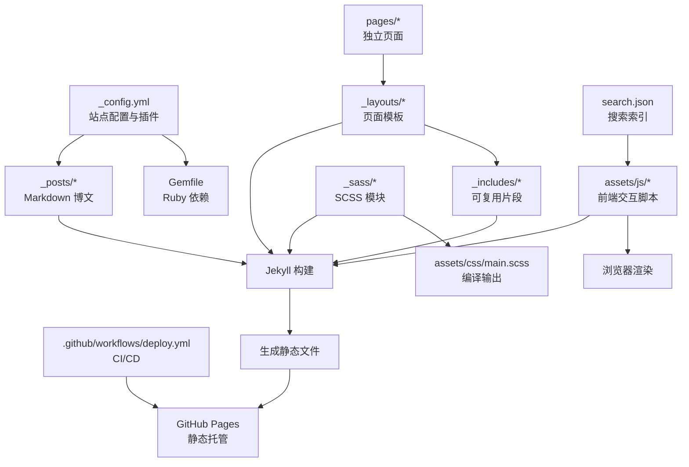
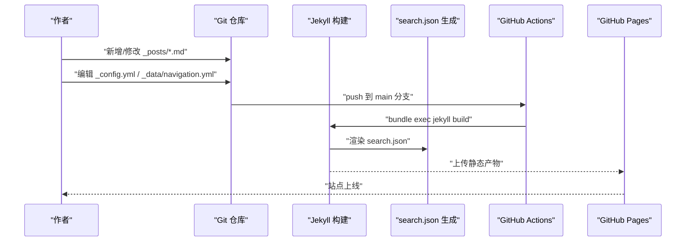
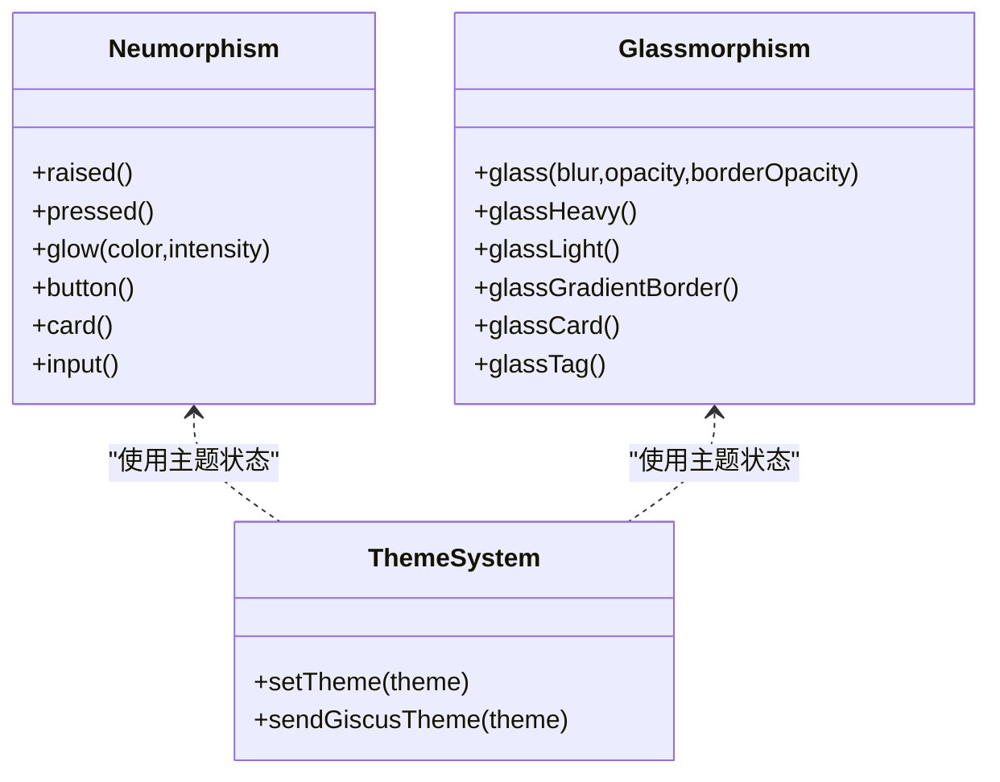
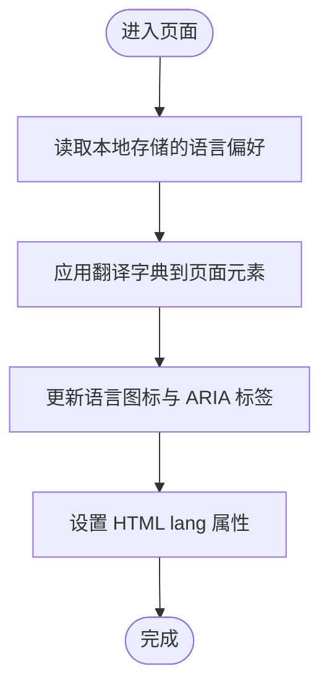
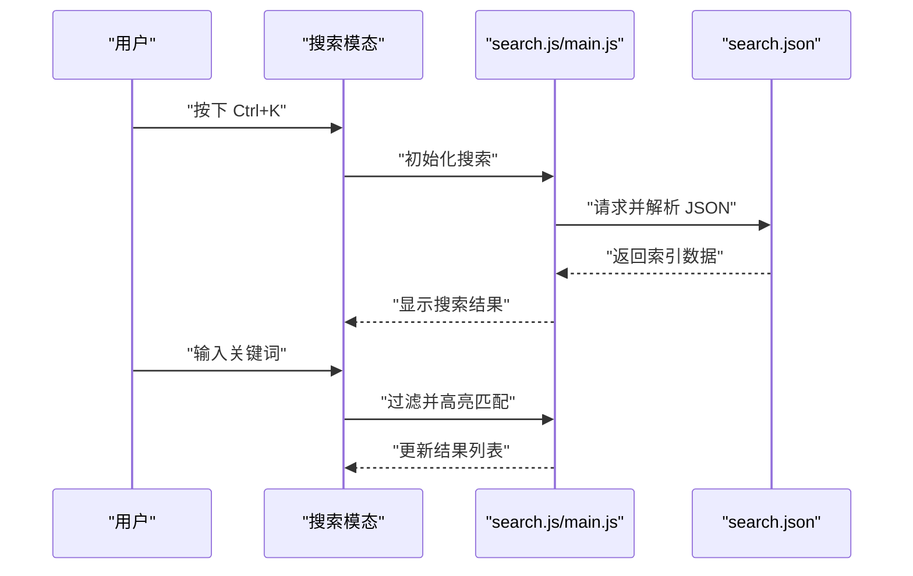
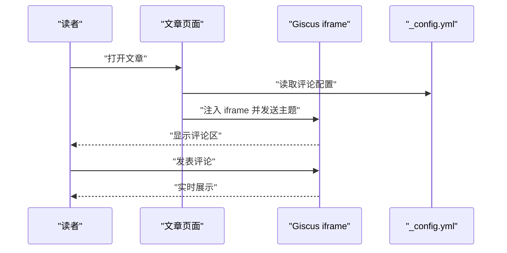
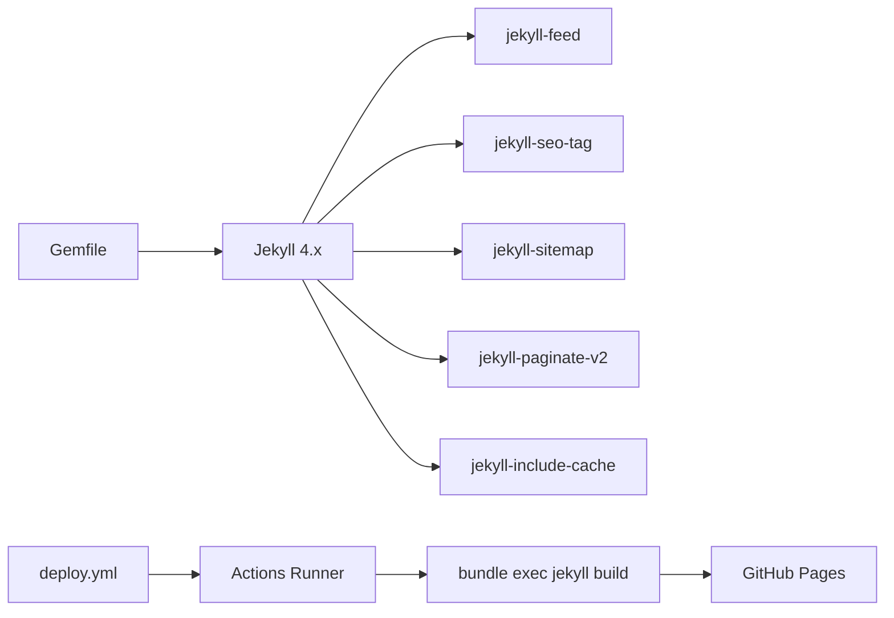

# 项目概述

<cite>
**本文引用的文件**
- [README.md](file://README.md)
- [_config.yml](file://_config.yml)
- [Gemfile](file://Gemfile)
- [index.html](file://index.html)
- [search.json](file://search.json)
- [_layouts/default.html](file://_layouts/default.html)
- [_includes/head.html](file://_includes/head.html)
- [_includes/header.html](file://_includes/header.html)
- [_includes/footer.html](file://_includes/footer.html)
- [_sass/_neumorphism.scss](file://_sass/_neumorphism.scss)
- [_sass/_glassmorphism.scss](file://_sass/_glassmorphism.scss)
- [assets/js/main.js](file://assets/js/main.js)
- [_posts/2026-05-17-welcome-to-labtab.md](file://_posts/2026-05-17-welcome-to-labtab.md)
- [pages/about.md](file://pages/about.md)
- [.github/workflows/deploy.yml](file://.github/workflows/deploy.yml)
</cite>

## 目录
1. [简介](#简介)
2. [项目结构](#项目结构)
3. [核心组件](#核心组件)
4. [架构总览](#架构总览)
5. [详细组件分析](#详细组件分析)
6. [依赖分析](#依赖分析)
7. [性能考虑](#性能考虑)
8. [故障排除指南](#故障排除指南)
9. [结论](#结论)
10. [附录](#附录)

## 简介
labtab 是一个基于 Jekyll 的个人技术博客，采用静态站点生成器构建并部署在 GitHub Pages 上。项目以暗色主题为核心，融合了 neumorphism（软拟物）与 glassmorphism（玻璃拟物）视觉风格，提供多语言支持（中/英）、响应式布局、客户端搜索、分类与标签导航、评论系统（Giscus 基于 GitHub Discussions）、RSS 订阅与 SEO 优化等功能。项目通过 GitHub Actions 实现自动化构建与部署，适合希望快速搭建个人博客或技术档案馆的开发者。

## 项目结构
项目采用 Jekyll 标准目录组织方式，结合自定义样式与脚本实现丰富的交互体验。关键目录与文件职责如下：
- 根配置：_config.yml 定义站点元数据、分页、插件、评论与 SEO 设置；Gemfile 指定 Jekyll 版本与插件依赖。
- 内容与布局：_posts 存放博文；_layouts 提供页面模板；_includes 提供可复用片段（头部、页脚、评论、搜索模态等）。
- 样式与主题：_sass 目录包含 neumorphism 与 glassmorphism 混合器、变量与响应式规则；assets/css/main.scss 编译输出主样式。
- 脚本与交互：assets/js 下包含主逻辑、搜索与特效脚本。
- 页面与导航：pages 目录存放独立页面；_data/navigation.yml 提供导航项数据。
- 自动化：.github/workflows/deploy.yml 定义 CI/CD 流程，实现 push 到 main 分支后自动构建与部署。

图表来源
- [_config.yml:1-91](file://_config.yml#L1-L91)
- [Gemfile:1-14](file://Gemfile#L1-L14)
- [_layouts/default.html:1-32](file://_layouts/default.html#L1-L32)
- [_includes/head.html:1-30](file://_includes/head.html#L1-L30)
- [_sass/_neumorphism.scss:1-92](file://_sass/_neumorphism.scss#L1-L92)
- [_sass/_glassmorphism.scss:1-89](file://_sass/_glassmorphism.scss#L1-L89)
- [assets/js/main.js:1-324](file://assets/js/main.js#L1-L324)
- [search.json:1-15](file://search.json#L1-L15)
- [.github/workflows/deploy.yml:1-52](file://.github/workflows/deploy.yml#L1-L52)

章节来源
- [_config.yml:1-91](file://_config.yml#L1-L91)
- [Gemfile:1-14](file://Gemfile#L1-L14)
- [index.html:1-6](file://index.html#L1-L6)
- [search.json:1-15](file://search.json#L1-L15)

## 核心组件
- 静态站点生成与部署
  - 使用 Jekyll 4.x 作为生成器，配合 GitHub Pages 实现零服务器运维。
  - 通过 GitHub Actions 在推送至 main 分支时自动构建并发布到 Pages。
- 主题与设计风格
  - 暗色主题为基础，结合 neumorphism（软拟物）与 glassmorphism（玻璃拟物）混合器，营造立体与通透的视觉效果。
  - 支持主题切换（明/暗），并同步更新评论区主题。
- 多语言与本地化
  - 支持中文与英文双语，通过本地存储与 i18n 字典动态切换界面文案与语言标识。
- 响应式设计
  - 针对移动端与桌面端的导航、滚动行为与交互进行适配。
- 搜索功能
  - 基于 search.json 的客户端搜索索引，支持 Ctrl+K 快捷键打开搜索框并进行全文检索。
- 导航与内容组织
  - 通过 _data/navigation.yml 维护导航项，结合分类与标签实现内容组织。
- 评论系统
  - 使用 Giscus（基于 GitHub Discussions），在每篇文章下启用评论，支持主题联动与懒加载。
- SEO 与订阅
  - 集成 jekyll-seo-tag、jekyll-feed、jekyll-sitemap 插件，提供 SEO 元数据与 RSS 订阅。

章节来源
- [README.md:5-12](file://README.md#L5-L12)
- [_config.yml:65-79](file://_config.yml#L65-L79)
- [assets/js/main.js:52-139](file://assets/js/main.js#L52-L139)
- [_sass/_neumorphism.scss:1-92](file://_sass/_neumorphism.scss#L1-L92)
- [_sass/_glassmorphism.scss:1-89](file://_sass/_glassmorphism.scss#L1-L89)
- [_includes/header.html:15-28](file://_includes/header.html#L15-L28)
- [_includes/footer.html:1-16](file://_includes/footer.html#L1-L16)

## 架构总览
下图展示了从内容创作到用户访问的整体流程，包括本地开发、Jekyll 构建、搜索索引生成与自动化部署的关键节点。

图表来源
- [_config.yml:1-91](file://_config.yml#L1-L91)
- [search.json:1-15](file://search.json#L1-L15)
- [.github/workflows/deploy.yml:17-52](file://.github/workflows/deploy.yml#L17-L52)

## 详细组件分析

### 主题与设计系统（Neumorphism/Glassmorphism）
- 设计理念
  - neumorphism 通过内外阴影模拟“浮起”与“按压”的立体感；glassmorphism 通过 backdrop-filter 实现半透明与模糊效果，增强层次感。
- 样式模块
  - _neumorphism.scss 提供 raised/pressed/glow/button/card/input 等混入，统一按钮与卡片的交互反馈。
  - _glassmorphism.scss 提供 standard/heavy/light/gradient-border/card/tag 等混入，覆盖导航、模态与标签等场景。
- 主题切换
  - 通过 data-theme 属性与 localStorage 同步主题状态，并在切换时同步评论区主题。

图表来源
- [_sass/_neumorphism.scss:5-92](file://_sass/_neumorphism.scss#L5-L92)
- [_sass/_glassmorphism.scss:6-89](file://_sass/_glassmorphism.scss#L6-L89)
- [assets/js/main.js:13-47](file://assets/js/main.js#L13-L47)

章节来源
- [_sass/_neumorphism.scss:1-92](file://_sass/_neumorphism.scss#L1-L92)
- [_sass/_glassmorphism.scss:1-89](file://_sass/_glassmorphism.scss#L1-L89)
- [assets/js/main.js:13-47](file://assets/js/main.js#L13-L47)

### 多语言与本地化（i18n）
- 语言切换
  - 通过本地字典与 localStorage 实现中/英双语切换，动态更新页面文案与 ARIA 标签。
- 语言标识
  - 根据当前语言设置 HTML lang 属性，提升可访问性与 SEO 表现。

图表来源
- [assets/js/main.js:52-139](file://assets/js/main.js#L52-L139)

章节来源
- [assets/js/main.js:52-139](file://assets/js/main.js#L52-L139)

### 搜索功能（客户端搜索）
- 数据源
  - search.json 由 Jekyll 渲染，包含标题、链接、日期、分类、标签与摘要字段。
- 交互流程
  - 通过 Ctrl+K 打开搜索模态，前端脚本加载索引并执行过滤，展示匹配结果与高亮提示。

图表来源
- [search.json:1-15](file://search.json#L1-15)
- [assets/js/main.js:1-324](file://assets/js/main.js#L1-L324)
- [_includes/header.html:25-28](file://_includes/header.html#L25-L28)

章节来源
- [search.json:1-15](file://search.json#L1-L15)
- [assets/js/main.js:1-324](file://assets/js/main.js#L1-L324)
- [_includes/header.html:25-28](file://_includes/header.html#L25-L28)

### 评论系统（Giscus）
- 配置与集成
  - 在 _config.yml 中配置 repo、repo_id、category、mapping 等参数；通过 include 引入评论片段。
- 主题同步
  - 通过 postMessage 将主题状态同步至 giscus iframe，确保评论区与站点主题一致。

图表来源
- [_config.yml:65-79](file://_config.yml#L65-L79)
- [_layouts/default.html:24-25](file://_layouts/default.html#L24-L25)
- [assets/js/main.js:13-47](file://assets/js/main.js#L13-L47)

章节来源
- [_config.yml:65-79](file://_config.yml#L65-L79)
- [_layouts/default.html:24-25](file://_layouts/default.html#L24-L25)
- [assets/js/main.js:13-47](file://assets/js/main.js#L13-L47)

### 响应式导航与交互
- 移动端菜单
  - 通过切换类名控制移动端导航展开/收起，并在打开时禁用页面滚动。
- 滚动行为
  - 头部在滚动超过阈值时添加“scrolled”类，改善可视体验。
- 平滑滚动与动画
  - 对锚点链接执行平滑滚动；使用 IntersectionObserver 触发淡入动画。

章节来源
- [_includes/header.html:31-42](file://_includes/header.html#L31-L42)
- [assets/js/main.js:144-180](file://assets/js/main.js#L144-L180)
- [assets/js/main.js:252-261](file://assets/js/main.js#L252-L261)
- [assets/js/main.js:268-282](file://assets/js/main.js#L268-L282)

### 内容组织与导航
- 导航数据
  - _data/navigation.yml 提供导航项，页面通过循环渲染链接，支持活动状态高亮。
- 分类与标签
  - 文章 front matter 中的 categories/tags 用于内容分类与筛选。
- 归档与分页
  - 通过 jekyll-paginate-v2 实现首页分页；归档页聚合所有文章。

章节来源
- [_includes/header.html:6-12](file://_includes/header.html#L6-L12)
- [_config.yml:26-33](file://_config.yml#L26-L33)
- [pages/about.md:1-30](file://pages/about.md#L1-L30)

## 依赖分析
- 运行时依赖
  - Ruby 生态：Jekyll 4.x 及其插件生态（jekyll-feed、jekyll-seo-tag、jekyll-sitemap、jekyll-paginate-v2、jekyll-include-cache）。
- 构建与部署
  - GitHub Actions 在 Ubuntu 环境中安装 Ruby 与 Bundler，执行 jekyll build 并上传工件，最终部署到 GitHub Pages。
- 样式与脚本
  - SCSS 模块化管理 neumorphism/glassmorphism 与响应式规则；JavaScript 负责主题切换、i18n、导航、搜索与评论联动。

图表来源
- [Gemfile:1-14](file://Gemfile#L1-L14)
- [_config.yml:34-39](file://_config.yml#L34-L39)
- [.github/workflows/deploy.yml:17-52](file://.github/workflows/deploy.yml#L17-L52)

章节来源
- [Gemfile:1-14](file://Gemfile#L1-L14)
- [_config.yml:34-39](file://_config.yml#L34-L39)
- [.github/workflows/deploy.yml:17-52](file://.github/workflows/deploy.yml#L17-L52)

## 性能考虑
- 静态化优势
  - 采用 Jekyll 生成静态文件，减少运行时计算与数据库查询，显著降低延迟与带宽消耗。
- 资源压缩与缓存
  - SCSS 压缩输出，插件自动提供 sitemap 与 feed，利于搜索引擎抓取与订阅。
- 本地化与懒加载
  - 评论区采用 lazy 加载策略，减少首屏资源压力；搜索索引在客户端按需加载。
- 建议优化
  - 图片懒加载与压缩；CSS/JS 按需拆分；利用 CDN 缓存字体与图标资源。

## 故障排除指南
- 评论不显示或主题不一致
  - 检查 _config.yml 中的 repo、repo_id、category_id 是否正确；确认 iframe 注入后是否触发主题同步。
- 搜索无结果
  - 确认 search.json 已随构建生成；检查浏览器控制台是否存在跨域或解析错误。
- 主题切换无效
  - 检查 localStorage 中的主题键值；确认 data-theme 属性是否正确写入；核对 CSS 变量映射。
- 部署失败
  - 查看 GitHub Actions 日志中的 Ruby/Bundler 安装与 jekyll build 步骤；确认 JEKYLL_ENV 与 baseurl 设置。

章节来源
- [_config.yml:65-79](file://_config.yml#L65-L79)
- [search.json:1-15](file://search.json#L1-L15)
- [assets/js/main.js:13-47](file://assets/js/main.js#L13-L47)
- [.github/workflows/deploy.yml:17-52](file://.github/workflows/deploy.yml#L17-L52)

## 结论
labtab 以 Jekyll 为核心，结合 neumorphism 与 glassmorphism 设计风格，提供了现代化、可访问且易于维护的个人技术博客方案。通过多语言支持、响应式设计、客户端搜索、评论系统与自动化部署，项目在功能与体验上达到良好平衡。对于初学者，项目提供了清晰的起步路径与文档；对于有经验的开发者，其模块化的样式与脚本、完善的 CI/CD 流程与 SEO/订阅能力，便于进一步扩展与定制。

## 附录
- 许可证
  - 项目采用 MIT 许可证，允许自由使用、复制、修改与再发布，需在衍生作品中保留版权与许可声明。
- 维护状态
  - 项目处于活跃维护状态，通过 GitHub Actions 实现持续集成与部署，版本与依赖保持更新。

章节来源
- [README.md:48-50](file://README.md#L48-L50)
- [.github/workflows/deploy.yml:1-52](file://.github/workflows/deploy.yml#L1-L52)